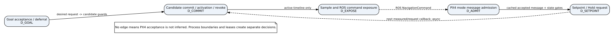
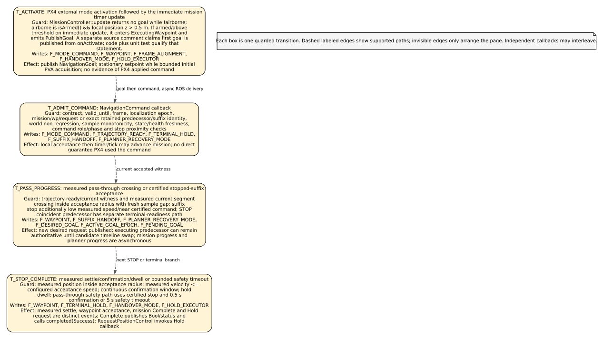

# Hành vi hiện tại

**Kết luận:** `PARTIAL_AS_IS`. Đã truy vết vertical slice từ goal/mission qua planning, committed timeline, ROS command, PX4 adapter và Hold request. Các boundary trọng yếu có source refs; compile database không khớp, writer inventory không exhaustive, chưa có paired-process trace/test run. Bảy Graphviz và bốn Mermaid diagram đã render/kiểm tra trực quan, nhưng các khoảng trống bằng chứng còn lại khiến chưa ghi `READY_FOR_REDESIGN_DISCUSSION`.

## Baseline và phạm vi chạy

Phân tích theo local working tree tại HEAD `9534d8dc15920c8b3e80c8fa12f28ec972b8c6a2`, branch `codex/close-proven-findings`, snapshot 2026-09-20. Các file staged/unstaged/untracked có trước audit vẫn nằm trong baseline và không bị chỉnh. Xem [metadata](baseline/environment.json) và [source snapshot manifest](baseline/source_manifest.json).

Có 23 package manifests trong source tree; [package scope](tables/package_scope.md) phân loại theo manifest, CMake, launch và đường dẫn. Production deployment nhìn từ launch có `navigation_runtime` và `px4_navigation_external_mode`; FAST-LIO được launch riêng. `avoidance_mission.launch.py` ghép hai process navigation; FAST-LIO có launch riêng và PX4 odometry bridge là tùy chọn. Không có bằng chứng process graph đang chạy. [Deployment view](diagrams/svg/deployment.svg) và [package inventory](tables/package_scope.md).

`navigation_runtime_main` chạy node với `MultiThreadedExecutor(2)`. Process PX4 có `NodeWithModeExecutor<NavigationModeExecutor, NavigationMode>` và một state-input node chạy thread riêng. Vì vậy planner worker, command timer, ROS callbacks và PX4 state input không có một total order chung; các điểm tuần tự hóa trong source là mutex, timeline store hoặc exact identity recheck. [Process entry refs](evidence/refs.html#E_RUNTIME_MAIN) · [PX4 process refs](evidence/refs.html#E_PX4_MAIN) · [deployment SVG](diagrams/svg/deployment.svg).

## Ai sở hữu state và quyết định

- `NavigationRuntimeNode` giữ desired `active_goal_` riêng với physical `executing_goal_`; `active_goal_epoch_`, localization epoch và `command_goal_epoch_` là token khác nhau. Đây là các định danh riêng, không gộp thành một request ID. [Field table](tables/fields.md) · [runtime declarations](evidence/refs.html#E_HANDOFF_FLAGS).
- `PendingGoalHandoffOwner` có một slot cho goal cùng mission mới hơn trong khi BACKUP/EMERGENCY suffix đang chạy. Nó không thay thế `NavigationMode::safety_suffix_handoff_pending_`; hai slot nằm ở hai process/lifetime khác nhau. [Pending-goal source](evidence/refs.html#E_PENDING_GOAL) · [mode fields](evidence/refs.html#E_MODE_FIELDS).
- `ExecutionEpisode` owns một mutex-protected snapshot gồm phase, recovery state, localization/goal/request, active generation, command availability, failure latch, suffix và restart-from-rest. `transitionExecutionRecovery` là helper tính next enum; helper không tự ghi state. [Episode source](evidence/refs.html#E_EPISODE_SNAPSHOT) · [recovery helper](evidence/refs.html#E_RECOVERY_HELPER).
- `ExecutionTimelineStore` owns authoritative active/pending immutable `CandidateBundle`; successor pending chưa execute trước activation. `CommandSampler` chỉ đọc active timeline theo thời gian/role. [Timeline source](evidence/refs.html#E_TIMELINE) · [sampler source](evidence/refs.html#E_SAMPLER).
- `PlanningWorker` có một solve đang chạy và một latest pending job; queue policy/cancel không cấp quyền commit hay publish. Planning vẫn có thể chạy trong lúc command timer đọc/publish bundle đang active. [Worker source](evidence/refs.html#E_WORKER) · [runtime executor/timer refs](evidence/refs.html#E_RUNTIME_MAIN).
- `MissionController` owns mission route progress, waypoint index, request id, trajectory readiness, terminal/safety timers. `NavigationMode` owns last locally admitted `NavigationCommand` cache, suffix/recovery/handover flags, state snapshots và frame alignment. `NavigationModeExecutor` owns PX4 Hold API request bookkeeping. [Mission fields](evidence/refs.html#E_MISSION_FIELDS) · [mode/executor fields](evidence/refs.html#E_MODE_FIELDS).

## Vertical slice: request đến setpoint input

`NavigationMode::onActivate` invalidates cached command, resets per-activation latches and activates `MissionController`; the mission timer updates immediately. `MissionController` enters `WaitingForAirborne`, and `update()` returns no goal unless `isArmed() && local_position.z > 0.5 m`. Once airborne it enters `ExecutingWaypoint` and emits `PublishGoal`. A comment says the first goal is published from `onActivate`; source branch and unit assertion qualify that statement: it is only emitted there if the airborne predicate already passes. [Activation source](evidence/refs.html#E_MODE_ACTIVATE) · [airborne branch](evidence/refs.html#E_MISSION_UPDATE) · [comment/run-condition branch](evidence/refs.html#E_ACTIVATE_COMMENT) · [test assertion](evidence/refs.html#E_MISSION_TEST).

Runtime validates route/message identity, compares mission/request order and localization epoch, and checks current recovery state. A same-mission pass-through successor can become desired while old `executing_goal_` and active bundle remain. During a moving safety suffix, one newer same-mission goal can wait in the pending slot; a foreign mission is treated as authority violation and fails closed after measured stop. [Goal mutation path](evidence/refs.html#E_GOAL).

The planning key preserves localization epoch, goal epoch, request ID, route revision, committed-bundle generation, world generation/revision, start mode, anchor stamp and dynamics hash. `PlanningWorker` runs one backend solve at a time, while `CommandSampler` can sample the currently active timeline. Candidate return is not commit; staged is not active; active is not yet a published sample. [PlanningKey](evidence/refs.html#E_REQUEST) · [worker](evidence/refs.html#E_WORKER) · [candidate schema](evidence/refs.html#E_CANDIDATE).

Candidate admission rechecks candidate certificates/identity, current world, active predecessor, goal/localization epochs, transaction and recovery/failure gates. Normal successors are staged for the declared activation time; immediate emergency admission is a distinct branch. `activatePendingIfDueAndFinalize` rechecks exact generation/goal/recovery/lease identity under the store and runtime locks, swaps active timeline, then queues planner-facade synchronization. Those are serialized boundaries, not one distributed transaction. [Candidate admission](evidence/refs.html#E_COMMIT) · [store stage/activation/exposure](evidence/refs.html#E_TIMELINE) · [runtime activation caller](evidence/refs.html#E_ACTIVATION).

At command time, runtime samples active bundle/role, checks fresh source and steady-receive state, world freshness, goal/executing identity, bundle and stream leases, recovery episode and exact current store pointer. The stream command lease is 100 ms by default. If valid, runtime publishes `NavigationCommand`; if superseded it drops, if world stale it suspends/revalidates, and if state lease fails it latches and fails closed. `NavigationMode` independently checks message contract, lease, frame, estimator epoch/health, mission/request identity, world non-regression, sample monotonicity, measured odometry and role/tracking conditions before caching. [runtime exposure gate](evidence/refs.html#E_PUBLISH) · [final ROS command](evidence/refs.html#E_PUBLISH_FINAL) · [message contract](evidence/refs.html#E_COMMAND_CONTRACT) · [PX4 adapter admission](evidence/refs.html#E_MODE_ADMISSION).

A locally admitted command is still only a cache input. `updateSetpoint` checks local command/state/health ages, terminal/recovery/handover latches and PX4 frame alignment. Normal output converts ENU position/velocity/acceleration/yaw to PX4 NED setpoint inputs; jerk is present in `NavigationCommand` but is not part of the output fields described by this adapter path. The source does not prove PX4 accepted or applied the setpoint. [Setpoint selection](evidence/refs.html#E_SETPOINT).

## Mission progress, STOP and PASS_THROUGH

`MissionController` uses measured route progress. A pass-through needs an inside-acceptance measured segment plus current accepted MAIN continuation witness, a certified stopped safety suffix witness, or one of its explicitly named coincident/terminal cases; a fresh BACKUP message alone does not authorize normal pass-through continuation. Acceptance increments waypoint/request; `NavigationMode` publishes a new goal. It may retain the exact old command only when `commandMayBeRetainedAcrossWaypointHandoff` says identity/status/role can bridge and its normal validity remains. Runtime can be planning for N+1 while N remains physical execution owner. [Mission update](evidence/refs.html#E_MISSION_UPDATE_END) · [goal handoff event](evidence/refs.html#E_MISSION_EVENT) · [progression test](evidence/refs.html#E_PROGRESSION_TEST).

STOP has separate phases: trajectory endpoint; mode-side terminal hold pending; measured position within acceptance; measured speed below configured threshold; continuous confirmation; `Holding`; configured `hold_s`; waypoint acceptance or `Complete`. Safety braking has different timing: measured speed <= 0.15 m/s, braking endpoint elapsed, 0.5 s confirmation, and 5 s safety timeout in the controller. These facts do not collapse to one terminal state. [Mission timing and state](evidence/refs.html#E_MISSION_FIELDS) · [STOP branches](evidence/refs.html#E_MISSION_UPDATE_END) · [mission test assertions](evidence/refs.html#E_MISSION_TEST_TERMINAL).

A coincident PASS_THROUGH followed by STOP has explicit helper/terminal readiness handling; moving through the shared acceptance sphere does not publish the STOP goal while the previous safety suffix still owns runtime execution. `CoincidentPassThroughStopRestoresTerminalReadiness` tests this case. Other zero-length route cases are not established by this one test. [Code](evidence/refs.html#E_MISSION_UPDATE_END) · [test](evidence/refs.html#E_MISSION_TEST_TERMINAL).

## Recovery and authority handover

When sampler observes BACKUP/EMERGENCY role on the exact active generation, runtime `ExecutionEpisode` reflects that role. A late result rechecks captured solve request, executing identity, timeline version/pointer, active generation and episode; stale result is discarded or retained only under its specific validated branch. Emergency certification/boundary failure for the current owner applies fail-closed recovery and clears executable authority; stale owner failure is discarded. A measured emergency endpoint is not mission completion. [Recovery transitions](evidence/refs.html#E_RECOVERY_USE) · [late result / emergency failure](evidence/refs.html#E_RECOVERY_COMMIT).

After certified measured stop, runtime can preserve a stopped hold and request plan-from-rest. Runtime stopped-recovery failure timeout is 5.0 s from the first steady-clock failure timestamp; retries remain within that window. The PX4 adapter has its own 5.0 s planner-recovery wait from the completed command, identified by mission/wp/request/bundle. These timers are not a shared lease. [Runtime timeout source](evidence/refs.html#E_RUNTIME_TIMEOUT) · [PX4 recovery path](evidence/refs.html#E_MODE_RECOVERY).

On PX4 side, mission `Complete` or safety `RequestPositionControl` sets handover gates; while waiting, `updateSetpoint` publishes stationary command inputs when state permits. Executor schedules AUTO_LOITER. A failed API result sets pending and retries after 250 ms; a VehicleStatus with AUTO_LOITER is the explicit confirmation. Source also shows Success/Deactivated API callback clears `hold_handover_pending_` before observed `px4_hold_confirmed_` becomes true; because retry timer only retries while pending, eventual state confirmation depends on PX4 API/status behavior not observed here. [Mission event](evidence/refs.html#E_MISSION_EVENT) · [setpoint stationary/handover path](evidence/refs.html#E_SETPOINT) · [executor](evidence/refs.html#E_HOLD).

`trajectory-ended`, `safety-stop-observed`, `waypoint-accepted`, `mission-complete`, `hold-requested`, `hold-confirmed` are separate predicates/events across runtime and mode. Diagrams keep process handoffs and delayed callbacks separate.

## Profile-dependent tracking policy conflict

The checked-in `mapping.yaml` and `external_mode.yaml` set tracking coefficients to zero and comment that zero disables tracking/health-response gates. `avoidance_mission.launch.py` defaults `use_sim_time` to false. The shared loader instead sets `enabled=use_sim_time`; if simulation time is true and coefficients are zero, `trackingGateEnabled()` is false, so it sets `suppress_braking=true` and `suppress_estimator_health_response=true`. Runtime selects its experiment tracking result when enabled; the PX4 mode can suppress geometric tracking braking and health response under that flag. The code logs increased collision risk / not flight qualification. Thus effect is source-proven only under the `use_sim_time=true` parameter valuation; which parameters a live profile passed is unresolved. This source/comment discrepancy is retained for design discussion and was not changed. [YAML](evidence/refs.html#E_TRACKING_CONFIG) · [launch default](evidence/refs.html#E_LAUNCH_DEFAULT) · [policy loader](evidence/refs.html#E_TRACKING_POLICY) · [runtime use](evidence/refs.html#E_RUNTIME_TRACKING_GATE) · [mode path](evidence/refs.html#E_TRACKING_MODE_BYPASS).

## Bằng chứng, mức hoàn tất và giới hạn

- **FACT_FROM_CODE:** captured source excerpts and paths in [evidence index](evidence/refs.html); the model's field and transition refs retain source hash and line range.
- **TEST_SUPPORTED:** source test assertions linked from [test review](validation/test_review.md); tests were not run.
- **RUNTIME_OBSERVED:** none. No runtime trace was captured.
- **INFERENCE/UNRESOLVED:** live run profile, full cross-process callback ordering, actual PX4 acceptance/application, rare exception/cancellation and complete writer alias inventory.

Coverage counts and scope denominators are in [model coverage](model/architecture.json) and [coverage table](tables/coverage.md). Seven Graphviz and four Mermaid diagrams rendered and structurally parsed; visual review is documented in [render review](validation/render_review.md). Remaining profile, writer-inventory and runtime-evidence gaps keep the delivered status at `PARTIAL_AS_IS`, not ready-for-redesign.
