# Pipeline end-to-end và nhánh lỗi

Phạm vi: source tại `7e0b850`. `wall` trong tài liệu này là timer/worker
monotonic của host; `ros` là ROS time, có thể là simulated `/clock`; `steady` là
`std::chrono::steady_clock`. Các bảng chỉ ghi deadline khi source định nghĩa;
thiếu phép đo được ghi `NOT_MEASURED`.

## 1. Chu kỳ nominal

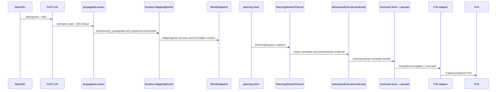

| step | actor | thread | input identity checked | output | deadline/budget (value + file:line) | failure disposition (file:line) |
|---|---|---|---|---|---|---|
| 1 | FAST-LIO ROS ingress | `fast_lio_executor` | message conversion; sensor timestamp | IMU/LiDAR queues | queue wait supervisor 20 ms (`fast_lio_node.cpp:602-610`) | invalid message is warned/dropped (`fast_lio_node.cpp:298-335`) |
| 2 | FAST-LIO estimator | `fast_lio_processing_worker` | ordered measurement stream | corrected registered scan + estimator health | planner budgets do not cover estimator; `NOT_DEFINED_AT_BASELINE` | processing exception marks worker failed/stops (`fast_lio_node.cpp:767-779`) |
| 3 | propagated odometry | `propagated_odometry_worker` | source time strictly newer; correction generation | `/lio/odometry_propagated` | period derived from configured rate (`propagated_odometry_worker.cpp:28-35`); measured end-to-end `NOT_MEASURED` here | skip on stale/non-newer/replay (`propagated_odometry_worker.cpp:553-628`) |
| 4 | runtime mapping ingress | `mapping_ros_ingress` then `mapping_worker` | epoch, sequence, source stamp, frame/freshness (`navigation_runtime_node.cpp:1461-1508`, `1976-2073`) | world snapshot/revision | snapshot period 100 ms (`planning_timing.hpp:21`); mapping runtime `NOT_MEASURED` | reject or fail-closed on publication failure (`navigation_runtime_node.cpp:1311-1329`) |
| 5 | planning schedule | `planning_timer` then `planning_worker` | `PlanningKey` and current authority/world identity (`navigation_runtime_node.cpp:3723-3795`) | typed `PlanningRequest` | planner period 100 ms; solve 80 ms (`planning_timing.hpp:9-12`) | unavailable key/obsolete request is dropped (`navigation_runtime_node.cpp:3735-3749`, `3772-3774`) |
| 6 | solve/export/certificate | `planning_worker` | request identity, pinned world, route, dynamics | candidate bundle | A*/solve gates (`config.hpp:300-313`, `planning_timing.hpp:11-15`) | failed solve retains/revalidates incumbent or fail-closes (`navigation_runtime_node.cpp:6307-6318`) |
| 7 | admission/commit | `planning_worker` | epoch, goal, generation, world, anchor, freshness | active or pending execution bundle | commit guard 20 ms (`planning_timing.hpp:13`, `navigation_runtime_node.cpp:3064-3077`) | candidate rejection leaves active authoritative (`navigation_runtime_node.cpp:2943-2965`, `3343-3353`) |
| 8 | command sampling | `command_timer` | world freshness, authority identity, execution state freshness | `/navigation/navigation_command` | 20 ms / 50 Hz (`planning_timing.hpp:17-19`, `navigation_runtime_node.cpp:1776-1778`) | no sample, suspend, or terminal emergency path (`navigation_runtime_node.cpp:8602-8612`, `9011-9051`) |
| 9 | adapter local admission | `adapter_mode_executor` | contract, temporal lease, activation, epoch, sequence, odometry freshness | accepted command / admission receipt | command 100 ms, state 200 ms (`navigation_mode_node.cpp:183-190`, `243-266`) | retain, fail navigation, or safety stop (`navigation_mode_node.cpp:1308-1345`) |
| 10 | PX4 setpoint | PX4 mode callback | command validity, tracking, finite ENU→NED | `/fmu/in/trajectory_setpoint` via `TrajectorySetpointType` | 50 Hz setpoint scheduler (`navigation_mode_node.cpp:308`); `update()` at `2548` | Hold/handover (`navigation_mode_node.cpp:2426-2445`, `2013-2034`) |

## 2. Initial plan from rest

```mermaid
sequenceDiagram
  participant G as goal/mission
  participant T as planning timer
  participant W as PlanningWorker
  participant P as Planner
  participant E as ExecutionAuthority
  participant X as Adapter
  G->>T: new goal / stopped state
  T->>W: key start_mode=StoppedMeasuredState
  W->>P: PlanningRequest with measured state
  P->>P: PlanFromRest; A*; MAIN+BACKUP/STOP
  P->>E: immediate admission
  E->>X: first navigation command
  X->>X: command and state lease admission
```

| step | actor | thread | input identity checked | output | deadline/budget (value + file:line) | failure disposition (file:line) |
|---|---|---|---|---|---|---|
| 1 | `currentPlanningKey` | `planning_timer` | no pending; goal/epoch/world/execution coherent | `kStoppedMeasuredState` | 100 ms planner tick (`planning_timing.hpp:9-10`) | no key => skip (`navigation_runtime_node.cpp:3745-3749`) |
| 2 | request builder | `planning_worker` | measured state epoch/frame/freshness and route | `PlanningRequest` | solve 80 ms (`planning_timing.hpp:11`) | invalid request returns outcome (`planner.cpp:2393-2415`) |
| 3 | Planner | `planning_worker` | `setCommandIdentity`; measured start state | candidate | A*/total/solve validation (`config.hpp:300-313`) | no odom/start point/optimizer failure (`planner.cpp:1869-1872`, `1919-1925`, `1953-1962`) |
| 4 | runtime boundary | `planning_worker` | candidate identity/world/fresh execution state | immediately admitted bundle | commit guard 20 ms (`navigation_runtime_node.cpp:3064-3077`) | discard candidate and preserve no executable replacement (`navigation_runtime_node.cpp:3285-3317`) |
| 5 | adapter | `adapter_mode_executor` | session activation + typed health + 200 ms odometry | accepted command/setpoint | command 100 ms/state 200 ms (`navigation_mode_node.cpp:1151-1252`) | reject/retain or fail navigation (`navigation_mode_node.cpp:1323-1336`) |

## 3. Successor renewal, committed future anchor, 400 ms stitch

```mermaid
sequenceDiagram
  participant R as runtime key
  participant E as ExecutionAuthority
  participant P as Planner
  participant A as admission
  participant C as command timer
  R->>E: active MAIN and current generation
  R->>E: reserve future anchor
  R->>P: PlanningRequest(CommittedFutureState)
  P->>P: seed from anchor; retain 400 ms stitch
  P->>A: stage pending successor
  C->>E: activate only at declared boundary
  E->>C: sample successor
```

| step | actor | thread | input identity checked | output | deadline/budget (value + file:line) | failure disposition (file:line) |
|---|---|---|---|---|---|---|
| 1 | key selection | `planning_timer` | active generation, no pending, current epoch/world | `kCommittedFutureState` | planner period 100 ms (`planning_timing.hpp:9`) | pending or stale authority => no key (`navigation_runtime_node.cpp:3611-3619`) |
| 2 | anchor reservation | `planning_worker` | active generation, localization epoch, world identity | `ExecutionAnchor` | stitch 400 ms (`planning_timing.hpp:12`, `navigation_runtime_node.cpp:5624-5645`) | no anchor => `kNoCompleteBundle` (`navigation_runtime_node.cpp:5646-5659`) |
| 3 | successor solve | `planning_worker` | anchor state and activation stamp | candidate beginning exactly at activation | solve 80 ms (`planning_timing.hpp:11`) | planner deadline/cancellation => failed outcome (`planner.cpp:2174-2203`) |
| 4 | stage | `planning_worker` | candidate declared start and reserved anchor | pending candidate | commit guard 20 ms (`navigation_runtime_node.cpp:3064-3077`) | non-exact start/anchor mismatch rejects (`navigation_runtime_node.cpp:3085-3129`) |
| 5 | activation/sample | `command_timer` | pending identity and due activation | active successor, then sampled command | command 20 ms (`navigation_runtime_node.cpp:8622-8648`) | not due/invalid sample keeps active or clears pending (`navigation_runtime_node.cpp:9011-9051`) |

## 4. World revision mới → revalidate retained command

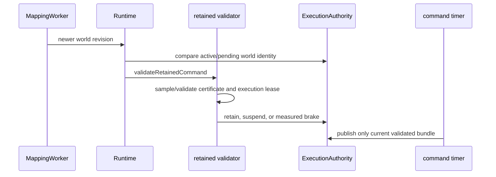

| step | actor | thread | input identity checked | output | deadline/budget (value + file:line) | failure disposition (file:line) |
|---|---|---|---|---|---|---|
| 1 | mapping publication | `mapping_worker` | observation epoch/frame/sequence | new world identity/revision | snapshot 100 ms (`planning_timing.hpp:21`) | publication failure fail-closes (`navigation_runtime_node.cpp:1311-1329`) |
| 2 | runtime recertification | `mapping_worker` or `planning_worker` | retained bundle, goal, epoch, world (`navigation_runtime_node.cpp:1009-1219`) | validation decision | freshness 500 ms (`navigation_runtime_node.cpp:717-720`) | suspend exact command or fail-closed (`navigation_runtime_node.cpp:3455-3482`) |
| 3 | `validateRetainedCommand` | `planning_worker` / decision callback | captures authority/goal/epoch/timeline under canonical locks (`navigation_runtime_node.cpp:7564-7613`) | retained decision, new candidate, or brake | command period witness 20 ms (`navigation_runtime_node.cpp:8298-8311`) | superseded/invalid/lease failure path (`navigation_runtime_node.cpp:7614-7638`, `8143-8171`) |
| 4 | command exposure | `command_timer` | latest world/authority/state freshness | command or no publish | 20 ms (`planning_timing.hpp:17`) | no publish on stale world (`navigation_runtime_node.cpp:8602-8612`) |

## 5. MAIN → BACKUP activation

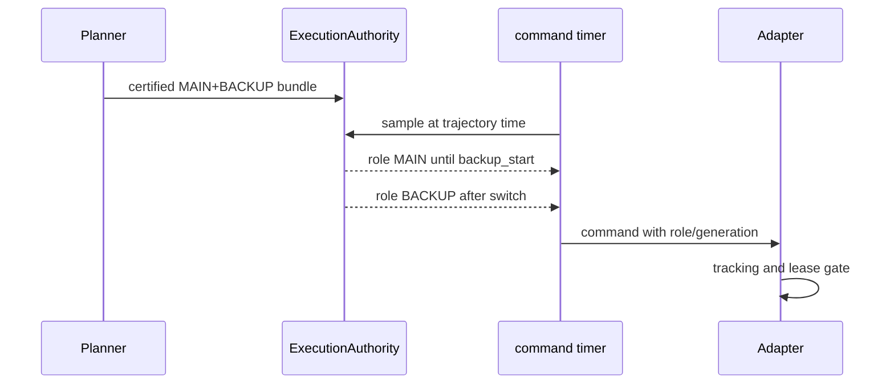

| step | actor | thread | input identity checked | output | deadline/budget (value + file:line) | failure disposition (file:line) |
|---|---|---|---|---|---|---|
| 1 | planner certificate | `planning_worker` | MAIN/BACKUP candidate, world/certificate identity | immutable bundle | minimum reserve includes solve + stitch + planner + guard (`planning_timing.hpp:14-15`) | backup failure leaves incumbent unchanged (`planner.cpp:2337-2346`) |
| 2 | activation | `command_timer` | pending generation and declared activation | active bundle | 20 ms command period (`navigation_runtime_node.cpp:8622-8648`) | activation transaction rejected => no switch (`navigation_runtime_node.cpp:8646-8654`) |
| 3 | sampler | `command_timer` | goal epoch, bundle generation, world identity | sampled PVA + role | no separate role deadline; command lease 100 ms (`planning_timing.hpp:19`) | no point clears/suspends current identity (`navigation_runtime_node.cpp:9011-9051`) |
| 4 | adapter | `adapter_mode_executor` | tracking envelope and exact command identity | PX4 setpoint | state 200 ms, command 100 ms (`navigation_mode_node.cpp:1243-1252`, `2426-2444`) | safety stop on anchor/lease/tracking failure (`navigation_mode_node.cpp:1338-1345`) |

## 6. Measured-state emergency brake

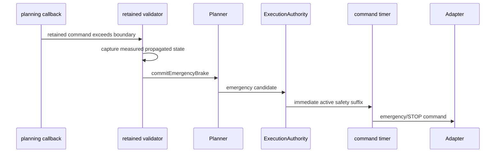

| step | actor | thread | input identity checked | output | deadline/budget (value + file:line) | failure disposition (file:line) |
|---|---|---|---|---|---|---|
| 1 | retained validator | `planning_worker` | measured state freshness, anchor error, goal/epoch | emergency authorized or not | no distinct brake WCET in source/artifacts (`NOT_DEFINED_AT_BASELINE`) | not authorized retains/suspends according to decision (`navigation_runtime_node.cpp:8090-8103`) |
| 2 | measured brake | `planning_worker` (the call is inside `validateRetainedCommand`, which is invoked from the planning worker job at `navigation_runtime_node.cpp:6317-6318`) | measured PVAJ and current identity | `planner_->commitEmergencyBrake` | commit call at `navigation_runtime_node.cpp:8143-8145`; measured duration `NOT_MEASURED` | failed commit does not authorize suffix (`navigation_runtime_node.cpp:8147-8150`) |
| 3 | execution boundary | `planning_worker` | candidate and exact authority snapshot | immediate admitted emergency bundle | commit guard 20 ms (`navigation_runtime_node.cpp:8160-8168`, `planning_timing.hpp:13`) | boundary rejects and rechecks owner (`navigation_runtime_node.cpp:8160-8171`) |
| 4 | publication | `command_timer` | fresh world/state and active authority | emergency PVA command | 20 ms command tick (`planning_timing.hpp:17`) | no valid sample => fail closed (`navigation_runtime_node.cpp:9011-9051`) |
| 5 | adapter | `adapter_mode_executor` | command/state/tracking leases | Hold or emergency setpoint | command 100 ms/state 200 ms (`navigation_mode_node.cpp:183-190`) | `safetyStopNavigation`/Hold (`navigation_mode_node.cpp:2013-2034`) |

## 7. Fail-closed → PX4 Hold

```mermaid
sequenceDiagram
  participant R as Runtime
  participant C as command timer
  participant X as Adapter
  participant H as NavigationModeExecutor
  participant PX as PX4
  R->>R: failClosedLocked; no executable command
  C-->>X: no valid command / terminal failure
  X->>X: invalidate command and request handover
  X->>H: px4_hold_handover callback
  H->>PX: scheduleMode(Loiter/Hold)
  H-->>PX: retry until confirmed
```

| step | actor | thread | input identity checked | output | deadline/budget (value + file:line) | failure disposition (file:line) |
|---|---|---|---|---|---|---|
| 1 | runtime failure latch | `planning_worker` or `command_timer` | current epoch/goal/authority under locks | cleared executable state | watchdog 1.0 s (`navigation_runtime_node.cpp:717-720`; safety contract `runtime_safety_current.md:97`) | `failClosedLocked` path at `navigation_runtime_node.cpp:8952-8965` |
| 2 | runtime command stream | `command_timer` | world/state/lease | no command or emergency | command stream 100 ms (`planning_timing.hpp:19`) | no publish / terminal fail-closed (`navigation_runtime_node.cpp:8879-8934`) |
| 3 | adapter safety stop | `adapter_mode_executor` | trajectory mutex, current activation | invalidated command + PAUSED/FAILED | state/command gates 200/100 ms (`navigation_mode_node.cpp:243-266`) | `safetyStopNavigation` and `failNavigation` (`navigation_mode_node.cpp:2013-2059`) |
| 4 | PX4 handover | `adapter_mode_executor` / handover timer | `px4_hold_confirmed_`, retry steady deadline | Loiter/Hold request | retry timer 50 ms (`navigation_mode_node.cpp:2599-2620`) | retry until PX4 confirms; completion failure is handed to Hold (`navigation_mode_node.cpp:2651-2661`) |

## 8. Localization epoch reset

```mermaid
sequenceDiagram
  participant I as sensor ingress
  participant R as Runtime
  participant M as MappingWorker
  participant B as odometry bridge
  participant X as Adapter
  participant PX as PX4/EKF2
  I->>R: newer estimator epoch/frame generation
  R->>R: mark epoch not ready; cancel/reset authority
  R->>M: release lifecycle lock; drain/reset map
  R->>B: newer epoch high-water/reset continuity
  R->>X: health/odometry epoch mismatch invalidates command
  X->>PX: stop publishing external odometry until gates reopen
```

| step | actor | thread | input identity checked | output | deadline/budget (value + file:line) | failure disposition (file:line) |
|---|---|---|---|---|---|---|
| 1 | runtime reset | `mapping_ros_ingress` or state ingress callback | epoch strictly newer | `localization_epoch_ready=false`, authority reset | no reset timeout; `NOT_DEFINED_AT_BASELINE` (`navigation_runtime_node.cpp:1896-1917`) | stale/non-newer ignored (`navigation_runtime_node.cpp:1899-1902`) |
| 2 | map drain | `mapping_worker` | reset barrier; no new READY work | old map work drained and order key reset | no timeout (`mapping_worker.hpp:122-134`) | exception relocks lifecycle and propagates (`localization_epoch_reset.hpp:20-27`) |
| 3 | bridge | `px4_external_odometry_executor` | epoch/sequence high-water | continuity baseline cleared; generation latch observed | diagnostics max age 2 s (`px4_external_odometry_bridge_node.cpp:206-213`) | reject/gate until health and continuity recover (`px4_external_odometry_bridge_node.cpp:228-339`) |
| 4 | adapter ingress | `adapter_state_input_executor` | typed health epoch + odometry epoch/sequence | command invalidated; state snapshot cleared | state age 200 ms (`navigation_mode_node.cpp:1641-1659`, `243-266`) | command admission fails closed (`navigation_mode_node.cpp:1222-1252`) |
| 5 | PX4 odometry path | bridge executor | gate includes frame/generation/covariance/LIO/jump latch | `/fmu/in/vehicle_visual_odometry` or no publish | no independent bridge timer on external path (`px4_external_odometry_bridge_node.cpp:96-110`) | gate closed (`external_odometry_gate.cpp:19-47`) |

## 9. Waypoint STOP / PASS_THROUGH, mission complete, handover

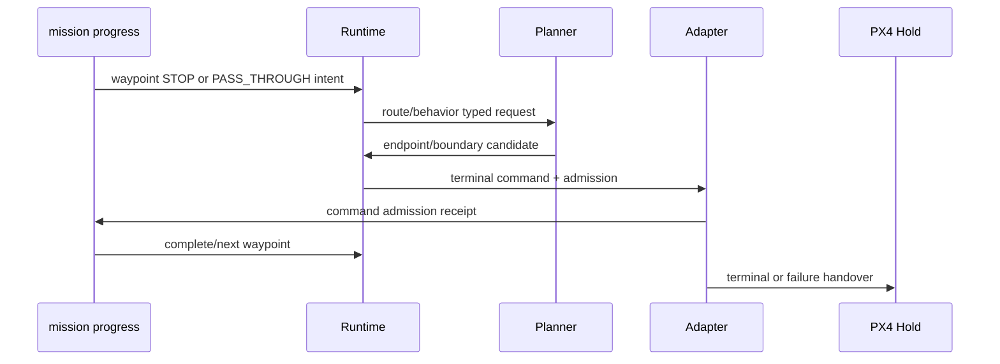

| step | actor | thread | input identity checked | output | deadline/budget (value + file:line) | failure disposition (file:line) |
|---|---|---|---|---|---|---|
| 1 | runtime candidate boundary | `planning_worker` | behavior STOP/PASS_THROUGH, declared endpoint | finite endpoint metadata | endpoint must be sampleable; no extra timing budget (`navigation_runtime_node.cpp:3132-3150`) | candidate rejected if endpoint invalid |
| 2 | PASS_THROUGH route boundary | `planning_worker` | route snapshot, junction, boundary stamp, MAIN role/containment | boundary witness | MAIN reserve `kMinimumMainReserveS` (`navigation_runtime_node.cpp:3152-3242`) | route boundary/main reserve rejection |
| 3 | adapter terminal sample | `adapter_mode_executor` | exact endpoint/odometry anchor and command identity | endpoint hold or recovery window | planner recovery 5 s (`navigation_mode_node.cpp:187-190`, `2485-2507`) | safety stop if endpoint not representable/anchored (`navigation_mode_node.cpp:2462-2480`) |
| 4 | mission receipt | `mission_timer` then adapter subscription | activation, mission/wp/request/bundle/sample identity | admission receipt; continuation witness | command lease 100 ms (`navigation_runtime_node.cpp:2786-2862`) | receipt ignored if identity/validity mismatches |
| 5 | complete/handover | `adapter_mode_executor` + handover timer | terminal authority and PX4 status | COMPLETE or Hold | handover timer 50 ms (`navigation_mode_node.cpp:2599-2620`) | completion calls `schedulePx4Hold` (`navigation_mode_node.cpp:2636-2649`) |

## 10. External Mode deactivate → reactivate

```mermaid
sequenceDiagram
  participant PX as PX4 mode manager
  participant E as Mode executor
  participant X as NavigationMode
  participant R as Runtime
  PX->>E: deactivate External Mode
  E->>X: onDeactivate
  X->>X: invalidate command and terminalize old activation
  PX->>E: activate External Mode again
  E->>X: onActivate
  X->>X: increment activation_id; publish ACTIVE
  R->>X: new command with activation/session identity
```

| step | actor | thread | input identity checked | output | deadline/budget (value + file:line) | failure disposition (file:line) |
|---|---|---|---|---|---|---|
| 1 | deactivate | `adapter_mode_executor` | current mode activation | mode inactive; command invalidated | no explicit deactivation deadline (`navigation_mode_node.cpp:877-905`) | late command rejected until new activation |
| 2 | activate | `adapter_mode_executor` | PX4 mode lifecycle | `mode_activation_id_++`, ACTIVE status | no explicit activation deadline; initial hold 5 s (`navigation_mode_node.cpp:821-875`, `183-190`) | overflow marks failure (`navigation_mode_node.cpp:851-855`) |
| 3 | state re-entry | `adapter_state_input_executor` | health/odometry epoch, sequence, frame | state snapshots retained but re-gated | state age 200 ms (`navigation_mode_node.cpp:829-835`, `1243-1252`) | missing health/state fails closed |
| 4 | runtime status | `runtime_default_callback_group` | activation ID and source/receive time | mission boundary session | 200 ms mode freshness in mission path (`navigation_runtime_node.cpp:2725-2742`) | old status ignored; mission state cleared (`navigation_runtime_node.cpp:2484-2521`) |

## 11. Heading rebind

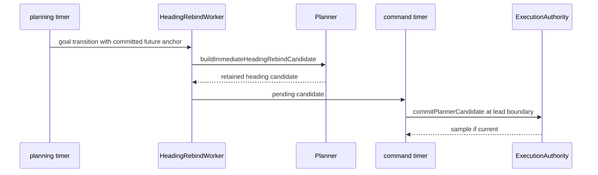

| step | actor | thread | input identity checked | output | deadline/budget (value + file:line) | failure disposition (file:line) |
|---|---|---|---|---|---|---|
| 1 | scheduler | `planning_timer` | goal transition, committed-future start mode, current generation | heading job | lead = 2 command periods + 2 commit guards (`navigation_runtime_node.cpp:3843-3851`) | missing execution/world/goal returns (`navigation_runtime_node.cpp:3811-3839`) |
| 2 | heading worker | `heading_rebind_worker` | route/request/epoch/goal and committed bundle | candidate with activation/valid-until | command period 20 ms and guard 20 ms (`planning_timing.hpp:13`, `17`) | candidate invalid/stop requested discarded (`navigation_runtime_node.cpp:3868-3879`) |
| 3 | handoff | `heading_rebind_worker` | candidate generation and heading mutex | `pending_heading_rebind_` | no independent solve WCET; `NOT_MEASURED` | exception discards retained candidate (`navigation_runtime_node.cpp:3881-3889`) |
| 4 | commit | `command_timer` | exact goal/request and candidate/world/anchor | staged or active candidate | commit guard 20 ms (`navigation_runtime_node.cpp:3912-3915`, `3064-3077`) | reject/discard generation (`navigation_runtime_node.cpp:3916-3925`) |

## 12. PX4 odometry: propagated → bridge → EKF2

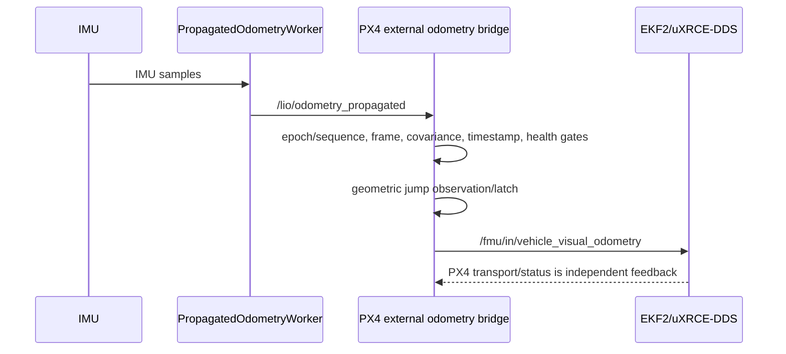

| step | actor | thread | input identity checked | output | deadline/budget (value + file:line) | failure disposition (file:line) |
|---|---|---|---|---|---|---|
| 1 | propagated producer | `propagated_odometry_worker` | strictly increasing source time; correction generation | typed propagated odometry | period from publish rate (`propagated_odometry_worker.cpp:28-35`); measurement `NOT_MEASURED` | skip publication on stale/replay/invalid estimate (`propagated_odometry_worker.cpp:553-608`) |
| 2 | ROS serializer | `lio_propagated` | public frame generation and sequence | `/lio/odometry_propagated` | no independent deadline (`ros_propagated_odometry_publisher.cpp:46-112`) | conversion/trace is diagnostic; publisher callback exceptions suspend producer |
| 3 | bridge ingress | `px4_external_odometry_executor` | epoch/sequence high-water before gates | candidate PX4 odometry | diagnostics source age <= 2 s (`px4_external_odometry_bridge_node.cpp:206-213`) | older sample rejects and new gated sample advances high-water (`px4_external_odometry_bridge_node.cpp:215-244`) |
| 4 | bridge gate | `px4_external_odometry_executor` | node/transport/timestamp/covariance/frame/LIO freshness/generation/jump latch | publication-ready decision | jump threshold is config, no WP-A3 timing budget (`external_odometry_gate.cpp:19-47`) | no PX4 publish while gate closed (`px4_external_odometry_bridge_node.cpp:314-339`) |
| 5 | PX4 transport | uXRCE-DDS/PX4 | NED frame and timestamp fields | `/fmu/in/vehicle_visual_odometry` to EKF2 | PX4-side EKF deadline not defined in product source (`NOT_DEFINED_AT_BASELINE`) | bridge only records transport/gate evidence; no local fallback |

## Thread/clock summary for the diagrams

- Runtime planning and command timers are `create_wall_timer` despite the node
  accepting `use_sim_time` (`navigation_runtime_node.cpp:1773-1783`). Adapter
  boundary and handover timers are likewise wall timers
  (`navigation_mode_node.cpp:299-300`, `2599-2600`).
- A solve has both simulation-time semantics and an authoritative steady deadline
  (`absolute_deadline.hpp:18-55`); this prevents a stalled `/clock` from extending
  optimizer CPU time.
- Runtime freshness pairs ROS source age with steady receive age
  (`execution_state_freshness.hpp:28-63`). The two clock values are not subtracted
  from each other.

## S13 — Initial plan from rest (`kStoppedMeasuredState`, 0 lần nhắc)

Đây là nhánh khởi tạo từ measured state khi chưa có command predecessor khả dụng.
`currentPlanningKey()` chọn `kStoppedMeasuredState` khi không có bundle hoặc khi
episode yêu cầu restart-from-rest; không có committed-future anchor hay renewal
nhắc lại trước đó (`navigation_runtime_node.cpp:3667-3683`).

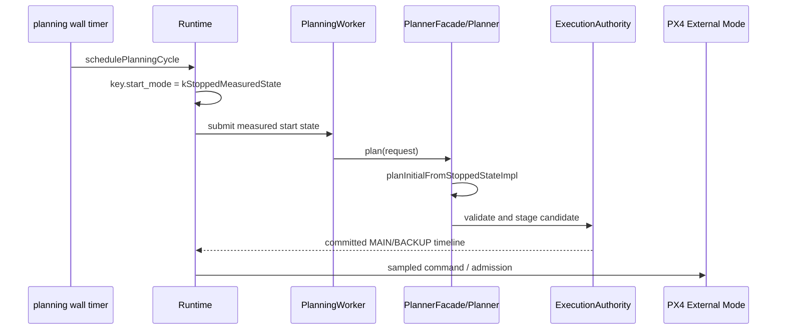

| step | actor | thread | input identity checked | output | deadline/budget (value + file:line) | failure disposition (file:line) |
|---|---|---|---|---|---|---|
| 1 | planning key | runtime planning callback, then PlanningWorker job | localization epoch, goal/request, pinned world and measured execution state | `kStoppedMeasuredState` key; zero predecessor anchor | scheduler 100 ms; key construction `navigation_runtime_node.cpp:3670-3687` | invalid key is not submitted (`navigation_runtime_node.cpp:3685-3687`) |
| 2 | worker admission | `PlanningWorker::worker_` | duplicate/supersession and stop token | serialized initial-plan job | solve 80 ms `planning_timing.hpp:11`; submit path `navigation_runtime_node.cpp:3765-3785` | cancellation/non-current key returns without commit |
| 3 | initial planner | PlanningWorker backend critical section | measured state/body support, immutable world, route/goal identity | nominal candidate or failure | A* 30/60 ms runtime config; typed solve 80 ms (`planner.yaml:196-203`, `planning_timing.hpp:11`) | `planInitialFromStoppedStateImpl` returns failure; no synthetic nominal command (`planner.cpp:1850-1877`) |
| 4 | admission/commit | PlanningWorker job after planner return | world/epoch/goal/lease and candidate identity | active or pending execution bundle | commit guard 20 ms; `commitPlannerCandidate` (`navigation_runtime_node.cpp:2933-2999,3330-3410`) | stale/rejected candidate is discarded; incumbent or fail-closed state remains |
| 5 | command exposure | runtime command callback then adapter ingress | bundle role/time, activation/session, state freshness | finite `NavigationCommand` or Hold | command period/lease 20/100 ms (`planning_timing.hpp:17-20`) | rejected command is not exposed; adapter retains/rejects per session gate |

## S14 — MAIN → BACKUP activation

S14 tách việc tạo bundle `MAIN+BACKUP` khỏi thời điểm command sampler thực sự
đi qua boundary. Role schedule được producer ghi trong candidate; sampler là nơi
quan sát role execution-side và phát `kBackupActivated` khi sample chuyển sang
BACKUP.

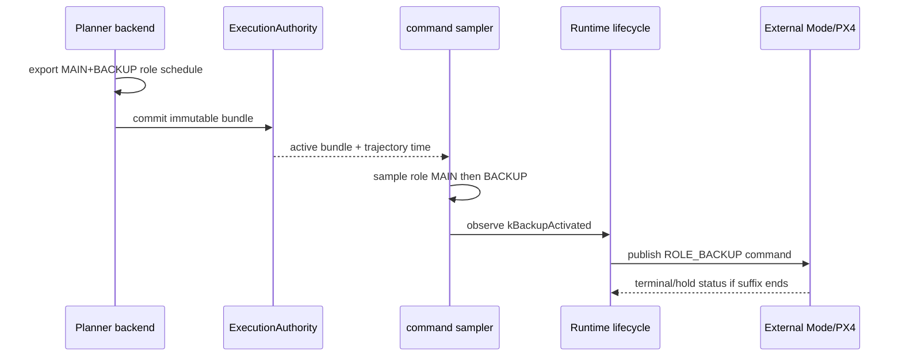

| step | actor | thread | input identity checked | output | deadline/budget (value + file:line) | failure disposition (file:line) |
|---|---|---|---|---|---|---|
| 1 | candidate producer | PlanningWorker backend | certified role schedule and `backup_available` | `CandidateRole::kMain` bundle with BACKUP intervals | no separate activation WCET; role export `planner.cpp:1072-1083` | invalid kind/role is rejected by `candidate_bundle.hpp:240-249` |
| 2 | execution commit | PlanningWorker backend/runtime commit path | exact world, generation, epoch, valid window | immutable active timeline | commit guard 20 ms (`planning_timing.hpp:13`; runtime gate `navigation_runtime_node.cpp:3064-3120`) | anchor/identity mismatch leaves incumbent and discards candidate |
| 3 | boundary sample | runtime command callback | trajectory time and sampled role; `sampledRoleAllowed` permits MAIN or certified BACKUP | sampled `kMain` or `kBackup` | command period 20 ms (`planning_timing.hpp:17`) | stale/missing sample does not advance role or command |
| 4 | recovery transition | runtime command callback | exact active goal, bundle generation, epoch and lifecycle | `kBackupActivated`, safety suffix ownership | no extra budget declared; transition at `navigation_runtime_node.cpp:9186-9213` | identity mismatch prevents lifecycle mutation |
| 5 | adapter publication | runtime command publisher → adapter mode executor | command role/activation/session, state freshness | PX4 BACKUP setpoint or Hold | command lease 100 ms, state age 200 ms (`planning_timing.hpp:19-20`) | old/invalid command is retained/rejected and mode fails closed |

## S15 — Measured-state emergency brake

S15 là đường one-shot bắt đầu từ trigger trong `validateRetainedCommand`, không
phải timer command độc lập. Trên baseline, trigger → `commitEmergencyBrake` →
`commitPlannerCandidate` chạy trong job của PlanningWorker; khoảng trigger tới
publish không có histogram trực tiếp. Vì vậy `max observed` của riêng S15 là
`NOT_MEASURED`; số planning p99/max trong CSV không được gán cho emergency path.

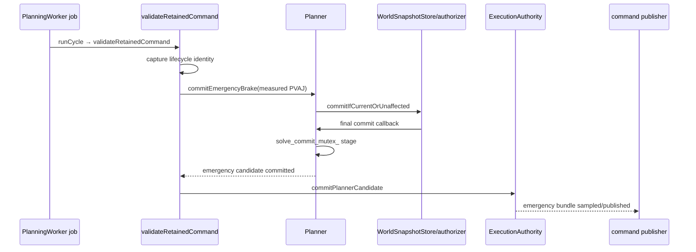

| step | actor | thread | input identity checked | output | lock scope / timing evidence | failure disposition (file:line) |
|---|---|---|---|---|---|---|
| 1 | trigger and capture | PlanningWorker `worker_` job; `backend_access_mutex_` held by worker, worker lifecycle `mutex_` released before job | goal/epoch/timeline/lifecycle snapshot | retained-command decision inputs | runtime `localization_transition_mutex_ -> input_mutex_ -> command transition` only during capture `navigation_runtime_node.cpp:7593-7613`; no direct trigger→publish measurement | superseded snapshot returns before expensive validation (`navigation_runtime_node.cpp:7614-7638`) |
| 2 | measured boundary | same PlanningWorker job | measured P/V, optional A/J, anchor error, freshness/world/role certificates | `emergency_command` | trigger at `navigation_runtime_node.cpp:8103-8141`; direct trigger→publish `NOT_MEASURED` | missing/invalid measured state or authorization does not commit |
| 3 | planner brake | Planner backend on same worker | finite PVAJ, steady/sim deadline, dynamic/yaw/flatness certificates | staged emergency candidate | `WorldSnapshotStore::publication_gate_` then callback `solve_commit_mutex_` (`planner.cpp:818-841`; `world_snapshot_store.hpp:137-153`); no runtime lifecycle lock acquired in callback | seed/dynamic/atomic admission failure (`planner.cpp:2762-2851`) |
| 4 | runtime store admission | PlanningWorker job after planner call returns | exact goal/epoch/world/lease/candidate identity | execution-owned emergency bundle | `commitPlannerCandidate` starts after planner return; input lock is acquired for identity checks (`navigation_runtime_node.cpp:2933-2999`) | boundary rejection clears candidate and rechecks owner (`navigation_runtime_node.cpp:8160-8171`) |
| 5 | publish | later command callback | active bundle, role, valid-until, state freshness | `STATUS_BRAKING`, `ROLE_EMERGENCY`, finite PVAJ | command publisher path `navigation_runtime_node.cpp:9490-9558`; no emergency-specific max in inspected evidence | stale/failed boundary is fail-closed; no nominal substitution |

## S16 — External Mode deactivate → reactivate and `mode_activation_id`

Mỗi lần `onActivate()` tăng `mode_activation_id_`; deactivation invalidates the
cached command and keeps late traffic rejected until activation mới. Vì vậy
command của activation cũ không thể được phát lại chỉ vì nó còn sống về thời
gian.

```mermaid
sequenceDiagram
  participant PX as PX4 mode manager
  participant X as NavigationMode
  participant R as Runtime
  PX->>X: onDeactivate
  X->>X: mode_active=false; invalidate cached command
  PX->>X: onActivate
  X->>X: mode_activation_id_++
  X-->>R: ACTIVE status with new activation_id
  R->>X: command tagged activation N-1
  X-->>R: reject old activation / retain previous
  R->>X: command tagged activation N
  X-->>PX: admit only current session
```

| step | actor | thread | input identity checked | output | deadline/budget (value + file:line) | failure disposition (file:line) |
|---|---|---|---|---|---|---|
| 1 | deactivate | adapter mode executor | current mode lifecycle | `mode_active_=false`, cached command invalidated | no explicit deactivation WCET (`navigation_mode_node.cpp:877-905`) | late trajectory cannot repopulate cache before re-entry |
| 2 | reactivate | adapter mode executor | PX4 lifecycle and activation counter | monotonic `mode_activation_id_++`, ACTIVE status | initial hold 5 s; increment `navigation_mode_node.cpp:821-875`, `:183-190` | counter overflow marks failure (`:851-855`) |
| 3 | command admission | adapter command callback under `trajectory_mutex_` | incoming activation, localization epoch, health/session identity | accept current or reject-retain old | session check `navigation_mode_node.cpp:1222-1242`; activation mismatch `command_admission_assessment.hpp:66-93` | old activation returns `kModeActivationMismatch`, does not refresh accepted command |
| 4 | progress/receipt | adapter subscription | `mode_activation_id`, mission/wp/request/frame and activation-time stamp | receipt only for current activation | `navigation_mode_node.cpp:1385-1403` | old activation is ignored before completion/handover |
| 5 | runtime status | runtime callback | status activation and terminal boundary | current session state only | status carries activation at `navigation_mode_node.cpp:355-375` | stale/foreign status cannot close current identity |

## S17 — Successor renewal with committed future anchor (400 ms stitch)

S17 chỉ nói về renewal của cùng execution predecessor với committed future
anchor; nó không gộp với S5 (scheduler/worker admission). Anchor là witness
được `ExecutionAuthority` reserve trước khi planner đổi state, không phải một
timestamp mutable do planner tự sửa.

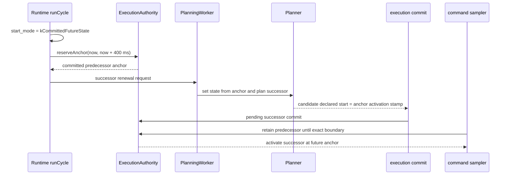

| step | actor | thread | input identity checked | output | deadline/budget (value + file:line) | failure disposition (file:line) |
|---|---|---|---|---|---|---|
| 1 | renewal preparation | PlanningWorker job via `runCycle` | active bundle generation, epoch, world identity | `kCommittedFutureState` request | stitch lead 400 ms `planning_timing.hpp:12`; arithmetic/reservation `navigation_runtime_node.cpp:5623-5645` | overflow, unavailable anchor, or mismatch rejects request (`:5627-5668`) |
| 2 | anchor binding | Planner backend | exact anchor PVAJ/yaw, activation stamp and localization epoch | planner state at future anchor | `planner.cpp:2473-2488` | missing anchor or failed state admission returns no bundle |
| 3 | successor solve | PlanningWorker backend | successor key, route/world/goal and committed predecessor | candidate with `declared_start_ns=activation` | solve 80 ms, commit guard 20 ms (`planning_timing.hpp:11,13`) | candidate with non-exact declared start is rejected (`navigation_runtime_node.cpp:3085-3096`) |
| 4 | pending commit | PlanningWorker job → execution store | `candidateMatchesAnchor`, generation, world and lease | pending successor; predecessor remains active | exact anchor gate `navigation_runtime_node.cpp:3107-3120`; future activation is queued `:3407-3409` | anchor mismatch keeps incumbent and discards successor |
| 5 | boundary activation | runtime command callback / Planner history handoff | sampled bundle generation and role; exact time boundary | successor becomes command authority | activation queue applied before next worker plan `navigation_runtime_node.cpp:3991-4007` | stale queue/generation is skipped; fail-closed synchronization on queue failure |

## Map: 12 kịch bản trong prompt gốc → S-id

| prompt scenario | S-id | boundary covered |
|---|---|---|
| 1. Chu kỳ nominal | S1 | planning/command cycle and nominal ownership |
| 2. Initial plan from rest | S2 | `kStoppedMeasuredState` initial admission |
| 3. Successor renewal, committed future anchor, 400 ms stitch | S3 | future-anchor successor handoff |
| 4. World revision mới → revalidate retained command | S4 | immutable world recertification |
| 5. MAIN → BACKUP activation | S5 | role schedule and safety suffix |
| 6. Measured-state emergency brake | S6 | measured boundary and one-shot brake |
| 7. Fail-closed → PX4 Hold | S7 | command failure containment and Hold |
| 8. Localization epoch reset | S8 | epoch reset and map drain |
| 9. Waypoint STOP / PASS_THROUGH, mission complete, handover | S9 | terminal boundary and handover |
| 10. External Mode deactivate → reactivate | S10 | mode lifecycle and session fencing |
| 11. Heading rebind | S11 | independent heading candidate handoff |
| 12. PX4 odometry: propagated → bridge → EKF2 | S12 | state transport to PX4 |

S13–S17 là các nhánh bổ sung của revision này: S13 initial-from-rest, S14
MAIN→BACKUP, S15 measured emergency, S16 activation fencing, và S17 committed
future-anchor renewal. S17 không thay thế S5; nó mô tả handoff semantics sau khi
S5 đã tạo job.
