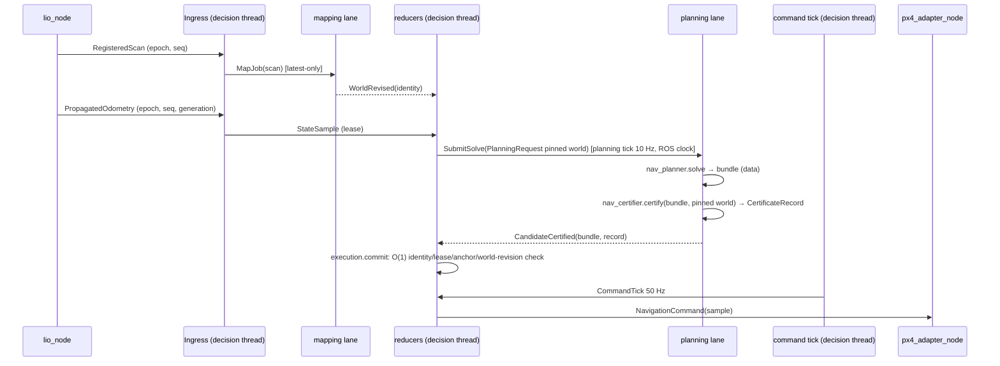

# A3 — Pipeline, timing và nhánh lỗi: hiện tại → đích

Baseline `main @ 7e0b850`. Hiện trạng chi tiết gồm 17 sequence (S1–S17), `threads.csv`, `lock_order.md` và `timing_budget.csv` nằm ở `docs/refactor/WP-A3/` (đã review; F-04/F-05/F-06 có verdict NO_CYCLE ở mức static). Tài liệu này chốt **pipeline đích** và **chính sách lane/clock/budget**.

## 1. Hiện trạng: những điểm quyết định thiết kế

| # | Sự thật trên baseline | Bằng chứng | Hệ quả cho thiết kế |
|---|---|---|---|
| T1 | Runtime có 5 luồng chạm cùng một object: `MultiThreadedExecutor(2)` + PlanningWorker + MappingWorker + HeadingRebindWorker | `navigation_runtime_main.cpp:6`; `navigation_runtime_node.cpp:1716-1720` | Đích: 1 decision thread + các lane (ADR-013) |
| T2 | Planning, command và mission tick là `create_wall_timer` trong khi freshness đo theo ROS/sim time. Adapter cũng dùng wall timer 50 ms | `navigation_runtime_node.cpp:1773-1783`; `navigation_mode_node.cpp:299` | Đích: mọi timer theo ROS clock (ADR-016) |
| T3 | Emergency brake chạy **trên thread PlanningWorker** (`runCycle → validateRetainedCommand → commitEmergencyBrake`), không có histogram trigger→publish | `navigation_runtime_node.cpp:6317, 7564, 8143`; WP-A3 S15 | Lane của emergency là quyết định có rủi ro. Giữ nguyên chỗ chạy cho tới khi đo xong (§4) |
| T4 | Retained recertification theo world mới cũng chạy trong `runCycle` (planning thread) | `navigation_runtime_node.cpp:6317-6318` | Như trên |
| T5 | Chu kỳ planner đo được p95 = p99 = max = 148 ms so với period 100 ms (E10); solve p99 = 24 ms (cùng run). Đây là overrun của **cả chu kỳ** chứ không phải của solve | WP-A3 `timing_budget.csv` (nguồn `runtime_evidence/2026-09-04/E10_*`) | Thời gian ngoài solve (diagnostic, recert, lock) đang ăn vào chu kỳ; đích phải tách chúng khỏi decision path |
| T6 | Mapping update p50/p95/max = 20/40/57 ms, không có budget nào | idem | Cần một budget cho mapping lane (đo trước, P0.2) |
| T7 | Tick cancellation được gọi khi đang giữ các lifecycle lock (F-04/F-05). Static NO_CYCLE nhưng có latency risk | WP-A3 `findings.md:51-113` | Đích: cancellation là một Effect được thực thi **sau** reducer, không giữ khoá nào |
| T8 | HG-001 trong ledger (A* 40/80, solve 180) lệch với code (30/60/80) | `runtime_safety_current.md:91`; `planner.yaml:199,203`; `planning_timing.hpp:11` | Chờ quyết định D1 (ADR-017) |

## 2. Kiến trúc thực thi đích của `nav_core_node`

```
                     ┌──────────────────── decision thread (SingleThreadedExecutor, ROS clock) ───────────────────┐
 ROS subs ──► Ingress gate ──► Event queue ──► Reducers (planning_policy · execution · mission) ──► Effects ──► ROS pubs
                                   ▲                                                        │
                                   │ results (immutable)                                    │ jobs (immutable)
         ┌─────────────────────────┴────────────┬───────────────────────────┬───────────────┴────────────┐
   mapping lane (1 thread)          planning lane (1 thread)          fast lane (1 thread)
   MappingActor.process → snapshot  solve(Request) → certify(bundle)  recertify(active/staged, world) ·
   publish WorldRevised event       → CandidateCertified/Failed       heading rebind · emergency synth+certify
```

Hợp đồng:
- Decision thread là **writer duy nhất** của state quyết định. Handler của decision thread không được block: không solve, không certify, không log ra IO đồng bộ lớn.
- Lane giao tiếp với decision thread qua hai loại queue:
  - **Job queue** latest-only theo `JobKey`. Đây chính là semantics hiện tại của `PlanningWorker` và `MappingWorker`.
  - **Result queue** MPSC.
- Mọi result mang identity đầy đủ: epoch, goal, request, generation, world. Reducer chỉ chấp nhận result mà identity còn hiện hành, còn lại là `DISCARD_STALE` và được ghi thành evidence.
- Cancellation là Effect `CANCEL_SOLVE(key)`, được thực thi sau reducer, qua cờ atomic của job. Không giữ khoá nào khi cancel.
- Khoá còn lại trong shell: mutex của event queue và của mỗi job slot. Mục tiêu tối đa 2 (P4 gate).

## 3. Pipeline đích theo kịch bản

### 3.1 Chu kỳ nominal (thay S1–S9)


### 3.2 World revision → recertify (thay S4 và phần recert trong `runCycle`)
`WorldRevised` → execution reducer phát `RECERTIFY_RETAINED(active, staged, world)` → lane chạy recertify → `RecertifyResult`, từ đó reducer chuyển sang một trong ba nhánh: *keep*, *suspend* (`WorldTemporalAssessment`), hoặc *activate backup / emergency / fail-closed*, theo đúng các rule `RT-*` của WP-A4.

**Lane:** giai đoạn P4a chạy trên planning lane, đúng thứ tự như hiện nay. P4b mới chuyển sang fast lane, và chỉ khi §4 cho phép.

### 3.3 Emergency brake (thay S15)
Execution reducer phát hiện điều kiện theo `measuredStateEmergencyMayReplaceCommittedCommand` và các predicate liên quan (A4 §4), rồi phát `EMERGENCY_BRAKE_PREPARE(measured PVAJ, boundary)`. Lane thực hiện synth rồi certify, trả về `EmergencyPrepared` hoặc `EmergencyFailed`. Reducer commit nếu identity vẫn hiện hành; nếu fail thì đi `FAIL_CLOSED → REQUEST_PX4_HOLD`. HG-031 (one-shot mỗi recovery episode) là state của reducer (A4 §2.1).

**Deadline:** hiện chưa có deadline riêng, đường này đang dùng deadline của planner. Đích là một deadline tường minh `emergency_prepare_deadline`. Giá trị lấy từ phân phối đo được ở P0.2, không phỏng đoán (AGENTS.md). Hết deadline thì `DeadlineMissed`, và reducer áp đúng đường `EmergencyFailed` như hiện tại.

### 3.4 Localization epoch reset (thay S11)
Hiện trạng: khoảng 60 dòng gọi tay tuần tự (`navigation_runtime_node.cpp:1905-1970`), phải unlock giữa chừng để drain mapping (`localization_epoch_reset.hpp:15-27`).

Đích: một event `EpochReset(epoch)`. Mọi reducer có handler riêng cho nó (A4 §2). Shell phát theo thứ tự các Effect `CANCEL_SOLVE(*)`, `RESET_LANE(mapping)`, `RESET_STORE(state)`. Mapping lane xác nhận bằng `LaneReset(epoch)`. Trước khi nhận xác nhận đó, reducer không chấp nhận `WorldRevised` của epoch mới. Hết cảnh unlock/relock giữa chừng.

### 3.5 Mission advance, completion và handover (thay S10, S13, S16)
Mission reducer nhận `StateSample`, `AdmissionReceipt`, `ModeStatus`, `CommandIssued`, rồi phát `ADVANCE_WAYPOINT` (đi vào planning policy thành một goal mới) hoặc `COMPLETE_MISSION` (publish `MissionProgress COMPLETE`). Adapter xử lý handover như hiện tại. Deactivate và reactivate làm đổi `mode_activation_id`; reducer execution từ chối mọi thứ của activation cũ (S16, giữ nguyên hành vi).

### 3.6 Odometry tới PX4 (thay S12)
`PropagatedOdometry(epoch, seq, generation)` đi vào `odom_bridge_core`. Tại đây: kiểm identity; đọc health typed (`/lio/health`: `navigation_valid`, `covariance_valid`, generation); kiểm continuity so với **anchor trước gap** (R-02, P6); sau đó publish `vehicle_visual_odometry`. Bridge bỏ phụ thuộc `/lio/diagnostics`.

## 4. Chính sách lane (quyết định D3 trong ADR-017)
1. **P4a: chỉ tách cấu trúc.** Chuyển logic vào reducer và lane nhưng **giữ vị trí thực thi hiện tại**: recert và emergency vẫn trên planning lane, đúng thứ tự như `runCycle` ngày nay. Gate: replay event log cho ra cùng chuỗi Effect.
2. **P4b: chuyển recert và emergency sang fast lane.** Chỉ làm khi đủ ba điều kiện:
   - (a) P0.2 đã đo được phân phối trigger→publish của emergency và thời gian recert;
   - (b) đo lại trên nhánh P4a cho thấy planning lane làm trễ emergency (queueing sau một solve lên tới 80 ms);
   - (c) thay đổi đi thành một commit behavior riêng, có ledger entry.
3. Mapping lane giữ `MappingActor` như hiện tại. Budget mapping (T6) là một key mới trong profile; giá trị lấy từ P0.2, gắn nhãn `PROVISIONAL`.

## 5. Budget đích (giá trị không đổi; chỉ đổi nơi định nghĩa)
| Budget | Giá trị đang chạy | Nguồn hiện tại | Đích (`nav_safety_profile`) | Enforce ở |
|---|---|---|---|---|
| planner period | 100 ms | `planning_timing.hpp:9` | `timing.planner_period` | planning tick (ROS timer) |
| solve deadline | 80 ms | `planning_timing.hpp:11`; `planner.yaml:44` | `timing.solve_deadline` (chờ D1) | planning lane, `PlanningBudget` (steady) |
| A* attempt / total | 30 / 60 ms | `planner.yaml:199,203` | `timing.astar_attempt` / `astar_total` (chờ D1) | planner |
| stitch | 400 ms | `planning_timing.hpp:12` | `timing.stitch_duration` | planning policy |
| commit guard | 20 ms | `planning_timing.hpp:13` | `timing.commit_guard` | execution reducer |
| command period | 20 ms | `planning_timing.hpp:17` | `timing.command_period` | command tick (ROS timer) |
| command lease (adapter) | 100 ms | `planning_timing.hpp:19` + pin `navigation_mode_node.cpp:255` | `lease.adapter_command` | adapter SetpointGuard |
| state age (adapter) | 200 ms | `planning_timing.hpp:20` + pin `:256` | `freshness.adapter_state_age` | adapter SetpointGuard |
| observation freshness | 500 ms | `mapping.yaml:22`; HG-006 | `freshness.observation_max_age` | ingress gate |
| planner watchdog | 1 s | runtime param | `timing.planner_watchdog` | planning policy |
| emergency prepare | — (chưa có) | — | `timing.emergency_prepare_deadline` (**đo ở P0.2**) | fast lane (P4b) |
| mapping update | — (chưa có) | — | `timing.mapping_update_budget` (**đo ở P0.2**, diagnostic) | mapping lane |

## 6. Clock domain (luật đích)
| Clock | Dùng cho | Cấm |
|---|---|---|
| ROS time (sim trong beta) | timer quyết định, source stamp, freshness/lease, activation time | — |
| steady | receive stamp, latency, `PlanningBudget` deadline của solve | so sánh với source stamp |
| wall | không dùng trong product | `create_wall_timer` trong product (có CMake/grep gate ở P4) |

Mọi timestamp trong domain type là `TimestampNs { int64 ns; ClockDomain domain; }`. So sánh khác domain là lỗi compile: operator chỉ được định nghĩa cho cùng domain.

## 7. Nhánh lỗi: bảng disposition đích
| Lỗi | Phát hiện ở | Effect đích | Hành vi hiện tại được giữ |
|---|---|---|---|
| State stale hoặc sai epoch | ingress gate | `REJECT_OBSERVATION` (+evidence); execution tick thấy lease hết hạn thì `FAIL_CLOSED` | có |
| World stale | execution reducer (`WorldTemporalAssessment`) | `SUSPEND_COMMAND`, sau đó `RESUME_COMMAND` hoặc `FAIL_CLOSED` | có |
| Solve fail hoặc timeout | planning lane result | planning policy: retry theo `classifyPlannerRenewal`; execution giữ command đã certify (HG-023) | có |
| Certify fail | planning lane | `CertificationFailed`; không commit (invariant 3) | có (hiện tại lỗi nằm trong backend) |
| Recert fail cho active | recert result | backup nếu suffix còn usable; không thì emergency; không thì `FAIL_CLOSED` | có |
| Emergency fail | lane result / deadline | `FAIL_CLOSED → REQUEST_PX4_HOLD` | có |
| Watchdog | planning policy | theo `watchdogTimeoutMayRetain*` | có |
| Epoch reset | ingress | `EpochReset` cho mọi reducer (§3.4) | có (tuần tự hoá lại) |
| Mode deactivate | ModeStatus | execution từ chối activation cũ | có |
| Evidence gap | judge | `NOT_EVALUABLE` | có (ở dạng typed) |
