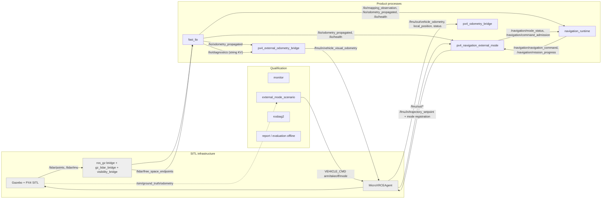

# KB-01: Kiến trúc tổng thể (hiện trạng `main @ 7e0b850`)

## 1. Bối cảnh hệ thống
- **Mục đích:** UAV multirotor bay tự hành theo mission waypoint. Dùng LiDAR Mid-360 + IMU, estimator FAST-LIO, bản đồ occupancy, planner MINCO có corridor và BACKUP braking. Điều khiển qua PX4 External Mode (px4_ros2).
- **Phạm vi beta:** chỉ SITL (Gazebo + PX4 SITL), theo ADR-016. Hardware bị khoá bằng `deployment_profile`, và `sitl` là profile duy nhất được phép khởi động (`docs/architecture/parameter_contract.md`).
- **Quy mô code first-party:** khoảng 200k LOC.

| Khối | LOC |
|---|---|
| Planning backend | 51k |
| Judge / runner (Python) | 42k |
| Runtime | 24k |
| Estimation | 21k (thêm 8k vendor) |
| PX4 boundary | 13k |
| Mapping | 13k (thêm vendor) |
| Execution / contracts | 8k |

## 2. Topology process (SITL)

| Process | Package | Vai trò | Thread chính |
|---|---|---|---|
| `fast_lio` | fast_lio_ros + fast_lio_core | Estimator duy nhất. Phát odometry propagated 50 Hz, corrected, RegisteredScan, health | executor 1 thread; `fast_lio_main`; `lio_propagated`; OpenMP ×3; ikd rebuild |
| `px4_external_odometry_bridge` | px4_odometry_bridge | LIO → PX4 EKF2 (external vision). Chuyển ENU/FLU sang NED/FRD, latch jump, gate | 1 thread |
| `navigation_runtime` | navigation_runtime + mapping + planning backend + execution | Mapping, world snapshot, lập lịch planner, execution authority, command 50 Hz, mission progress | executor 2 thread + 3 worker (mapping, planning, heading) |
| `px4_navigation_external_mode` | px4_navigation_external_mode | Nhận NavigationCommand, chạy guard, phát `TrajectorySetpoint`, xử lý handover PX4 Hold | main (setpoint 50 Hz); state-input; trace |
| `px4_odometry_bridge` (`px4_ingress`) | px4_odometry_bridge | PX4 → ROS: `/px4/estimator_odometry`, chỉ dùng làm evidence và prior | 1 thread |
| `robot_state_publisher` | — | TF tĩnh base_link → sensor (mount 0 0 0.28) | — |
| monitor, scenario, rosbag, report | tools/runtime | Điều phối SITL, arm/takeoff/activate, ghi evidence, chấm verdict | Python |

## 3. Lớp kiến trúc (đang tồn tại trong code)
| Lớp | Package | Hướng phụ thuộc thực tế |
|---|---|---|
| L0 common / contracts | navigation_common, navigation_contracts (msg + header có logic), navigation_planning (contract), navigation_world_model, navigation_mission | L0 ← mọi lớp. **Vi phạm:** contract header chứa logic nặng; `CandidateBundle` chứa closure (V4) |
| L1 estimation | fast_lio_core, fast_lio_ros, ikfom/ikd vendor | Không phụ thuộc lớp trên (tốt) |
| L2 mapping / world | navigation_mapping, rog_map_vendor (kèm `navigation_math`, V3) | Phụ thuộc L0 |
| L3 planning | navigation_planning_backend (planner_core, traj_opt, facade) | Phụ thuộc L0, L2 view |
| L4 execution / runtime | navigation_execution, navigation_runtime | Runtime include thẳng planner_facade và mapping (V1). Execution tốt, chỉ phụ thuộc L0 |
| L5 PX4 boundary | px4_navigation_external_mode, px4_odometry_bridge | Phụ thuộc L0; bridge phụ thuộc chuỗi diagnostics (V5) |
| L6 qualification | tools/runtime, tools/check_*.py, config/runtime | Tự dẫn xuất lại ngữ nghĩa C++ (V7) |

## 4. Điểm tốt cần giữ (tổng hợp từ 7 vùng)
1. Có **một** nơi tuyến tính hoá việc lộ command: `ExecutionAuthority::publishIfCurrent`. Nó dựa trên identity typed (epoch, goal, request, generation, world), có watermark transaction và finalize an toàn khi rollback.
2. **Snapshot world bất biến.** Identity fail-closed (epoch / generation / revision / stamp), gate publication đơn điệu, change history có giới hạn.
3. Toán lõi đã được review xác nhận đúng:
   - piece / Taylor / MINCO S4 và gradient;
   - Jacobian ESEKF point-to-plane; lever-arm và covariance;
   - chuyển đổi ENU/NED và FLU/FRD cho odometry gửi PX4;
   - DDA supercover;
   - certificate liên tục V/A/J bằng Sturm.
4. Certificate độc lập với penalty của optimizer. BACKUP seed minimum-snap tất định; refinement chỉ được phép rơi về seed.
5. Thời gian dạng `Timestamp` int64 ns có clock domain ở estimator; có hàm checked arithmetic.
6. Nhiều điểm mặc định fail-closed: mapping fail-stop, jump latch, PX4 Hold handover có retry.
7. Runner sinh param theo từng session, rồi kiểm "requested vs effective" qua log witness. `resolved_mission.yaml` là nguồn mission duy nhất.

## 5. Điểm xấu gốc: 6 root cause (khớp ARCHITECTURE_REVIEW)
| RC | Biểu hiện trong review lần này |
|---|---|
| RC1: shell ôm domain logic | `navigation_runtime_node.cpp` 9.9k dòng, khoảng 150 member, 6 mega-function. `Planner` 6.2k dòng, khoảng 80 member mutable bị đổi ngay giữa solve. `updateSetpoint` có CCN 119 |
| RC2: bên sinh tự chứng nhận | N5. Ngoài ra `PLANNER_CANDIDATE_REJECTED` luôn báo `kWorldChanged` (R1-40) |
| RC3: không có nguồn config duy nhất | 15 finding CONFIG, 51 CONFLICT. Mapping và flatness có default âm thầm (R6-20, R2-16). Freshness mỗi process một số (R7-08) |
| RC4: evidence dạng chuỗi | V5 / R5-09 (hai nguồn generation). Judge so ordinal (R7-31). 10 hàm percentile (R7-23) |
| RC5: biên estimator → PX4 mờ | R5-08 (S1), R5-17 (S1), R4-06, R-02 |
| RC6: giữ kiến trúc bằng quy trình | Static guard dựa regex / `assert` (R7-10..12) |

**Root cause mới làm rõ trong review này:**
- **RC7: nhiều định nghĩa cho cùng một đại lượng vật lý, lệch thời điểm.**
  - Anchor error raw và time-aligned so với cùng một limit (R3-11). Projected bound thiếu tuổi state (R3-10). Emergency lấy state ở source nhưng stamp lúc `now` (R3-09).
  - Tracking envelope dạng box ở adapter (R5-16).
  - Velocity body-frame bị coi là world-frame ở judge (R7-25).
  - Hướng xử lý: chỉ có **một** `TrackingAssessment` và **một** kiểu thời gian.
- **RC8: latch hoặc state không có đường thoát.**
  - Estimator không bao giờ gọi `reset()`, nên có ba ngõ cụt: IMU buffer bão hoà (R4-01), `state_time_` lệch trước lần prediction đầu (R4-12), map guard (R4-16).
  - `MappingActor` tự đầu độc (poison) ngay cả với outcome sạch (R6-04).
  - Hướng xử lý: mỗi latch phải có đường reset hoặc relocalize tường minh, kèm epoch bump.
