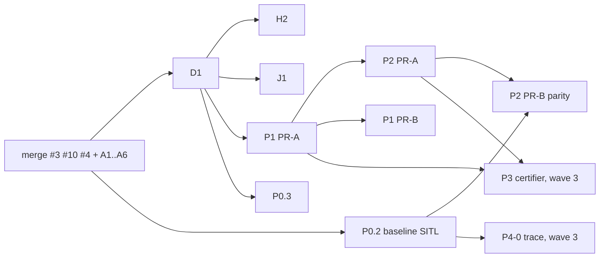

# Review wave 1 (R1) và kế hoạch wave 2: tổng công trình sư, 2026-09-29

## 1. Verdict PR (kiến trúc sư tự chạy lại checker ở head mới nhất)
| WP | PR | Head | Kiểm lại | Verdict |
|---|---|---|---|---|
| D0 | #3 | `6e531de` | docs-only; static + ledger PASS trên cây merge | **APPROVE: merge #1** |
| P0.1 | #10 | `a2e78ea` | chỉ CI/tooling/test (không có `src/`, `config/`); 10 guard PASS; Python 469 test OK (3 skip, Python 3.11) trên cây merge | **APPROVE: merge #2**. `ci-local` bất khả thi vì không pull được image; áp dụng D9 sửa đổi (ADR-017 §6.4) |
| H1 | #4 | `984ba55` | Python-only; suite PASS như trên | **APPROVE: merge #3** |
| A1-R1 | #9 | `47ea085` | `coverage_check`: semantic_rows = 801, failures = 0 | **APPROVE** (docs) |
| A2 | #12 | `d288341` | `validate_icd` PASS (12 msg, 17 channel); `extract_check` 46 site | **APPROVE** (docs) |
| A3-R1 | #6 | `bd919ac` | docs-only | **APPROVE** |
| A4-R1 | #5 | `76185b3` | `check_tables` PASS. Được chấp nhận như **exit-site index** (ADR-017 D4), không đòi R2 | **APPROVE** |
| A4 (bản trùng) | #11 | `a9f0a00` | trùng với #5, nằm ngoài review path | **CLOSE, không merge** |
| A5-R1 | #7 | `fab1717` | `check_tables` PASS (99 rule, 94 predicate, `source_changes=0`) | **APPROVE**: là oracle của P6 |
| A6-R1 | #8 | `e834516` | `check_constants` PASS (47/47 witness, literal 100%); 119 row; 4 pinned; đủ 7 dòng 0.15 | **APPROVE**: là oracle của P1 |

**Thử merge tuần tự** trên worktree cô lập theo thứ tự D0 → P0.1 → H1 → A1 → A2 → A3 → A4 → A5 → A6:
- 0 conflict; 0 file dưới `src/` hoặc `config/`;
- 10 guard + ledger PASS; `git diff --check` sạch;
- Python `Ran 469 tests … OK (skipped=3)`.

Log: `logs/static.log`, `logs/python.log`.

**Kiến trúc sư không có quyền push lên `main`.** Chủ dự án bấm merge trên GitHub theo đúng thứ tự trên, dùng **merge commit** (không squash) để giữ SHA của từng WP. Sau đó merge branch `docs/kb-wave2`. Branch này gồm tài liệu mới và việc dọn các tài liệu cũ.

## 2. ADR-017 rev 1: ACCEPTED
Chủ dự án đã cho triển khai. Amendment 1 (§6) bổ sung:
- D10–D14, H2, J1, P7;
- các điểm thu gọn thiết kế (3 package contract, 2 lane, evidence tối thiểu);
- sửa D9: gate native trên head SHA.

Sáu câu hỏi trong §6.3 (Q-HG001, Q-ENV, Q-VOX, Q-UNK, Q-TRK, Q-XTRK) vẫn chờ chủ dự án. Agent không được tự quyết các câu này.

## 3. Wave 2: giao việc
| WP | Prompt | Chạy khi | Máy |
|---|---|---|---|
| **D1** | `prompts/WP-D1.md` | **ĐÃ LÀM**: kiến trúc sư tự đưa lên trong commit docs của branch `docs/kb-wave2`. Không cần giao | — |
| **H2** (S1) | `prompts/WP-H2.md` | sau D1 | ROS Jazzy |
| **J1** | `prompts/WP-J1.md` | sau D1, song song với H2 | Python 3.12 |
| **P1** PR-A | `prompts/WP-P1.md` | sau D1, song song | ROS Jazzy |
| **P0.3** | `WP-P0.3.md` + `prompts/P0.3-ADDENDUM.md` | sau P0.1, song song | ROS Jazzy |
| **P0.2** | `WP-P0.2.md` + `P0.2-ADDENDUM.md` + `prompts/P0.2-ADDENDUM-2.md` | khi có máy PX4 SITL + Gazebo. Baseline **trước** H2/P1 | SITL |
| **P2** PR-A | `prompts/WP-P2.md` | sau khi P1 PR-A merge | ROS Jazzy |
| P1 PR-B, P2 PR-B | như trên | P1 PR-B: sau PR-A. P2 PR-B: sau P0.2 + P2 PR-A | SITL |

Mọi WP áp dụng `COMMON_CONTRACT_v2.md`.

## 4. Wave 3 (chưa giao; spec viết khi wave 2 xong)
- P3: certifier shadow (D5, D14).
- P4-0: trace tại các call site có effect.
- P4-1: checker map `RT-*` sang transition.
- P2b: D6 và D2(c).
- P6 (bridge/adapter/estimator): D10, D12, D13, R-02.

## 5. Rủi ro điều phối
- H2, P1.4b và P0.3 cùng chạm `src/px4/*`, nhưng khác file. Nếu vẫn có conflict thì PR merge sau phải rebase; không cherry-pick.
- P0.2 phải lấy baseline SHA **trước** H2, nếu không nó không còn là baseline. Addendum 2 §1 đã ghi rõ.
- J1 có thể làm đổi verdict của các run lịch sử. Mỗi thay đổi phải được giải thích bằng finding ID. Run nào chuyển PASS → FAIL phải được đưa vào debt trong ledger, không được giấu.
