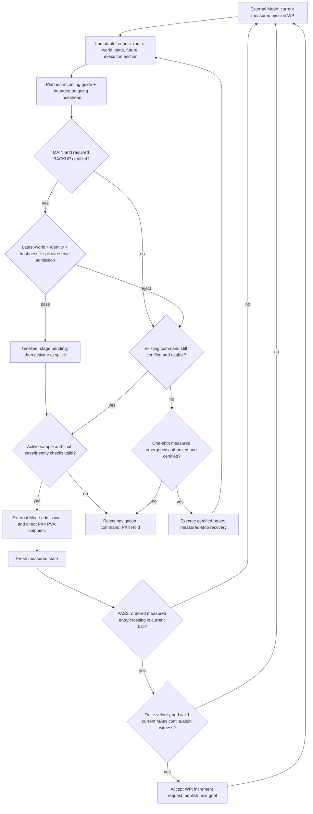
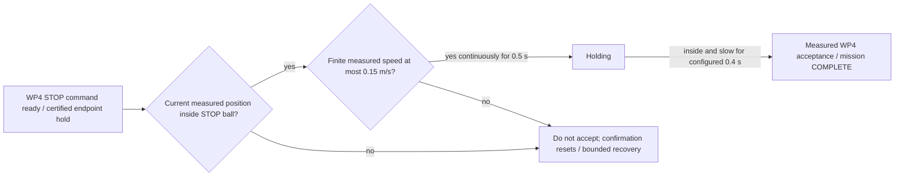
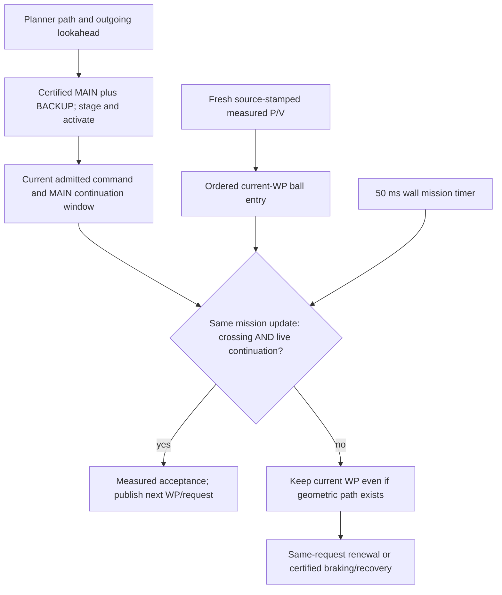
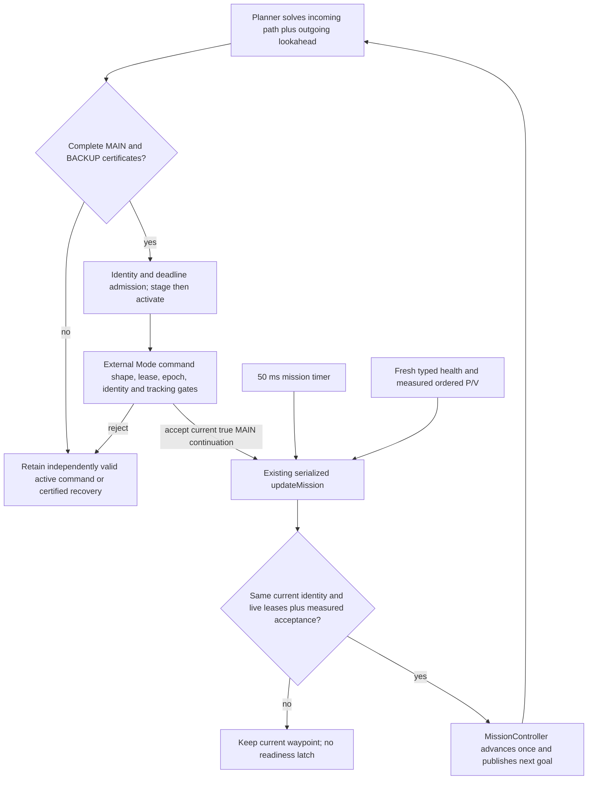
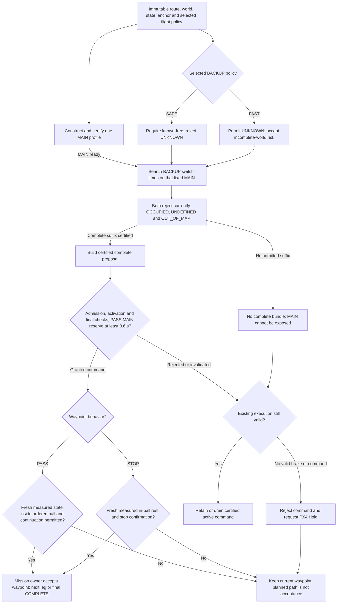
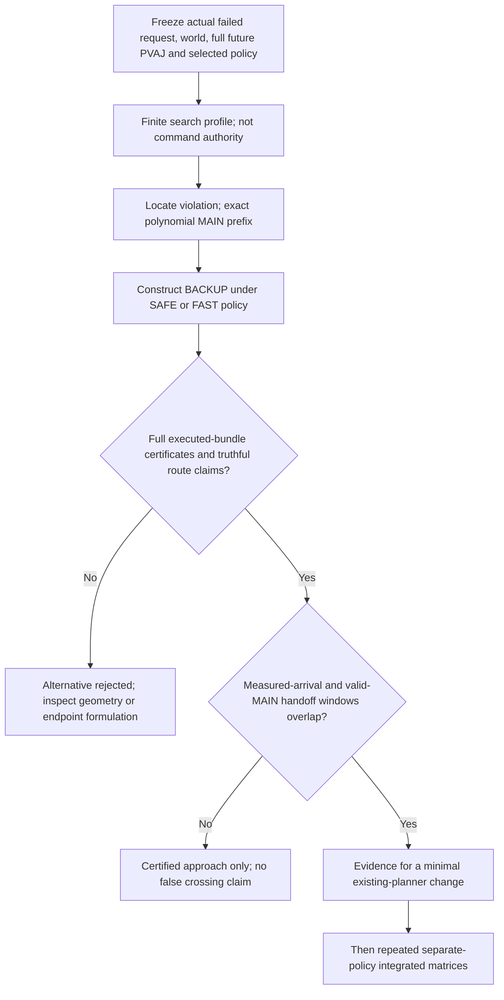
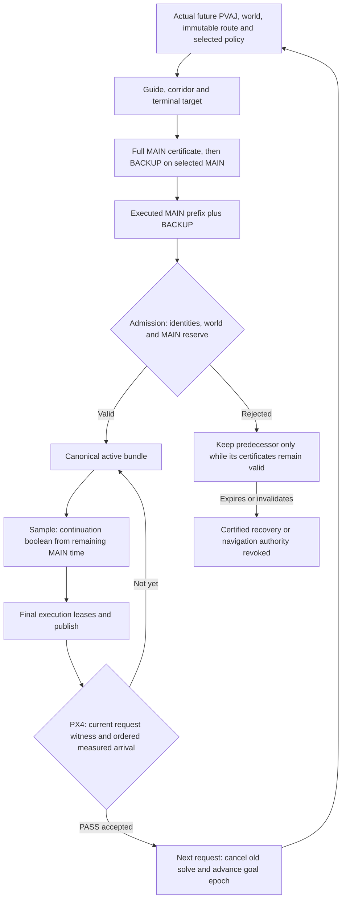
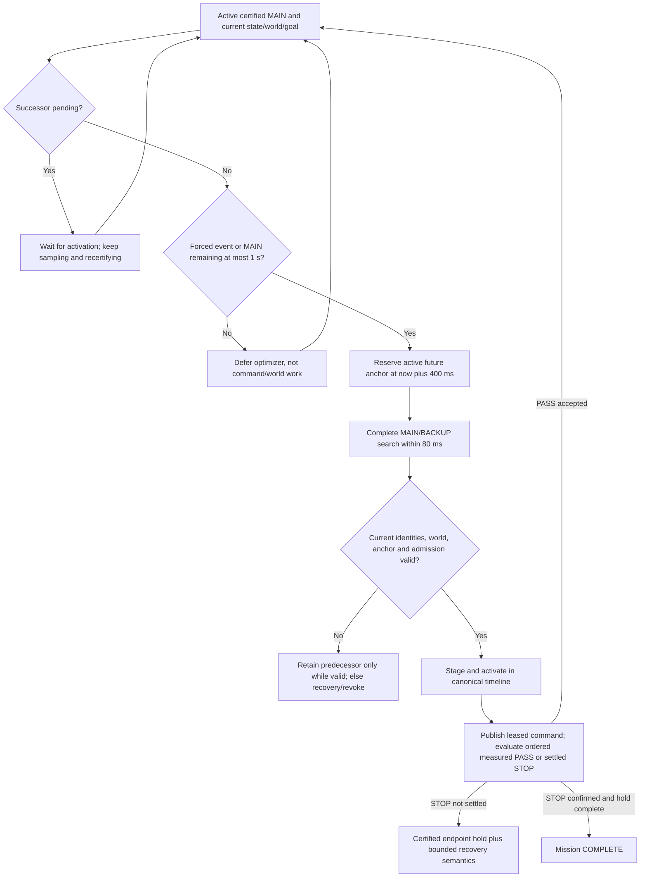
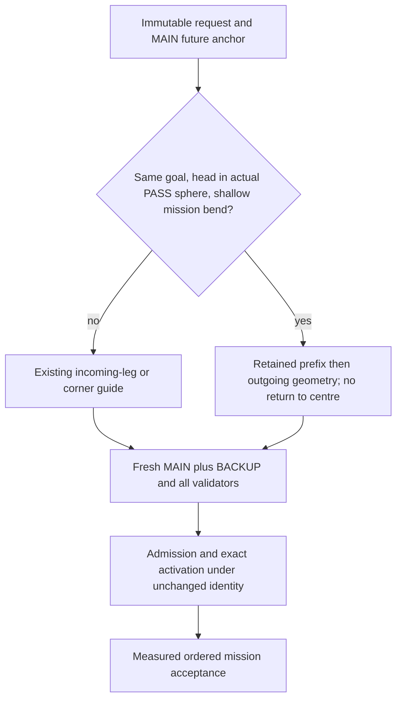
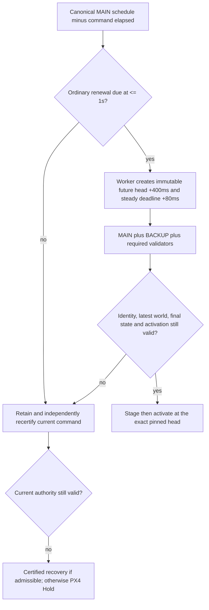

# Certified-iterate checkpoint and terminal STOP: 5 m/s diagnostic matrices

Date: 2026-09-17, Asia/Ho_Chi_Minh.

Latest integrated follow-up: the frozen Release on `90716e93` completed all18
sequential SAFE/FAST cases: **SAFE2/9mission COMPLETE, FAST3/9mission COMPLETE,
0/18report PASS**. Completion remains below a majority and no run qualifies.
This closes integration of the scoped unaccepted-MAIN guide repair; it does
not establish a causal completion-rate improvement. FAST9-r1 exposes a
non-overlapping measured-sphere/handoff window, including sampled nominal
positions outside the sphere before the handoff cutoff. Other failures include
estimator publication loss, current-world recertification and terminal
braking/tracking containment. The fixed solve cap alone cannot explain them.
See [the latest terminal matrix and temporal-contract review](#unaccepted-main-guide-matrix-closure-and-temporal-contract-review).
The earlier `8a775d128` SAFE1/9, FAST4/9 and `b2f25ab0` SAFE2/9,
FAST4/9 matrices remain separate below.

Historical integrated evidence: the explicit FAST/AllowUnknown matrix on `80020ed0`
completed all nine runs: **1/9mission COMPLETE,0/9report PASS**, three
ODOMETRY_STALE failures and five safety stops. The previous
`aedb4b96` SAFE/RequireKnownFree matrix remains a separate denominator:
**3/9mission COMPLETE,0/9report PASS**. Its WP3 case lost execution before
measured arrival, not after a valid in-ball rejection. The paired real-planner
fixture and policy-specific failure attribution preserve the two behaviors;
no planning/control decision or default gate was changed in `80020ed0`.
The FAST campaign does not demonstrate an improvement, qualify either mode,
or establish a statistical causal A/B conclusion. Historical rounds and every
unsuccessful outcome below remain separate; the stable smooth5m/s product
target is still unmet. Historical rounds below retain their original denominators;
the latest integrated closure is at the end of this report.

## Original checkpoint-round verdict

All nine requested simulations and their reports completed. Mission completion
was 1/9; report PASS was 0/9 (two FAIL, seven BLOCKED). Recorded collisions,
PX4 failsafes, mapping cloud loss and scenario-writer loss were zero in all
nine runs. None of this constitutes qualification or collision-free stopping
proof. The product target of stable, smooth 5 m/s movement remains unmet.

The checkpoint is reachable through the production MAIN/BACKUP admission
path, but nominal feasibility alone does not solve successor availability.
The matrix also separated a terminal mission-completion defect from planner
failure: 5WP repetition 2 reached the last goal and held it, yet timed out.

## Frozen inputs

- Navigation HEAD: `0cd68221b1de5c82028793d746c57daa037e7ad2`, dirty.
  Complete source fingerprint:
  `384664991067f9ef46106e508b47be27c0203657e964de323f36b3b10216abcc`.
  The dirty source includes the checkpoint, ownership-evidence correction and
  numerical replay diagnostics; results must not be attributed to HEAD alone.
- Authoritative Release manifest SHA-256:
  `dd769e7cd77acd62508086355f7cf9a7e0dbf8e8dac96ebc2bfc2c9936418ab6`.
- PX4 HEAD: `deaff86ee335dd697677bcfc2415a23878e1b895`, dirty;
  source fingerprint
  `25341a3df3acb2e557ef386affdf7a67f070603e924eb8107e8d291d22e2081f`;
  SITL binary SHA-256
  `e440bd77fbacdc422eaafdb168fec01554298d545f11e2b004a640b04e324ff9`.
  Each session separately captures mutable PX4 parameter/dataman inputs.
- Legacy positive profiles, motion preset `nominal`, seed 0, requested cruise
  speed override 5 m/s, V/A/J 5/5/8, visibility 40 m / 4,096 endpoints,
  ROS domain 42 and XRCE port 8892. No fault injection or tuning between runs.
- Tracking gates remain 0/0/0, the existing relaxed diagnostic policy. Its
  suppression of tracking, typed-health response and stopped-hold rejection
  prevents qualification. Lifecycle, reference lineage and acceptance-policy
  completeness also remain blockers, including in the completed mission.
- Simulations ran sequentially without concurrent builds/tests. Nominal
  snapshot capture was OFF. The sequencer was briefly held during postflight
  reporting for an isolated mission reproducer; no simulation was active then.
- The older 2026-09-16 matrix used motion preset `fast`, not `nominal`.
  It is historical context, not a paired performance A/B comparator.

Command template (repeat 1--3 for each profile):

```bash
env -u UAV_NAVIGATION_NOMINAL_SNAPSHOT_DIR \
  -u UAV_NAVIGATION_NOMINAL_SNAPSHOT_INCLUDE_WORLD \
  -u UAV_NAVIGATION_NOMINAL_SNAPSHOT_FAILURE_ONLY \
  python3 tools/runtime/runner.py external-mode-check \
  --map-profile PROFILE --speed-cap-mps 5.0 --map-seed 0 \
  --visibility-max-endpoints 4096 --visibility-range-max-m 40.0 \
  --ros-domain-id 42 --xrce-port 8892 --experiment-id RUN_ID
```

2WP uses `long_three_pillars_speed` (140 m straight terminal goal); 5WP uses
`long_three_pillars` (48 m outbound, orthogonal return to [41,0,3]); 9WP uses
`long_three_pillars_multiwaypoint` (alternating detours to [140,0,3]).

## Denominator-preserving results

All sessions are under `.artifacts/runtime/`. Accepted indices include the
takeoff origin WP0. Planning distributions cover recorded decision samples,
not every timer trigger. Certificate time is the maximum per-record aggregate,
not one validator call. Observed maxima and p99 are not deadline upper bounds.

| Case | Session | Report / outcome | Accepted | Planning p99/max ms (n) | Checkpoint selections / current records | Certificate aggregate max ms |
|---|---|---|---|---|---|---|
| 2WP-1 | `external-mode-check-20260917T011411-29321` | FAIL / COMPLETE | 0,1 | 50.488/50.488 (25) | 3/25 | 0.261 |
| 2WP-2 | `external-mode-check-20260917T011617-33729` | BLOCKED / PAUSED_SAFETY_STOP | 0 | 80.689/80.689 (8) | 0/6 | 15.008 |
| 2WP-3 | `external-mode-check-20260917T011748-37356` | BLOCKED / PAUSED_SAFETY_STOP | 0 | 69.060/69.060 (10) | 1/9 | 10.486 |
| 5WP-1 | `external-mode-check-20260917T011903-40949` | BLOCKED / PAUSED_SAFETY_STOP | 0 | 66.473/66.473 (10) | 0/7 | 4.060 |
| 5WP-2 | `external-mode-check-20260917T012031-44350` | FAIL / WALL_TIMEOUT | 0,1,2,3 | 86.635/86.635 (25) | 7/23 | 13.969 |
| 5WP-3 | `external-mode-check-20260917T013622-52473` | BLOCKED / PAUSED_SAFETY_STOP | 0 | 70.725/70.725 (1) | 0/1 | 10.134 |
| 9WP-1 | `external-mode-check-20260917T013728-56165` | BLOCKED / PAUSED_SAFETY_STOP | 0 | 80.275/80.275 (7) | 3/7 | 19.881 |
| 9WP-2 | `external-mode-check-20260917T013834-59591` | BLOCKED / PAUSED_SAFETY_STOP | 0 | 80.525/80.525 (6) | 2/6 | 17.180 |
| 9WP-3 | `external-mode-check-20260917T013936-62944` | BLOCKED / PAUSED_SAFETY_STOP | 0 | 80.261/80.261 (7) | 4/7 | 15.953 |

Completion by route: 2WP 1/3, 5WP 0/3, 9WP 0/3. Non-completion is retained as
2/3, 3/3 and 3/3 respectively; it is not removed from timing denominators.
The 91 current diagnostic records contain 20 checkpoint selections, 2,009
certificate calls and 274,121 us of certificate work. Sparse records are not a
complete optimizer-call census or a complete latency distribution.

| Metric | Per-run p99 range | Largest observed max |
|---|---|---|
| Mapping callback | 69.183--88.055 ms | 126.142 ms |
| Planning worker | 49.458--82.973 ms | 88.947 ms |
| World snapshot export | 15.577--18.340 ms | 22.027 ms |
| PX4 local-position setpoint source gap | Not reported as p99 | 32 ms; zero stale events |
| Propagated odometry source gap | Not reported as p99 | 28 ms; zero stale events |

Measured speed reached 6.004 m/s, while the largest setpoint speed was
4.967 m/s. These descriptive maxima include the entire captured run, including
braking/hover; tracking remains NOT_EVALUABLE. They are not a qualified
closed-loop envelope or evidence attributing error to LIO or PX4.

## Findings and next minimum changes

1. **CONFIRMED, integrated reachability:** In 2WP-1, checkpoint cycles 1, 73
   and 206 passed BACKUP and reached immediate admission or staging. The
   checkpoint is not an alternate authority path. In 9WP-3, cycle 27 selected
   a checkpoint but was rejected for `backup_dynamics`; cycle 28 subsequently
   staged generation 2, which activated at source 25.552 s. Cycles 25/26 had
   rejected at `no_complete_bundle_at_deadline`. Downstream gates still
   distinguish nominal feasibility from an executable proposal.
2. **CONFIRMED, successor availability remains open:** All three 9WP runs
   stopped before WP1 despite selected nominal checkpoints. Deadline and
   BACKUP failures must be classified separately. Do not enlarge the solver
   budget, weaken jerk limits or replace execution ownership from this result.
3. **CONFIRMED, terminal STOP predicate:** 5WP-2 accepted WP0--WP3, then held
   the final endpoint without COMPLETE. At source 243.968 s, LIO position was
   approximately [41.1963,-0.0178,2.8478] with speed about 0.0076 m/s. A
   deterministic test against the exact Release mission library reproduced
   non-completion at 0.249 m goal error inside its unchanged 0.8 m radius.
   `ExecutingWaypoint` applies `passThroughAcceptance()` to STOP as well as
   PASS_THROUGH; ordered projection selected earlier segment 0 and rejected
   STOP. An isolated one-predicate correction used geometric current-position
   acceptance for STOP, preserved measured-speed/confirmation/hold gates, and
   passed the reproducer plus all 43 existing mission tests. Canonical
   integration and fresh SITL evidence are separate follow-up work.
4. **CONDITIONAL, postflight report scaling:** 5WP-2 report generation consumed
   minutes of CPU after simulation cleanup. Its JSON is 168,320,320 bytes.
   Lifecycle reduction currently scans all authorizations for every publish;
   this is a quadratic candidate for a measured, parity-tested indexing change,
   not proof that it explains all report time. This cost is outside the command
   path. Profiling attachment was unavailable; the live worker was allowed to
   finish rather than restarted.

The opt-in snapshot discriminator
`external-mode-check-20260917T010955-24315` is separate from the nine-run
denominator: PAUSED_SAFETY_STOP, 0 selected checkpoints in 10 current records,
429 certificate calls / 50,760 us. Its preflight LiDAR source gap (10.8 to
11.4 s) does not establish causality for the final handover around 45 s.

After the matrix, canonical `make test` passed all 81 currently selected CTest
entries. The Python check ran 380 tests successfully with one explicit
artifact-dependent skip (379 executed passes), not 380 executed passes.

Architecture remains option A plus bounded ownership completion: retain one
timeline store and the existing execution episode. Fix the mission predicate
at its current External Mode owner and close complete-bundle availability and
evidence lineage with focused tests/replay. A new large coordinator or process
split is not justified by this matrix.

## Post-fix terminal STOP round

All nine fresh simulations **and** reports are terminal. Completion by route
is 2WP 1/3, 5WP 1/3 and 9WP 0/3. Non-completion is 2/3, 2/3 and 3/3,
respectively (66.7%, 66.7%, 100%; three repetitions are a small sample).
Report PASS is 0/9: three FAIL, six BLOCKED. There were two COMPLETE outcomes,
six PAUSED_SAFETY_STOP outcomes and one FAILED_COMPONENT outcome. The latter
is an odometry-lease rejection, not a permission failure. No failed run was
removed or replaced. This is not qualification or proof of stable/smooth
5 m/s operation.

### Frozen follow-up inputs

- Navigation: clean `14e7d367552004ca161420531824b4e6a49f1711`, source
  fingerprint `18e02b423b7ea8728aecd8a36902245201bfe9e1dadd85ef61d9cc3c64b08333`.
- Authoritative full Release manifest SHA-256:
  `74edfb7bcce8c97bcb9f7b4d7a44d975b28e79c97febd03c21efdc631769b7d3`.
  Each report's `provenance.manifest.source` and manifest digest match these
  values. Canonical build passed all 23 packages; mission tests passed 44/44,
  selected CTest entries 81/81, Python 379 executed passes plus one explicit
  artifact-dependent skip, and seven auxiliary tests passed.
- External PX4 remains the separately captured dirty source/binary described
  above: HEAD `deaff86ee335dd697677bcfc2415a23878e1b895`, source fingerprint
  `25341a3df3acb2e557ef386affdf7a67f070603e924eb8107e8d291d22e2081f`, binary
  `e440bd77fbacdc422eaafdb168fec01554298d545f11e2b004a640b04e324ff9`.
  Mutable parameter/dataman snapshots remain session-specific.
- Same profiles, positive case, `nominal` preset, seed 0, requested cruise
  5 m/s, MAIN V/A/J 5/5/8, visibility 40 m / 4,096 endpoints, DDS domain 42,
  XRCE 8892, no injected fault, nominal-problem capture OFF. BACKUP physical
  limits remain separate (12/12/30), not the MAIN control envelope.
- Sequential order: three 5WP, three 2WP, three 9WP. No concurrent build/test
  or behavior/configuration change. Small read-only artifact/source inspections
  occurred; this is not a claim of an otherwise workload-free machine.
- Tracking remains the existing relaxed diagnostic policy, including its
  documented suppressed gates. Every report assessment is NOT_EVALUABLE,
  evidence INCOMPLETE and qualification ineligible, with the same six blocking
  codes listed in the original round. Provenance VALID is not qualification.

The command template above applies with explicit `--test-case positive
--motion-preset nominal` and experiment IDs
`terminal-stop-matrix-{2wp,5wp,9wp}-r{1,2,3}-20260917`.

### Full follow-up denominator

Accepted indices below come from
`scenario.json.waypoint_acceptance_events[].accepted_waypoint_index`.
The event's `waypoint_index` is the **next** index; the ephemeral batch wrapper
used that field in its printed `accepted_waypoints`, so that printed list is
not the acceptance witness. No product recorder/reducer data was changed.

| Case | Session under `.artifacts/runtime/` | Report / outcome | Accepted | Planning p99/max ms (n) | Checkpoint selections / current records | Certificate aggregate max ms |
|---|---|---|---|---|---|---|
| 2WP-1 | `external-mode-check-20260917T015652-94541` | FAIL / FAILED_COMPONENT | 0 | 84.242/84.242 (33) | 5/29 | 18.507 |
| 2WP-2 | `external-mode-check-20260917T015841-98513` | BLOCKED / PAUSED_SAFETY_STOP | 0 | 81.768/81.768 (17) | 1/16 | 23.219 |
| 2WP-3 | `external-mode-check-20260917T020007-102032` | FAIL / COMPLETE | 0,1 | 80.195/80.195 (31) | 2/29 | 13.227 |
| 5WP-1 | `external-mode-check-20260917T015138-83125` | BLOCKED / PAUSED_SAFETY_STOP | 0 | 73.719/73.719 (11) | 0/10 | 2.921 |
| 5WP-2 | `external-mode-check-20260917T015251-86803` | FAIL / COMPLETE | 0,1,2,3,4 | 80.764/80.764 (24) | 2/24 | 16.963 |
| 5WP-3 | `external-mode-check-20260917T015438-90782` | BLOCKED / PAUSED_SAFETY_STOP | 0 | 80.351/80.351 (9) | 0/9 | 21.217 |
| 9WP-1 | `external-mode-check-20260917T020158-105668` | BLOCKED / PAUSED_SAFETY_STOP | 0 | 80.306/80.306 (7) | 3/7 | 23.265 |
| 9WP-2 | `external-mode-check-20260917T020304-108922` | BLOCKED / PAUSED_SAFETY_STOP | 0 | 80.479/80.479 (8) | 2/8 | 22.082 |
| 9WP-3 | `external-mode-check-20260917T020411-112209` | BLOCKED / PAUSED_SAFETY_STOP | 0,1,2 | 80.598/80.598 (22) | 6/22 | 18.907 |

The 162 decision-trace records include 154 current checkpoint-diagnostic
records, 21 checkpoint selections, 3,207 certificate calls and 408,806 us of
summed certificate work. These remain sparse captured records, not a census
of all solver jobs. Max certificate time is a per-record aggregate, not one
call. The nine separate `navigation_mapping.timing_distributions` report:

| Metric | Per-run p99 range | Largest observed max |
|---|---|---|
| Mapping callback | 61.332--108.986 ms | 144.086 ms |
| Planning worker | 37.467--82.683 ms | 87.199 ms |
| World snapshot export | 14.432--20.762 ms | 24.405 ms |

These maxima are not upper bounds. No paired ON/OFF overhead or causal
performance improvement is established by comparing the two rounds.

### Adversarial findings and next direction

1. **CONFIRMED, integrated STOP reachability:** 5WP-2 accepted WP0--WP4.
   Its final measured STOP acceptance was 0.182362 m error and 0.049766 m/s.
   `logs/external_mode.log:159`--`:171` show terminal hold, above-limit speed
   samples and eventual measured acceptance. The deterministic regression
   isolates the predicate change; this one integrated completion does not
   establish 3/3 availability or attribute all round differences to that fix.
2. **CONFIRMED, clearance rejection:** 5WP-3 reports minimum ground-truth
   collision clearance 0.078432 m at `long_three_pillar_03`, below its frozen
   `scenario.minimum_collision_clearance_m=0.1`. Recorded collisions, PX4
   failsafes, scenario-writer drops and mapping cloud drops are zero in all
   nine runs; zero collision does not erase this clearance failure. Root
   cause/which layer violated its assumptions remains INCONCLUSIVE without
   synchronized state/command/truth/world residuals. The relaxed policy's
   known suppression of tracking/health responses is not a qualified envelope.
3. **CONFIRMED, receive-age containment:** 2WP-1
   `logs/external_mode.log:131`--`:132` rejects generation 22 with
   `RECEIVE_STALE`, source age 164 ms and receive age 207.942 ms, then hands
   over to PX4 Hold. The report also records one active propagated-odometry
   source gap of 512 ms and wall-arrival gap of 637.962446 ms around the same
   interval (source 52.116 to 52.628 s; arrival wall
   1789610287480217380 to 1789610288118179826 ns). The external-odometry bridge
   separately records `DT_TOO_LARGE`. This supports a missing-update interval,
   not a proven LIO/DDS/PX4 root cause. PX4 setpoint source-gap max remains
   28 ms for this run, showing why output continuity alone is insufficient.
   External Mode already has a separate state-input thread; adding threads
   without dispatch/lock/resource attribution is not the selected fix.
4. **CONFIRMED, mixed availability failures:** In 9WP-1, accepted nominal
   candidates are followed by BACKUP swept-tube failures and MAIN deadline
   failures. `logs/mapping.log:306` records seed V/A/J approximately
   4.890/9.176/28.771, feasible under BACKUP 12/12/30, followed by
   `last_reject_stage=known_free`, failure 8 (`kCertificateTubeBlocked`), cell
   1 (`kUnknown`), role 1 (`BACKUP`). The coarse outcome `backup_dynamics`
   is not causal proof of a dynamics violation. Likewise optimized MAIN
   certificate stage 4 is `kDynamics`, not continuity/corridor failure merely
   because a finite corridor residual is logged. In 9WP-3, progress reaches
   WP2 before an actual later corner corridor rejection (0.01977 > 0.01),
   then invalid-window revalidation (failure 1, zero samples). The code alone
   does not establish the expiry cause; do not classify every stop as the same
   first-waypoint error.
5. **CONFIRMED, limited legacy freshness metric:**
   `NavigationMode::last_state_age_s_` is reset to -1 and read by periodic
   logging, but has no producer assignment in the current source. It is not
   measured decision-age evidence. The explicit freshness rejection and
   source/arrival witnesses above remain distinct authoritative observations.
   9WP-2 also has raw stream stale-event counts despite small source gaps;
   source-stale counts are zero there. Phase/observer-dispatch attribution is
   required before calling those sensor interruptions or dropping the events.

Architecture remains A plus bounded B. The next experiment must close the
complete MAIN/BACKUP/world readiness contract and measured corner/stop
tracking, alongside a source-to-use discriminator for the odometry interval.
Replay must separate geometric/numerical dynamics, UNKNOWN swept tube,
deadline and invalid-window admission. Preserve the 0.1 m clearance gate, the
5/5/8 MAIN and 12/12/30 BACKUP limits, stop gates and all failed runs. No large
coordinator, process split, budget increase, or additional fallback is
justified by this round. Evidence lineage/eligibility and representative
recorded-data/hardware validation remain open.

The temporary terminal-overlap source copies and binaries were removed after
canonical regression and integrated evidence were available. The committed
regression can reproduce the case; all runtime artifacts are retained. No new
parallel execution path or cleanup of user files was introduced.

## Completion-focused discriminator and architecture choice

The post-STOP denominator remains 2/9 complete, with report PASS 0/9.
Rechecking each terminal chain classifies six of the seven non-completions as
loss of a complete successor before the active execution ends, and one as an
odometry lease rejection. This is a terminal-mechanism census, not proof that
all six share one numerical root cause. The low clearance in 5WP-3 is a
separate safety failure, not the causal reason for its mission stop. The
completed 5WP-2 itself contains eight deadline-failure trace records, so a
single failed solve or sparse failure frequency cannot explain completion.

For 9WP, eleven trace records have an observed hard deadline, ten before
BACKUP begins. Durations below are differences of the same transaction's
steady stage stamps, not the cached `time_consuming_` fields:

| 9WP repetition | MAIN n / median / max ms | A* n / median / max ms | BACKUP n / median / max ms | Deadline records / before BACKUP |
|---|---|---|---|---|
| 1 | 7 / 43.930 / 77.740 | 7 / 2.360 / 12.360 | 4 / 2.340 / 4.270 | 3 / 3 |
| 2 | 8 / 61.870 / 77.840 | 8 / 2.290 / 16.140 | 4 / 3.760 / 7.390 | 4 / 4 |
| 3 | 22 / 36.020 / 76.580 | 22 / 2.670 / 22.760 | 11 / 8.700 / 14.300 | 4 / 3 |

This supports prioritizing complete-bundle readiness and the problem sent to
MAIN. It does not justify an executor/process rewrite, making BACKUP optional,
raising budgets, or treating A* as universally negligible: 2/5WP A* tails reach
about 66 ms. BACKUP also fails strict known-free swept tubes even when its
V/A/J is within its separate physical limits.

### Exact-current 9WP capture

Clean observational commit `ab5b4c58b9a6061a73c802ce84e68cc7bcebcdb3`, Release
manifest `7b950aba1b595f1b064b3f4afb336ba6ee43ad7bbf49bf7fa9ca248545e88514`,
source fingerprint
`dd7a9c37a716dd161510e946db2fa3f2d0a288fd6edcea52f277ba6832259eb6`
ran `completion-readiness-9wp-discriminator-20260917` under the same nominal
5 m/s/seed-0 scenario. World capture was ON, unlike the nine-run baseline;
therefore this is not a matched performance/completion comparison. Session
`external-mode-check-20260917T022857-134431` was BLOCKED /
PAUSED_SAFETY_STOP, accepted only WP0 and stopped near [8.71,1.35,3] before
WP1 [20,5,3]. It does not demonstrate improved progress or completion.

The snapshot directory
`.artifacts/runtime/completion-readiness-9wp-discriminator-20260917`
contains ten written snapshots from eleven submissions, one dropped, zero
pending/write errors. The sidecar's accounting COMPLETE / capture_complete
means accounting was finalized; its writer_capture_complete_at_process_stop
is false. **The capture is not lossless.** Replay findings apply to identified
written problems, not a complete solve census.

The source-to-use observation is integrated: 534/534 PX4-update records are
usable, 427 distinct states, zero missing/invalid records or epoch mismatch.
Observed receiver-mutex wait max is 0.000916 ms and receive-to-snapshot max
25.387104 ms. This rejects a receiver-mutex bottleneck **in this run only**;
it does not explain the older 512 ms odometry interval or prove DDS/producer
latency/PX4 acceptance. Instrumentation overhead has no paired OFF/ON bound.

### Historical proposal: ready-first mandatory feasibility (now withdrawn)

Claim: when no certified seed exists, waiting until the optional-refinement
cutoff before preserving a fully certified accepted iterate can exhaust the
budget needed for BACKUP/world finalization. Strong counterargument: checking
every iterate early can itself consume the deadline. The old frozen 5WP
snapshots 13--15 distinguish these conditions:

| Frozen problem | Old 40/80 result / cert calls / aggregate us | Naive 0/80 result / calls / us | Weight-independent screen, 40/80 result / calls / us |
|---|---|---|---|
| 13, cycle 161 | candidate / 2 / 344 | candidate / 197 / 17322 | candidate / 9 / 984 |
| 14, cycle 162 | candidate / 78 / 6409 | deadline / 241 / 19774 | deadline / 0 / 0 |
| 15, cycle 163 | candidate / 68 / 5674 | deadline / 281 / 21407 | candidate / 1 / 257 |

These are serial individual probes, not statistical timing bounds. Preserve
the unfavorable problem 14: the new screen removes wasted certification but
the first search attempt can still exhaust 80 ms before reaching its retry.

In current 9WP snapshot 1 / cycle 21, the existing 40/80 path fails after
about 1,880 evaluations and 118 certificates (11,175 us aggregate). The new
40/80 path selects attempt 1 / iteration 8 after eleven evaluations, one
certificate (681 us). Snapshot 6 / cycle 27 likewise selects iteration 9
after eleven evaluations and one certificate (754 us). Both pass optimized
nominal corridor/route/V/A/J/flatness and offline world checks, with unchanged
boundaries/limits. Their MAIN durations are about 16.09 and 17.74 s: readiness
does not establish smooth sustained 5 m/s. Recovery snapshot 7 / cycle 83
still exhausts 80 ms, zero certificate calls, no candidate. Every replay has
`complete_executable_bundle=0`; no BACKUP/admission/lease is invented.

The implementation keeps objective cost/gradient/weights unchanged. It
records raw acceleration/jerk maxima from the already computed samples and
uses product limits plus the existing numerical boundary policy to reject
definitely invalid iterates cheaply. Only the independent full nominal
certificate can select a checkpoint; all downstream gates remain mandatory.
The future-cutoff regression fails on old source and passes after this change,
along with mandatory-feasibility, cancellation and expired-hard-deadline cases.
Canonical Release build passed (23 packages); `make test` exited zero with
selected component suites, 386 Python tests (one explicit artifact-dependent
skip) and seven runtime auxiliary tests. Adversarial diff review found no
concrete P1/P2 bypass or checkpoint identity incoherence. An earlier build
compiled all packages but provenance rejected a concurrent report edit; it
was rerun on fixed source. At this stage integrated verification was pending;
the completed matrix below rejects promotion of the early-return proposal.

### Remaining structural work, kept separate

- **CONFIRMED input defects / conditional completion impact:** current capture
  guide lengths reach 25.341 m against a 20 m local-window contract. Some
  guide suffixes fold; some initialized junctions repeat a position with
  nonzero durations. Seed jerk ranges about 7,058--125,434 m/s³. Correct
  ordered guide geometry and coherent point/time allocation before tuning
  solver throughput; do not infer every deadline was caused by the fold.
- **DESIGN_DEBT:** `SimplifySFC` bypasses compaction for the entire chain if any
  route gate exists. Gate-aware compaction must preserve marker order,
  metadata, the incoming boundary-point overlap and representable transitions,
  not merely pairwise overlap. Exploratory regression tests confirmed the
  blanket behavior but were removed when this separate implementation was
  deferred; no new dead tests, coordinator, fallback or command path remains.
- **EVIDENCE_GAP:** complete successor readiness must be evaluated jointly
  with strict known-free BACKUP reachability, active remaining horizon,
  state/truth tracking and clearance. Completion is the primary operational
  denominator; faster MAIN or a diagnostic PASS cannot substitute for it.

The selected behavior change must finish with a clean Release repeated
2/5/9WP matrix, three runs each at 5 m/s, snapshots OFF, unchanged gates and
configuration. Recorded-data/hardware validation and qualification eligibility
remain outstanding; no small successful replay closes the product goal.

## Ready-first integrated matrix: proposal rejected

All nine sequential runs completed on clean
`c3d7c841f598a67411cb090df394cdbfe33e383f`, authoritative Release manifest
`a1d3d25412f9e7e44cc822b344c653898ec5247f118624aadec3c38d1a4cd7cc`,
source fingerprint
`2eb082a5419b1b4d42c6735d18e695ab43a419a0b1d6261dd18c2c4b6fab1968`.
All nine provenance statuses are VALID. PX4 source/dirty checkout and binary
identity are unchanged from the prior round; its binary remains
`e440bd77fbacdc422eaafdb168fec01554298d545f11e2b004a640b04e324ff9`.
Every captured planner config has SHA-256
`6480ff9679e20c3d5f9f5a38efbe7702d9ca98e66c454299019b423d5d298356`.
Positive/nominal profiles, seed 0, requested 5 m/s, 40 m / 4,096 visibility,
DDS 42 / XRCE 8892, MAIN 5/5/8 and BACKUP 12/12/30 are unchanged. Snapshots
were OFF, no concurrent build/test/replay or gate tuning occurred. The order
was 9WP-1 as the integrated discriminator, 2WP-1--3, 5WP-1--3, then 9WP-2--3.

| Case | Session | Report / outcome | Accepted | Planning p99/max ms (n) | Checkpoints / trace records | Certificate calls / total us / max aggregate us |
|---|---|---|---|---|---|---|
| 2WP-1 | `external-mode-check-20260917T024743-158989` | FAIL / FAILED_COMPONENT | 0 | 54.073 (32) | 31/32 | 34 / 7030 / 421 |
| 2WP-2 | `external-mode-check-20260917T024928-163383` | BLOCKED / PAUSED_SAFETY_STOP | 0 | 31.506 (5) | 5/5 | 6 / 1360 / 438 |
| 2WP-3 | `external-mode-check-20260917T025037-167222` | BLOCKED / PAUSED_SAFETY_STOP | 0 | 22.399 (9) | 9/9 | 10 / 2219 / 426 |
| 5WP-1 | `external-mode-check-20260917T025156-170962` | BLOCKED / PAUSED_SAFETY_STOP | 0 | 73.122 (11) | 2/11 | 3 / 694 / 390 |
| 5WP-2 | `external-mode-check-20260917T025336-174950` | BLOCKED / PAUSED_SAFETY_STOP | 0,1,2 | 68.152 (11) | 4/11 | 5 / 1972 / 1073 |
| 5WP-3 | `external-mode-check-20260917T025623-179594` | BLOCKED / PAUSED_SAFETY_STOP | 0,1,2,3 | 102.563 (19) | 11/19 | 17 / 5050 / 836 |
| 9WP-1 | `external-mode-check-20260917T024625-154562` | BLOCKED / PAUSED_SAFETY_STOP | 0 | 80.338 (51) | 9/51 | 12 / 4352 / 1086 |
| 9WP-2 | `external-mode-check-20260917T025849-184062` | BLOCKED / PAUSED_SAFETY_STOP | 0 | 80.197 (17) | 13/17 | 13 / 5207 / 837 |
| 9WP-3 | `external-mode-check-20260917T030006-187886` | BLOCKED / PAUSED_SAFETY_STOP | 0 | 64.171 (9) | 4/9 | 4 / 1419 / 481 |

Completion is 0/3 for each route, 0/9 overall; report PASS 0/9, FAIL 1,
BLOCKED 8. Sparse trace totals are 164 records, 88 checkpoint selections,
104 certificate calls and 29,303 us certificate work. They do not represent
every solve or an all-job timing distribution. Much less certification work
and faster individual planning records did not improve mission completion.
The 102.563 ms observed planning maximum is retained, not hidden by a nominal
80 ms configured solve budget or a p99-only claim.

All nine scenario captures are complete with zero writer drops, mapping cloud
drops, recorded collisions and PX4 failsafes. Observed minimum clearances
range 0.447258--5.307079 m; this is not a stopping/physical safety proof.
The execution-timeline invariant counter is missing in three reports
(9WP-1, 5WP-2, 5WP-3), not zero by inference. All runs are ineligible with the
six existing qualification blockers; some additionally have incomplete
tracking position/velocity sources. Diagnostic tracking 0/0/0 remains active.

### Low-level causes and counterarguments

- **2WP-1:** explicit receiver odometry lease rejection: source age 164 ms,
  receive age 205.229 ms (`external_mode.log:128`). The prior post-STOP 2WP-1
  had the same receiver-side mechanism. Producer/IMU, FAST-LIO, transport and
  callback starvation remain indistinguishable from the captured witnesses;
  do not attribute this to the receiver mutex or LIO algorithm.
- **2WP-2/3 and 9WP-2/3:** complete successor loss includes strict known-free
  BACKUP rejection. In 9WP-3, two explicit batches contain eight and four
  feasible braking seeds within BACKUP 12/12/30, with zero known-free passes
  (`mapping.log:305,324`). Last V/A/J in the four-seed batch is
  4.682/8.526/26.274; its blocked cell is UNKNOWN at (12.3,2.1,2.9), role
  BACKUP, time 0.327808 s. Aggregate visibility reception cannot distinguish
  missing tube observation from discretization/body support/reset effects. The coarse
  `backup_dynamics` reason is not a physical-dynamics diagnosis. Five
  `input/invalid_input` trace records there also require producer-contract
  discrimination; stale cached stage timings are not fresh solve durations.
- **5WP-1:** MAIN dynamics/corridor failures persist before the first outbound
  goal. A shorter solve duration is not proof of feasibility.
- **9WP-1:** 41 final trace records are fresh recovery attempts (stage MAIN
  stamps are present) rejected by final MAIN route-regression certificates,
  approximately 0.9--1.0 m against unchanged 0.5 m tolerance. They are not a
  proven world-identity race: `PLANNER_CANDIDATE_REJECTED` maps generically to
  `world_changed/commit_recertification`. Local nominal seed certificates
  succeed, often by stretching MAIN to about 28 s, but final command route
  authorization fails. There is no route-rejection feedback that repairs the
  next seed; repeatedly returning a nominal-only baseline is not bundle-ready.
- **5WP-2:** stopped recovery plus MAIN route/corridor rejection and world
  occupancy rejection, not a reproduced geometric STOP predicate bug.
- **5WP-3:** terminal capture exists inside the goal radius, followed by
  execution/publish rejection before measured STOP confirmation. An initial
  `TRACKING_EXPERIMENT_BYPASS` reports anchor error 0.815 > 0.750 m, but the
  final publication boundary independently enforces the hard 0.750 m support
  limit. That is a reachable policy/containment distinction, not permission
  to suppress the final check. The exact final state/transition witness is
  still needed before claiming one unique causal latch. PVA stale is the
  receiver containment response, not itself the upstream cause.

The suspected sampler gap after declared end but before bundle lease expiry
is **not confirmed in production**: runtime candidate admission and store
renewal clamp the bundle lease to the declared endpoint. PVA `valid_until`
is a separate egress deadline, not that bundle lease. No sampler behavior
change is justified by that timestamp comparison.

### Decision and next leverage

Withdraw early checkpoint return before the refinement window. Retain the
weight-independent raw A/J necessary screen, with unchanged full certificates
and all hard gates. A single favorable nominal replay is insufficient to
promote early return after 0/9 integrated completion. The prior 2/9 round and
this 0/9 round are not a paired OFF/ON statistical causality proof.

After withdrawal, canonical Release build passed all 23 packages (33.6 s)
and `make test` exited zero: all selected CTest entries passed, 386 Python
tests included one explicit artifact-dependent skip, and seven runtime
auxiliary tests passed. Independent read-only artifact audit matched all nine
rows and denominators. These are component/build results, not a new integrated
completion measurement of the withdrawn source.

Next change should normalize the existing guide boundary rather than add a
coordinator or more conditions: one execution-anchor time origin; ordered
collision-checked geometry without folds or duplicate-position/nonzero-time
junctions; bounded route-window accounting; and seed/readiness semantics that
include the actual route contract needed by the complete MAIN/BACKUP bundle.
Keep the terminal measured-state/hold authority case separately reproduced.
Do not increase solve budget, allow UNKNOWN BACKUP, tune jerk weights, widen
anchor/acceptance tolerances, or treat telemetry/partial progress as success.

## Coherent guide boundary: implementation and component evidence

The existing planner now owns one anchor-relative ordered point/time sequence
and one spatial-window accounting path. The hot guide starts at immutable
anchor elapsed zero; every retained future sample keeps `sample_tt - anchor_tt`,
including its actual first positive delay. The anchor edge is counted before
A* search. Returned routes are clipped by actual polyline length rather than
the straight goal chord. A corner entry is selected on the incoming guide by
arc length, with aligned time interpolation and the old suffix removed; it
cannot be extrapolated behind the penultimate sample. Outgoing geometry is
capped by remaining window while the required envelope remains unchanged and
incomplete when insufficient. No coordinator, extra command path, tuning or
hard-gate relaxation is introduced.

The initial full test rejected two facade route-event fixtures. Their fake
world mapped all grid coordinates to zero and manufactured a 3 m descent/
climb in a horizontal route; actual-length clipping exposed it. Correcting
the declared 0.2 m voxel transforms and relocating the synthetic BACKUP-only
event volume retained the same tight radius, first-entry-after-MAIN and role
assertions. A voxel round-trip regression now protects that fixture contract.

Final Release build passed 23 packages (15.8 s), full `make test` exited zero:
all 83 selected CTest entries passed; 386 Python tests included one explicit
artifact-dependent skip; seven auxiliary tests passed. Planner config passed
75 cases, including five guide-boundary cases; facade passed 17. Independent
diff review found no concrete P1/P2 bypass. These tests do not prove improved
completion or fix strict BACKUP visibility, terminal tracking or odometry loss.
The clean repeated integrated matrix below has its own SHA/manifest and all
nine results. Component correctness is not a completion improvement claim.

## Normalized-guide integrated round: systemic completion review

All nine simulations **and** reports are terminal. Two missions completed:
5WP-2 and 9WP-3. The other seven are six PAUSED_SAFETY_STOP and one
FAILED_COMPONENT. Report verdicts are three FAIL, six BLOCKED, zero PASS.
A report FAIL must not be counted automatically as mission non-completion:
both COMPLETE runs fail the evidence/qualification assessment. Conversely,
partial waypoint progress is not COMPLETE.

### Frozen inputs and denominator

- Navigation: clean `4a6369d338506dd4cb4864b8a9f89dd77530df60`, source
  fingerprint `e091e06a7e5637732e74a6e0cc2a2a1ed9aca0fb10b6831206258fcdcafd3e52`.
- Authoritative 23-package Release manifest SHA-256:
  `2cf81e62ab8d320bd1c7f1b785cdda26c0fba09994142a977a78814fc94652c7`.
  The post-commit clean build completed in 9.92 s. All nine reports record
  this manifest/source and VALID provenance, not qualification.
- All nine captured `planner.yaml` files have SHA-256
  `6480ff9679e20c3d5f9f5a38efbe7702d9ca98e66c454299019b423d5d298356`.
  Positive/nominal, requested 5 m/s, seed 0, MAIN V/A/J 5/5/8, BACKUP
  12/12/30, visibility 40 m/4096, DDS 42/XRCE 8892 are unchanged.
  PX4 has the same separately captured dirty HEAD/source/binary stated
  above; its mutable parameter/dataman snapshots remain per-session inputs.
- Nominal snapshot capture OFF; sequential order 9WP-1, 2WP-1--3,
  5WP-1--3, 9WP-2--3. No concurrent build/test/replay, tracked-source edit,
  injected fault or gate/tuning change during the matrix. Small read-only
  inspections occurred; this is not an otherwise workload-free-machine claim.
- IDs: `normalized-guide-4a6369-5mps-{2wp,5wp,9wp}-r{1,2,3}-20260917`.
  Use the earlier command template with explicit positive/nominal arguments.

Accepted indices below are
`report.json.mission_outcome.acceptance.waypoint_acceptance_indices`, not
published goal indices or the scenario's next-waypoint field. Sessions are
under `.artifacts/runtime/`. Planning samples are captured decision durations,
not all triggers or solver-only durations; p99/max are not deadline bounds.

| Case | Session | Report / outcome | Accepted | Planning p99/max ms (n) | Checkpoints / records | Certificate aggregate max ms |
|---|---|---|---|---|---|---|
| 2WP-1 | `external-mode-check-20260917T032129-223352` | FAIL / FAILED_COMPONENT | 0 | 80.119/80.119 (30) | 3/30 | 0.502 |
| 2WP-2 | `external-mode-check-20260917T032321-227164` | BLOCKED / PAUSED_SAFETY_STOP | 0 | 80.086/80.086 (9) | 0/9 | 0.000 |
| 2WP-3 | `external-mode-check-20260917T032430-231058` | BLOCKED / PAUSED_SAFETY_STOP | 0 | 56.550/56.550 (19) | 3/19 | 0.290 |
| 5WP-1 | `external-mode-check-20260917T032600-235030` | BLOCKED / PAUSED_SAFETY_STOP | 0,1,2 | 80.368/80.368 (24) | 6/24 | 0.539 |
| 5WP-2 | `external-mode-check-20260917T032754-238676` | FAIL / COMPLETE | 0,1,2,3,4 | 82.018/82.018 (26) | 9/26 | 0.424 |
| 5WP-3 | `external-mode-check-20260917T032953-243355` | BLOCKED / PAUSED_SAFETY_STOP | 0 | 55.973/55.973 (10) | 4/10 | 1.181 |
| 9WP-1 | `external-mode-check-20260917T032010-219652` | BLOCKED / PAUSED_SAFETY_STOP | 0 | 66.332/66.332 (8) | 5/8 | 0.485 |
| 9WP-2 | `external-mode-check-20260917T033127-247127` | BLOCKED / PAUSED_SAFETY_STOP | 0,1 | 80.364/80.364 (19) | 6/19 | 0.400 |
| 9WP-3 | `external-mode-check-20260917T033305-250648` | FAIL / COMPLETE | 0,1,2,3,4,5,6,7,8 | 122.899/122.899 (48) | 10/48 | 0.598 |

Sparse totals: 193 decision records, 46 checkpoint selections, 64 certificate
calls and 16,102 us summed checkpoint certificate work. Certificate aggregate
max is per record, not one validator call. All nine capture-complete flags
are true, scenario-writer/cloud drops and recorded collisions are zero, and
PX4 failsafe flags are false. Observed minimum-clearance values range
0.121171--3.868828 m; this is not collision-free stopping proof. Timeline
invariant counts are missing in 2WP-2, 5WP-1, 5WP-2 and 9WP-3; the other
five report zero. Missing values remain missing, never an inferred zero.

All runs remain relaxed diagnostic/ineligible, with NOT_EVALUABLE assessment,
INCOMPLETE evidence and the six core qualification blockers listed above;
2WP-2 and 5WP-1 additionally lack complete tracking-position/velocity sources.
No hardware, recorded-data or C0 acceptance has been established.

### Decisive boundaries, counterarguments and leverage

The seven non-completions have one explicitly matched odometry-lease loss and
six planner/execution-continuity losses. This identifies the failed boundary,
not seven uniquely proved underlying causes. Multiple rejection types can
coexist; later successful commits mean an earlier rejection alone is not a
sufficient causal explanation.

1. **Complete-proposal readiness, not nominal convergence.** 2WP-3 rejects
   an optimized MAIN with V=5.0333/5 and J=9.3710/8
   (`logs/mapping.log:428`), then repeatedly fails to replace generation 11.
   5WP-1 rejects J=9.7146/8 although corridor residual 0.004202 is within
   0.01 (`mapping.log:656,662`); it stops after accepting WP2, not all goals.
   9WP-2 reaches WP1, then repeats MAIN deadline rejection before WP2
   (`mapping.log:502,517,547`). These are distinct dynamics/availability and
   budget boundaries; a coarse failure enum is not a numerical root cause.
   Even COMPLETE 5WP-2 has repeated final MAIN route-regression rejection
   near 1.5667 m against 0.5 m (`mapping.log:598,610,624,636`) after a local
   nominal seed certificate. Therefore final route/BACKUP readiness must
   inform seed construction; merely returning nominal incumbents sooner is
   not an adequate architecture. Next review: continuous ordered
   guide-to-overlap junction selection and coherent per-piece seed timing,
   tested on exact frozen inputs before changing costs, budgets or gates.
2. **Stopping tube and observed-free support must be designed together.**
   2WP-2 has batches of 7/7, 7/7 and 5/5 physically feasible BACKUP seeds
   with SFC hull passes but zero known-free passes (`mapping.log:322,329,342`),
   including UNKNOWN at (22.9,-0.7,3.1). 5WP-3 similarly ends with 6/6
   feasible seeds/hull passes and 0/6 known-free at (23.9,-0.7,2.9), BACKUP
   t=0.317506 s (`mapping.log:357`); it is not solely a MAIN failure.
   9WP-1 has the same boundary and then a retained recovery endpoint outside
   WP1 acceptance. Earlier/later MAIN failures and successful stages remain
   in the traces. The exact origin of those UNKNOWN cells is EVIDENCE_GAP;
   visibility endpoint counts alone do not prove the braking tube was seen.
   Next discriminator must compare the actual swept body/reaction/braking
   tube with observation support, grid semantics and world lineage. Do not
   permit UNKNOWN, inflate map uniformly by guess, or raise BACKUP limits.
3. **Estimator observability and validated prediction continuity.** In
   2WP-1 the direct External Mode input becomes stale
   (`external_mode.log:147`, wall 1789615370.163107692): source age 164 ms,
   receive age 207.044 ms, generation 22. The exact state-use witness reuses
   sequence 2619/source 56.296 s. Diagnostics at source 56.300/56.424 s show
   DEGRADED, `INSUFFICIENT_TRANSLATIONAL_OBSERVABILITY`, navigation/corrected
   validity false and correction rejects 1 then 2; IMU/LiDAR ingress continues,
   queue overflow is zero and replay is false. Tracking recovers at 56.820 s.
   `fast_lio_ros/src/propagated_odometry_worker.cpp:342--367` suppresses
   publication unless the main estimator is TRACKING/navigation-valid and
   no transition/correction/replay is pending. This strongly supports that
   policy mechanism for the direct state gap, not CPU congestion or the
   reason observability was lost. External Mode subscribes directly to
   `/lio/odometry_propagated`; the separate PX4 odometry bridge's
   `DT_TOO_LARGE` appears later and is containment, not its upstream cause.
   Underlying observability loss and per-message skip attribution remain
   INCONCLUSIVE. Next review must distinguish correction rejection from
   demonstrably bounded prediction uncertainty, with recorded-data and
   fault evidence. Do not lower observability thresholds, call unhealthy
   state healthy, extend freshness or assume PX4 GPS is a navigation fallback.

### Whole-system decision

Keep one implementation path and existing owners. The normalized guide is a
necessary input-contract repair, not the completion solution. Compared with
the separate post-STOP 2/9 round, total completion is still 2/9; 9WP now has
one complete run but 2WP has none. Same deterministic scene/seed does not
make these scheduler-dependent runs a paired statistical A/B. Current
9WP-3 completes with planning max 122.899 ms, while 2WP-3 and 5WP-3 fail
with maxima below 57 ms: reducing one timing number cannot by itself secure
completion. Hard deadlines and containment remain mandatory.

Run-wide speed must use `external_mode.speed_metrics`, not the final
`planning.execution.maximum_velocity_mps` snapshot. In COMPLETE 5WP-2,
setpoint maximum/p95 are 4.900114/4.722138 m/s (2679 samples), measured
maximum/p95 5.615598/4.800785 m/s (2844). The final planner diagnostic is
1.600849 m/s and is **not** the whole-run maximum. COMPLETE 9WP-3 has
setpoint maximum/p95 4.950888/4.898737 m/s and measured maximum/p95
5.794046/5.148808 m/s. These include braking/hover and are descriptive,
not a matched tracking proof or stable/smooth 5 m/s qualification.

Priority is joint executable-proposal reliability (ordered seed plus actual
MAIN/BACKUP/route contract), observation-supported stopping continuity, and
estimator-state continuity under a validated uncertainty envelope. Optimize
small hot-path costs or extract a coordinator only after evidence says they
limit these outcomes. No new coordinator, process split, alternate publisher,
fallback or hard-gate relaxation is justified by this round.

## Continuous overlap junction follow-up (nine-run diagnostic closed)

The next bounded repair normalizes geometry/time together at the existing
optimizer setup owner, rather than tuning solver cost or extracting authority.
The current-guide discriminator `external-mode-check-20260917T034028-259405`
is separate from the nine-run matrix: requested 5 m/s, positive/nominal,
`long_three_pillars_speed`, same seed/config/visibility, snapshot/world capture
ON. Navigation clean `08cb9d3fbc9c535f72f36b69c41bc0219355b210`, source
`692472f228aa8fa161e24a9f8fe33e6d041998d6937525b70b74ca4a0895c531`, Release
manifest `0bd58069607e92c75a216ca243e09ed95b65c51fc1d701cea6d8042893d4964e`.
Outcome COMPLETE, accepted [0,1], report FAIL and qualification ineligible.
This refutes universal straight-route infeasibility, not prior failures or
the product target. Capture produced 30/30 submitted snapshots, zero drops,
errors or pending records. The runner finalized COMPLETE accounting after
process stop; writer completion at process stop remained false, so this is
not independently graceful writer closure.

In 26/30 frozen inputs, initialized junctions differ from their discrete
guide references. Cycle 1 has a guide near y=-0.1,z=3, but its overlap
[7.0,7.2] contains no discrete sample: nearest x=5.7 is outside. Setup
therefore uses overlap interior (7.1,-1.5,3.1), while retaining the time at
x=5.7. The same guide **edge** intersects the overlap. An analytic optimizer
regression against pre-optimization state fails before the repair with
1.4 m lateral, 0.1 m vertical and 0.3 s timing error. Solver convergence is
deliberately not the test oracle; this run nevertheless completed, so the
defect alone does not explain every non-completion.

The repair preserves an existing sampled junction already inside its overlap,
with its coherent sample time. If discrete lookup misses that intersection,
it clips ordered guide chords by overlap halfspaces, projects the
interior onto the feasible chord fraction, and interpolates position/time
at that fraction. Continuous guide coordinates retain mission-gate phase
and order. Existing interior fallback remains when no ordered chord
intersects, but an empty/reversed sample interval cannot silently reuse an
old index. Mission boundary override and all independent final certificates
remain. No limits, costs, deadlines, UNKNOWN, freshness, execution or mission
gates are relaxed. Six analytic projection tests and the optimizer
before/after regression pass; the existing sparse-gate timing test also passes.
Independent diff review found no concrete P1/P2 authority/certificate bypass.

Frozen current 2WP snapshots 0/6/17 (cycles 1/106/263) replay serially with
exact config. At 40/80 ms, cycles 1 and 263 return nominal candidates; cycle
106 remains unavailable, without a hard-deadline failure. The cycle-1
isolated baseline used 714 objective evaluations; the repaired replay used
278, with nominal duration 4.250264 s versus 4.119645 s. This is one
discriminator, not a timing distribution or completion improvement. Its
zero-refinement case also increases effort (60 to 201 evaluations), so do
not claim uniform performance gain. Frozen raw construction and independent
numerical checks remain in the replay; some deterministic boundary witnesses
still reject even when the production optimized-candidate certificate passes.
Every replay still reports `complete_executable_bundle=0`, and its world
verdict is non-authoritative (no complete role/BACKUP/admission transaction).

The first full-test attempt rejected unrestricted projection at three
optimizer fixtures and one facade fixture, including high-speed certified
corridor availability. Moving already-valid sampled junctions unnecessarily
changed the optimization basin. The revised source limits continuous lookup
to discrete containment misses and retains valid sampled geometry/time and
the existing sampled outgoing gate split. Existing success/dynamics/corridor
assertions and tolerances are not weakened. The isolated replay numbers above
belong to the unrestricted prototype, not the revised source; they must be
rerun before drawing conclusions about it.

The revised prefer-valid-sample source passes canonical Release build (23
packages) and `make test` (exit 0). Optimizer XML has 24 tests/zero failures,
config XML 81/zero and facade XML 17/zero; the four fixtures rejected by the
prototype now pass unchanged. Python runtime contracts: 386 tests, one
existing artifact-dependent skip, zero failures. A sixth analytic fixture
also confirms arithmetic failure leaves output point/time/coordinate intact,
so a failed projection cannot corrupt the sampled fallback. Read-only
adversarial review rejected its earlier mission-boundary time finding:
geometry and reference are both overridden to the producer-owned guide
boundary before its time is assigned; no concrete P1/P2 bypass remains.

Revised-source exact-config serial replays at 40/80 ms return nominal
candidate/unavailable/candidate for cycles 1/106/263, with objective
evaluations 386/264/823. Cycle 1 duration is 4.123666 s; optimized and
independent deterministic certificates pass. Cycle 263 duration is 4.781459 s
and both certificates pass. At 0/80 ms, cycle 1 uses 31 evaluations and
retains an independent boundary rejection; cycle 263 uses 653 and passes.
Cycle 106 remains unavailable at both budgets without a deadline failure.
No executable bundle or authoritative world/role/BACKUP/admission proof is
created by these replays; no general latency or completion gain is claimed.

A fresh clean capture-OFF nine-run matrix is required before judging
integrated benefit. Observation-supported stopping and estimator-state
continuity remain separate unclosed product requirements. The declared
`aist-mid360-drive` registry/config exists but its prepared local ROS2 bag
does not; recorded-data verification is not silently counted as performed.

### Retained continuous-guide matrix

All nine sequential capture-OFF runs finished on clean navigation
`82ef05ca161a18cf4d0e0dfd40ad257ec6a87509`, requested 5 m/s, positive/nominal,
three-pillar 2/5/9WP, three repetitions per case, seed 0, visibility 4096/40 m,
ROS domain 42/XRCE UDP 8892. No concurrent build/test/replay or source edits.
All nine reports have VALID authoritative Release provenance, manifest
`643bda00d7ae7ca155fb592aee6e27fffbb267ec17dd2c61cabbfd0e4207af88`, source
`b8c4e498ec7151cf1fe366d40f54921c18e692af3c68b1c37154861eee489a92` and
captured planner YAML SHA
`6480ff9679e20c3d5f9f5a38efbe7702d9ca98e66c454299019b423d5d298356`.
External PX4 remains the same project-customized dirty dependency and binary
identity declared in the prior matrix; mutable parameters/dataman are pinned
per artifact, not implicitly equal. The later documentation-ledger migration
began at 04:19:40 UTC, after the final runner exited at 04:19:03 UTC; it is
not part of this frozen source or runtime evidence.

Session suffixes below resolve under `.artifacts/runtime/` as
`external-mode-check-20260917T<suffix>`; experiment IDs are
`continuous-guide-82ef05-5mps-<case>-r<rep>-20260917`.

| Case | Session suffix | Report / outcome | Accepted | Planner p99=max ms (n) | Checkpoint / records | Cert calls / total us |
|---|---|---|---|---|---|---|
| 2WP-1 | 035846-286284 | BLOCKED / PAUSED | [0] | 74.153 (21) | 4/21 | 4/1258 |
| 2WP-2 | 040029-290249 | FAIL / COMPLETE | [0,1] | 66.884 (31) | 4/31 | 4/1115 |
| 2WP-3 | 040227-294163 | BLOCKED / PAUSED | [0] | 65.699 (9) | 0/9 | 0/0 |
| 5WP-1 | 040346-297863 | FAIL / COMPLETE | [0..4] | 80.285 (22) | 7/22 | 7/2170 |
| 5WP-2 | 040606-302065 | FAIL / WALL_TIMEOUT | [0] | 80.393 (17) | 2/17 | 2/721 |
| 5WP-3 | 041318-308455 | BLOCKED / PAUSED | [0,1] | 85.390 (22) | 2/22 | 2/686 |
| 9WP-1 | 041530-313123 | BLOCKED / PAUSED | [0] | 65.207 (7) | 5/7 | 5/2005 |
| 9WP-2 | 041649-316844 | BLOCKED / PAUSED | [0] | 78.891 (10) | 5/10 | 5/1797 |
| 9WP-3 | 041758-320471 | BLOCKED / PAUSED | [0] | 80.143 (4) | 1/4 | 1/408 |

PAUSED is `PAUSED_SAFETY_STOP`, not mission acceptance. Completion is
**2/9**: 2WP 1/3, 5WP 1/3, 9WP 0/3; report verdicts are 3 FAIL/6 BLOCKED,
zero PASS. Total 143 trace records, 30 selected checkpoints, 30 certificates,
10,160 us; largest observed certificate cost 0.539 ms. These are small
diagnostic populations, not deadline upper bounds. Total completion is no
better than the separate prior 2/9 matrix; no statistical or integrated
performance improvement is established. Contract repair is not the completion
solution, and the new failure below precludes a safety-improvement claim.

All nine capture/writer counters are complete with zero writer/cloud drops
and no observed PX4 failsafe. Qualification is false in every report;
tracking/health-response suppressions remain the unchanged diagnostic baseline.
Eight assessments are NOT_EVALUABLE/INCOMPLETE; 5WP-2 is FAIL/INCOMPLETE with
an additional `safety.collision source incomplete` blocker. The six common
blockers remain experimental tracking, lifecycle attribution, missing motion
acceptance/coverage policies, reference lineage and required dimension not
passing. Timeline invariant counter is missing in 2WP-2/5WP-1, not zero;
the other seven have observed zero. Neither counter completeness nor zero
observed collisions proves continuous stopping safety.

### Failure discrimination and next whole-system priorities

- **2WP-1:** active generation 18 fails new-world revalidation, failure 8,
  BACKUP role, 112 samples (`mapping.log` near the final active invalidation).
  Store authority is removed and External Mode requests native Hold. Validator
  begins at current authorization time, so the inspected source does not
  support a "rechecks already-flown prefix" explanation. Actual unsafe voxel,
  deviation bound and world/sensing lineage remain to be distinguished.
- **2WP-3:** repeated corridor CIRI INIT_ERROR has nonfinite ellipsoid radius,
  then no successor and lease expiry; observed planner maximum is 65.699 ms.
  **5WP-3** instead has MAIN MINCO hard-deadline rejection near 80 ms and a
  retained endpoint 2.867 m outside WP2, followed by expiry/hold. Those are
  different availability failures, not all solver latency.
- **All three 9WP:** MAIN accepted/certified iterates are present, but final
  BACKUP KNOWN_FREE tube checks reject (failure 8/cell UNKNOWN). Physical
  minimum-snap seed and aligned-SFC hull pass in the final examples. The
  generation remains untouched; the retained suffix then expires outside
  the next waypoint. Cell/failure enums alone do not prove UNKNOWN's origin.
- **5WP-2 containment:** report observes 67 collision-envelope samples and
  7 rising-edge events, minimum clearance -0.14797 m at
  `long_three_pillar_03`. This is the Gazebo-ground-truth geometry observer
  minus the configured vehicle envelope, not physics-contact evidence.
  Collision-source coverage is incomplete and exact first-contact ordering
  is not available in the JSON counters; physical contact is NOT_EVALUABLE.
  No LAND was requested. Safety stop is at 37.204 s, native Hold is observed,
  first applicable Hold request at 37.352 s, and localization watchdog first
  divergence at 39.480 s (position 0.412561 m, velocity 2.437277 m/s).
  The second Hold-request event at 39.980 s has a different trigger
  (localization divergence), not a provenance conflict with the first-request
  summary. Ground truth is ENU/FLU with absolute sim time and 20 ms matching;
  final LIO status LOST is not proof of its state at initial command loss.
  The runner reaches 360 s wall timeout. Do not claim Hold implies a safe
  stop, blame the seed repair, or assign LIO-to-PX4 causality from final status.

The broad source review found a concrete production-reachable CIRI contract
defect, not just a timing hypothesis. `Ellipsoid::pointsInside` preserves
**input** point IDs while packing filtered output; `CIRI::findEllipsoid`
indexes that packed output with an input ID. With outside points preceding
the nearest inside point, the ID can exceed output columns: undefined behavior.
The existing boundary test intentionally expects the original source ID,
so changing the API to packed IDs would break its contract. Two CIRI calls
also alias input/output while the utility clears output before reading input,
silently ending obstacle-filter iterations. Read-only independent review
confirmed both call paths. This is CONFIRMED source/API behavior with
production reachability; attribution of a particular captured NaN or collision
to it is CONDITIONAL without that exact CIRI obstacle input/reproducer.

Highest-leverage next implementation is correct source-domain obstacle
selection and non-destructive filtering with analytic/permutation regressions,
not a coordinator or relaxed corridor gate. Keep the independent source-ID
contract and all clearance/certificate limits. The natural later planner seam
is complete-proposal construction: current MAIN precedes BACKUP, and a failed
BACKUP only tries switch/duration variants or rejects the completed MAIN; no
same-request geometry/speed feedback exists. That is DESIGN_DEBT/opportunity,
not proof that adding a retry will solve these failures. Any linked retry must
remain inside the existing deadline/world identity and final atomic validation.
Separately close observation-supported stopping and synchronized estimator/
PX4 containment before a stable/smooth product claim. No threshold tuning,
unsafe fallback, secondary publisher or qualification closure is justified.

All nine outcomes, denominators, provenance and aggregate counters were
independently audited without discrepancy.

### CIRI source-domain correction: component evidence, not completion evidence

The next bounded correctness change preserves the utility's original-input
ID contract. Initial CIRI selection reads `pc`, second-phase selection reads
`obs`, and each iterative selection reads its current input before swapping
in a separately filtered output. The utility itself postpones output mutation
until all input reads finish, so aliased calls no longer erase their input.
Invalid/nonfinite geometry still returns failure with an empty output and
ID -1. No radius, obstacle-inside predicate, clearance tolerance, loop cap,
deadline, UNKNOWN policy, certificate, command authority or tracking gate is
changed; there is no added fallback or test-specific production path.

Two regressions were first run on the pre-fix production implementation and
both failed: aliased filtering unexpectedly returned false, and permuting the
same obstacle cloud produced an empty CIRI ellipsoid when the unique inside
obstacle had source ID 2 but the packed output had one column. After correction,
all eight selected `CiriGeometry.*` / `PlannerTrajectory.Ellipsoid*` tests pass,
including the unchanged fail-closed boundary fixtures. Independent read-only
review found no concrete remaining P1/P2 in this change. Restoring actual
obstacle-filter iterations can increase CIRI work; unchanged iteration caps
do not imply unchanged latency, and a new integrated nine-run matrix is still
required before any completion/performance claim.

The first full Release attempt compiled all 23 packages but **failed build
provenance** because unrelated safety-document migration changed the workspace
while it ran. That attempt is not an authoritative runtime build. Its compiled
components pass full `make test` (exit 0; runtime Python 386 tests with one
existing missing-artifact skip); rebuild a stable committed snapshot before
SITL. The migration is not part of this feature: its documents and validator
are neither overwritten nor staged here. The current working contract was
read from `docs/safety/runtime_safety_current.md`; ordinary source correctness
repair adds no temporary bypass requiring a new bypass decision.

### CIRI corrected baseline: all nine integrated outcomes

Feature commit `478855eeb3370e592216f9f54f02f3b3314f6d18` was pushed before
these runs. Full `make test` passed all 81 selected CTest entries, including
137 trajectory, 24 optimizer-seed and 17 facade tests, plus the runtime Python
suite noted above. The stable rebuild completed 23 Release packages in
10.5 s with a valid authoritative manifest. Its source snapshot deliberately
includes unrelated safety-document migration WIP; it is **not a clean-HEAD
build**. That WIP was preserved, not committed as this feature.

Shared manifest SHA256:
`21b67946289e4d81e26609d2b7925eda565274885b086f45c848ea87d323aa5d`;
source fingerprint:
`540376d84008446531d15c5b98e20db32e106247997f3197de66b5fe92cd1f08`;
tracked WIP diff SHA256:
`2f9a593e5d93cf737c50eb9df0aa67bb57bb8fb70356e4d4262787166f627e6b`.
The untracked inputs were separately hashed: archived ledger
`8842b9f986b057fb2443b2e6874a82fdce2d6cb23ed8139f850a0d0d6f903290`,
current contract
`93408125d602346aa2113d501de8f369508b9a26991f02a96a2408ea0cb04a21`,
decision index
`c740cf62500365ed2b5ece86a9ce47999e51391e8ea6db3e111be7357783848e`,
and safety-ledger validator
`6d5b84ab07db77e0f652ae84fe9432e9272d1cdd0548a9421b5bbaf8c62d5828`.
Runtime provenance binds the full tracked/untracked
source fingerprint rather than silently attributing that WIP to the commit.
All nine captured planner YAMLs have unchanged SHA256
`6480ff9679e20c3d5f9f5a38efbe7702d9ca98e66c454299019b423d5d298356`.
PX4 HEAD/source/runtime binary identities are unchanged from the preceding
continuous-guide matrix; mutable PX4 rootfs inputs remain separate captures.

Runs were sequential, with no concurrent build, test, replay or source edits,
from 04:29:20 to 04:44:44 UTC on 2026-09-17. Labels are
`ciri-source-domain-478855-5mps-{2|5|9}wp-r{1|2|3}-20260917`;
profile, seed, speed cap, visibility, domain and XRCE settings match the
preceding matrix. Nominal/world snapshot capture is OFF. Session suffixes
below identify `.artifacts/runtime/external-mode-check-20260917T...`.
Accepted indices are zero-based `accepted_waypoint_index`, not the next active
one-based `waypoint_index`. PAUSED means `PAUSED_SAFETY_STOP`.

| Route/run | Session suffix | Mission / report | Accepted indices | Planner p99=max ms (n) | Checkpoints used / trace records | Cert calls / total us / max us |
|---|---|---|---|---|---|---|
| 2WP-1 | 042921-337624 | COMPLETE / FAIL | 0,1 | 80.186 (34) | 4/34 | 4/1273/342 |
| 2WP-2 | 043118-342222 | PAUSED / BLOCKED | 0 | 83.041 (9) | 2/9 | 2/652/334 |
| 2WP-3 | 043237-345845 | COMPLETE / FAIL | 0,1 | 69.180 (32) | 6/32 | 6/2091/468 |
| 5WP-1 | 043439-349790 | PAUSED / BLOCKED | 0 | 139.511 (17) | 0/17 | 0/0/0 |
| 5WP-2 | 043622-353500 | PAUSED / BLOCKED | 0,1,2 | 80.478 (23) | 6/23 | 6/2075/467 |
| 5WP-3 | 043835-357420 | PAUSED / BLOCKED | 0 | 82.942 (16) | 1/16 | 1/234/234 |
| 9WP-1 | 044005-361036 | PAUSED / BLOCKED | 0 | 80.509 (5) | 1/5 | 2/809/501 |
| 9WP-2 | 044117-364596 | PAUSED / BLOCKED | 0,1 | 80.900 (24) | 3/24 | 3/1152/413 |
| 9WP-3 | 044244-368261 | PAUSED / BLOCKED | 0,1,2,3 | 86.325 (31) | 6/31 | 7/2699/453 |

**Completion remains 2/9**: 2WP 2/3, 5WP 0/3, 9WP 0/3. The preceding
continuous-guide matrix was also 2/9 (1/3, 1/3, 0/3); route-level changes are
descriptive, not causal/statistical gains. Current verdicts are two FAIL and
seven BLOCKED, zero PASS. Independent review checked all nine exact reports
and accepted-index lists. A mistaken intermediate census of 3/9 mixed in a
prior 5WP COMPLETE; it was rejected against these artifacts and withdrawn.
Do not reuse it. Totals are 191 trace records, 29 selected checkpoints,
31 certificate calls and 10,985 us; largest per-record certificate-work total
is 0.501 ms, not a per-call upper bound. Certificate calls and selected
checkpoints need not be equal.

All nine provenance statuses are VALID; capture/writer completion is true,
writer/cloud drops and processing exceptions are observed zero, and no PX4
failsafe or collision-envelope event is recorded. Those observations do not
prove continuous physical safety. All assessments remain
NOT_EVALUABLE/INCOMPLETE and qualification is false. In addition to the six
common baseline blockers, 2WP-1 has CAPTURE_NOT_FINALIZED and PX4 trace
sequence/prefix gaps despite the final writer-complete flag; 5WP-2 has
incomplete position/velocity tracking sources. Those are evidence-contract
failures, not rescued by final counter completeness. Timeline invariant
counters must be read from `navigation_mapping`: missing in 2WP-1/5WP-2,
observed zero in the other seven, not inferred from unrelated
`planning.execution` fields or missing values.

Run-wide speed retains hover/braking. In the two COMPLETE 2WP runs, setpoint
max/p95/count is 4.900185/4.900006/2564 and 4.901507/4.900011/2596 m/s;
measured max/p95/count is 5.894468/5.165514/2726 and
5.698435/5.349545/2766 m/s. These show motion near the requested cap, not
qualified smooth sustained 5 m/s tracking.

### Whole-system reassessment: CIRI repair is not the completion solution

The inspected failed runs no longer show the pre-fix CIRI INIT_ERROR witness,
but this small population cannot close all numerical robustness questions.
The remaining terminal chains are materially different:

- **2WP-2:** late cycles 54/55/56 exceed the 80 ms budget, cycle 57 rejects
  BACKUP known-free (code 8/cell UNKNOWN), then two A*/nominal-seed failures
  leave generation 3 ending at x=24.68 before WP x=140. Lease/hold failure
  follows. Revalidation code 1 with zero samples is invalid time window,
  downstream, not a second world-tube finding. Startup epoch reset and the
  initial terminal-endpoint warning are not the late cause.
- **5WP-1:** active generation 3 fails new-world BACKUP revalidation, code 8,
  73 samples. This is a real certificate/authority loss; the exact tube
  witness, numerical deviation and sensor/free-space lineage remain open.
- **5WP-2:** generation 15 activates at 62.272 s. The subsequent hot-replan
  finalization cannot retain a safe suffix: elapsed 0.036 s, raw/projected
  anchor error 0.864/0.877 m against tracking budget 0.250 m, state age
  0.016 s, sweep clear. Commit decision 6 is finalization failure, not proof
  of a world-update race; the generic `world_changed` trace label is too
  coarse. Emergency `initial_point_blocked` appears after cancellation.
  Endpoint error 5.361 m alone does not explain the authority loss.
- **5WP-3 and 9WP-1/3:** prolonged MAIN deadline failures leave the retained
  certified command stopped outside the next waypoint; anchor/lease expiry
  follows. Valid earlier BACKUP commits refute a blanket "BACKUP always
  unavailable" claim. 9WP-3 reaches four accepted waypoints but never finishes.
- **9WP-2:** after valid earlier commits, late BACKUP known-free rejects
  dominate, then retained anchor/lease fails. Code 8/cell UNKNOWN alone still
  cannot distinguish a real blocked inflated voxel from curve-bound/fallback
  diagnostic classification. No direct state-freshness rejection is established.

A second **CONFIRMED** source/runtime lever is budget propagation in complete
proposal construction. The backward BACKUP switch search has no outer
cancellation/deadline check: passing a deadline only to its corridor subcall
does not stop repeated seed/hull enumeration. 5WP-1 records 803 feasible seed
attempts, zero aligned-SFC/known-free checks, and startup BACKUP overruns of
126.126/139.511 ms. Failure-path frontend timing remains zero because it is
assigned only after successful selection. This is not the terminal cause of
that run, but demonstrates wasted worker work and a timing-evidence gap.

The next bounded cycle should stop enumeration once its existing deadline or
cancellation expires (FAILED, never a MAIN-only NO_NEED), account for every
failure-path duration, and preserve current committed authority. Beyond that,
choose progress from **complete MAIN+BACKUP proposals**, not from nominal-only
feasible iterates: world-supported braking and measured-state handoff must
participate before optional refinement consumes the budget. First capture
the exact production tube/witness and tracking/handoff state to distinguish
false rejection from a genuinely unsafe/untrackable proposal. No relaxed
UNKNOWN/tracking/corridor gate, large coordinator, unbounded linked retry or
new parallel command path is justified by this matrix. Correctness is repaired
locally; product completion and stable/smooth 5 m/s flight remain unclosed.

### BACKUP failure timing closure — observability only

The production-facade regression now interrupts the first BACKUP corridor
world query, either by advancing the injected source clock or by cancelling
the solve. MAIN completes before the interruption; there is no sleep or
absolute latency assertion. With no preceding successful BACKUP to leave a
stale timing value, both cases fail on the old source because
`module_time_us[2] == 0`. A scope timer now closes BACKUP frontend accounting
on every return, and closes it explicitly before optional optimization so
optimizer work is not double-counted. The regression passes after this change.

This patch does **not** stop enumeration or increase completion: the old
74-candidate/71-world-query behavior remains visible after the interruption.
The existing timeout/cancellation classifications and absence of an admitted
candidate remain unchanged. A separate behavior patch will test stopping
that wasted work while preserving the previously committed trajectory.

Verification: `make build` finishes 23 Release packages (11.9 s);
`make test` exits zero, with 18 facade cases passing and the runtime Python
suite passing 386 cases with one existing unavailable-GUI-artifact skip.
`colcon test-result --test-result-base test-results` reports 83 test entries,
zero errors/failures; `git diff --check` passes. Independent read-only review
found no concrete gate, authority, phase-accounting or fixture defect. The
unrelated safety-document migration remains dirty and is excluded from this
commit. The last complete SITL baseline remains 2/9, not a new measurement.

### BACKUP budget propagation — separate behavior correction

On the timing-corrected `dc01ef2a` baseline, both production-facade tests
`BackupSourceExpiryStopsEnumerationAndPreservesActive` and
`BackupCancellationStopsEnumerationAndPreservesActive` fail: 74 switch
candidates and 71 BACKUP world queries are performed despite the first query
expiring/cancelling the request. The prior active bundle survives, but this
work cannot create an admissible successor and delays the worker's next job.

BACKUP now uses the outer transaction's existing `classifySolveFailure()`
policy at phase/loop boundaries and after world/certification calls. Each
abort returns `FAILED`, never `NO_NEED`/MAIN-only permission. No deadline,
dynamic limit, UNKNOWN, tracking, clearance, admission or recovery policy
changes. Both before-failing tests pass after the correction, with at most
one candidate and exactly the first interrupting world query. They also
verify unchanged active generation, duration and sampled P/V/A/J at origin,
midpoint and end; no replacement candidate is admitted.

Verification: three focused BACKUP cases pass; `make build` finishes 23
Release packages (12.3 s); `make test` exits zero, with all 20 facade cases
and the 386-case runtime Python suite passing (one existing GUI-artifact
skip). The test-result summary reports 83 entries, zero errors/failures.
Independent review found no concrete authority/gate regression. Individual
world/CIRI/seed calls remain non-preemptible: these checks stop subsequent
work but do **not** establish a hard WCET or deadline upper bound.

This is a request-budget correctness fix, not yet a demonstrated completion
lever. The next nine-run matrix must retain all failed runs, compare complete
MAIN+BACKUP readiness and terminal cause, and preserve the existing 2/9
baseline. No new bypass or qualification claim is introduced.

### Request-budget matrix closure and completion-first reassessment

The sequential `backup-budget-06e59cd0-5mps-{2,5,9}wp-r{1,2,3}-20260917`
matrix ran to all nine terminal reports, 06:22:42--06:36:19 UTC. Snapshots were
OFF; no concurrent build, replay, tests or source edits occurred. Parameters
remain nominal/positive, requested 5 m/s, seed 0, visibility 40 m/4096,
DDS 42/XRCE 8892. The 2WP/5WP/9WP profiles are respectively
`long_three_pillars_speed`, `long_three_pillars`, and
`long_three_pillars_multiwaypoint`; the last profile resolves its declared
`long_three_pillars_speed` world alias. Do not pool these scene identities.

All runs bind navigation HEAD `06e59cd0678538cbae16dabf52bc4a5a55dc303b`,
source fingerprint `e12d7b390200f157157592117a259dccc07be218b3264ecc969dcd088bb02df4`,
Release manifest `b3721585fcc3ebb862634506ea76308fcba29a0a21ba669fa0e6df427e275b30`,
and planner YAML `6480ff9679e20c3d5f9f5a38efbe7702d9ca98e66c454299019b423d5d298356`.
The unrelated safety-document migration is dirty and included in the source
fingerprint, not silently claimed to be clean-commit evidence. PX4 binds
`deaff86ee335dd697677bcfc2415a23878e1b895`, customized dirty source fingerprint
`25341a3df3acb2e557ef386affdf7a67f070603e924eb8107e8d291d22e2081f`.
Per-run scenario/configuration, mission and map hashes remain in each
`metadata.json`; run-specific configuration hashes are not interchangeable.

Artifact paths below share `.artifacts/runtime/external-mode-check-20260917T`.
Accepted waypoint indices are zero-based, not the next active waypoint.

| Case | Artifact suffix | Mission outcome | Report | Accepted | Planning p99/max ms (n) | Timeline invariant count |
|---|---|---|---|---|---|---|
| 2WP-1 | 062242-9956 | FAILED_COMPONENT | FAIL | 0 | 80.292 / 80.292 (24) | 0 |
| 2WP-2 | 062435-14033 | PAUSED_SAFETY_STOP | BLOCKED | 0 | 80.366 / 80.366 (9) | 0 |
| 2WP-3 | 062551-17619 | COMPLETE | FAIL | 0,1 | 71.303 / 71.303 (32) | MISSING |
| 5WP-1 | 062754-21339 | PAUSED_SAFETY_STOP | BLOCKED | 0 | 66.928 / 66.928 (7) | 0 |
| 5WP-2 | 062905-24766 | PAUSED_SAFETY_STOP | BLOCKED | 0 | 80.241 / 80.241 (10) | 0 |
| 5WP-3 | 063036-28118 | PAUSED_SAFETY_STOP | BLOCKED | 0,1,2 | 80.301 / 80.301 (31) | MISSING |
| 9WP-1 | 063254-31658 | PAUSED_SAFETY_STOP | BLOCKED | 0 | 80.350 / 80.350 (11) | 0 |
| 9WP-2 | 063358-34886 | PAUSED_SAFETY_STOP | BLOCKED | 0 | 80.497 / 80.497 (13) | 0 |
| 9WP-3 | 063506-39302 | PAUSED_SAFETY_STOP | BLOCKED | 0 | 80.286 / 80.286 (8) | 0 |

Completion is **1/9**: 2WP 1/3, 5WP 0/3, 9WP 0/3. Report PASS is 0/9
(FAIL 2, BLOCKED 7). All provenance checks are VALID, final evidence writers
are closed with zero drops/serialization/write errors, and observed mapping
cloud drops/exceptions and PX4 failsafe/collision event counters are zero.
These counters do not prove physical safety or complete lifecycle coverage.
Every versioned assessment remains NOT_EVALUABLE with qualification false;
the existing relaxed tracking configuration is unchanged. The COMPLETE run's
FAIL verdict is specifically versioned assessment/eligibility, not failure
to complete its mission. Its missing invariant counter is not treated as zero.

The previous corrected CIRI matrix is separately 2/9. Neither this small,
unpaired distribution nor the lower observed maximum establishes causal
completion regression/improvement or a hard deadline upper bound. The budget
fix is justified by the controlled cancellation/expiry tests, not by this
matrix's mission outcome. More microsecond optimization alone is not a
supported completion strategy.

Root-owned causal checks distinguish the following chains:

- 2WP-1 loses odometry receive freshness (206.537 ms at the rejection versus
  164 ms source age), after a valid admitted generation 20 successor. LiDAR,
  registered, propagated and external odometry streams share a roughly
  0.5 s source gap while IMU/clock advance. The coarse bridge accounting is
  loss-free; it cannot identify the upstream producer/transport/executor
  stall. Attribution to FAST-LIO or PX4 remains INCONCLUSIVE.
- 2WP-2 has MAIN and BACKUP deadline failures followed by MAIN dynamics
  failures before its finite bundle ends far short of the remote waypoint.
  Measured-stop recovery does not observe the required <=0.15 m/s in time.
  Same-source-time, same-child `base_link` speed norms at 36.12--36.30 s
  agree with independent simulation ground truth (0.3503/0.3544 down to
  0.2501/0.2555 m/s). This supports real residual motion, not an estimator-only
  speed error; it is not a full vector/frame or braking qualification proof.
- 5WP-1/2 lose complete successor readiness at production BACKUP known-free
  checks despite nominal-feasible MAIN. 5WP-1's maximum is only 66.928 ms.
  Terminal hold anchor/lease loss and zero-sample invalid-time-window
  recertification follow; they are not evidence of initial new-world tube
  failure. 5WP-3 demonstrates a successful measured-stop restart and progress
  through index 2, then a later handoff/tracking containment rejection.
- 9WP-1/2 lack a usable successor before BACKUP ends, eventually observe a
  measured stop, attempt ordinary REST planning, and meet MAIN deadlines
  before External Mode's recovery handover. Recovery is not simply absent.
  9WP-3 has repeated current BACKUP known-free failures (cycles 28/29/31)
  interleaved with MAIN deadlines, followed by terminal anchor/lease loss.

The 145 recorded transactions contain 137 observed MAIN entries: 131 seed
diagnostics fail at dynamics, five use a certified seed, and one fails at
boundary. There are 29 MAIN deadline outcomes and 20 current-stage BACKUP
known-free failures. These are sparse transaction counts, not mission-level
failure rates. Forty-four records carry BACKUP-attempted fields without a
current observed BACKUP entry: phase diagnostics persist when MAIN skips
BACKUP. Do not attribute those sticky fields to the current request. Likewise
failure 8 plus UNKNOWN does not distinguish a real tube cell from the
curve-bound/subdivision fallback's classified endpoint.

The separate world-enabled 9WP discriminator `064057-44569`, label
`complete-bundle-discriminator-06e59cd0-9wp-20260917`, also pauses before WP1.
Its directory `.artifacts/diagnostics/complete-bundle-06e59cd0-9wp-20260917`
has 10 written of 11 submitted snapshots, one accounted drop, zero pending/
write errors. Runner-finalized accounting is complete, **not lossless capture**.
It is excluded from the snapshot-OFF matrix and its performance denominator.
Eight of its ten frozen initializations have a zero-displacement terminal
piece despite nonzero terminal velocity. Source inspection identifies the
all-or-nothing `SimplifySFC()` route-gate bailout as retaining redundant
terminal cells; timestamp-only spreading cannot repair that geometry.

Next priority is geometry/time normalization that preserves the hard mission
gate and its neighboring cells, then selecting from world-supported complete
MAIN+BACKUP proposals before optional objective shaping. Measured-state
handoff and actual braking/settling are the next coupled layer; state-ingress
freshness is an independent containment lever. No UNKNOWN, tracking, mission,
recovery timeout or deadline relaxation, MAIN-only early return, unbounded
retry, large coordinator or parallel command authority is justified.

### WP3-to-terminal workflow audit: measured progress versus planned progress

The completion-first review was redirected to the reported 5WP west-turn
stall before implementing the proposed corridor-tail compaction. This audit
reads current source at `0c6ede18` and exact retained artifacts; production
behavior, thresholds and configuration are unchanged. Waypoint indices below
are zero-based. The route is `(0,0,3) -> (48,0,3) -> (48,5,3) -> (41,5,3)
-> (41,0,3)`, with WP0--WP3 PASS_THROUGH and WP4 STOP.

The actual integrated ownership is mission progress in External Mode,
immutable execution authority in the timeline, proposal construction in the
planning worker/backend, and direct P/V/A/yaw setpoints at the PX4 adapter.
The workflow below describes existing source, not a proposed coordinator or
an active OMMPC/controller path.



This MAIN progression branch has explicit initial/coincident/completed-suffix
exceptions, not a generic planner-success exception. The terminal branch is:



Key source cuts, separating logic from runtime evidence:

| Boundary | Existing condition and ownership |
| --- | --- |
| PASS position | `navigation_mission/src/route_progress.cpp:430-489`: current in-ball position or recent forward measured segment intersecting the ball, with projection onto an incoming/outgoing arc of the current waypoint. Spatial proximity on a later self-crossing branch is insufficient. |
| PASS velocity | `mission_controller.cpp:488-495`: measured velocity must exist and be finite. Ordinary PASS does **not** require speed <=0.15 m/s or outgoing-heading alignment. |
| PASS progression | `mission_controller.cpp:569-579`: current mission/WP/request continuation witness, or the explicit certified suffix-stop/coincident/initial exception, AND measured crossing AND finite velocity. Generic `trajectory_ready_` alone is insufficient. |
| Continuation production | `navigation_runtime_node.cpp:7904-7916` and `certified_continuation.hpp:60-101`: sampled unfinished MAIN, current boundary event/constraint and identity, plus remaining MAIN reserve. Current product reserve is `0.08 + 0.40 + 0.10 + 0.02 = 0.60 s`; this is not a waypoint acceptance radius. |
| Continuation consumption | `navigation_mode_node.cpp:1367-1399`: accepted command lease, source/receive freshness, health/epoch and exact current mission/WP/request precede the per-update witness. A retained predecessor cannot advance the successor WP. |
| Next goal | `mission_controller.cpp:587-613` and `navigation_mode_node.cpp:1468-1500`: only measured acceptance advances WP/request; preserve eligible predecessor under its old identity while the successor activates. |
| Future anchor | `navigation_runtime_node.cpp:2083-2146` and `planner.cpp:3264-3275`: desired goal and executing predecessor remain distinct; new PVAJ comes from immutable execution anchor, not private trajectory history. |
| Safety continuity | `navigation_runtime_node.cpp:5474-5500`: having `backup_available=1` does not establish that the physical state can still enter that suffix; strict current-anchor/tracking and world checks remain necessary. |
| Terminal STOP | `mission_controller.cpp:505-545,615-669`: current measured in-ball position, measured speed, continuous confirmation and hold. The earlier overlapping-route STOP false rejection is already corrected in current source. |

#### Discriminating the reported WP3 stall

Four retained exact-5WP runs have WP0--WP2 accepted but terminate with WP3
still active. The search inspected 89 retained September-15/17 runtime
manifests; these are diagnostic examples, **not one matched rate denominator**.
Each minimum uses finite source-stamped `lio_odom` propagated positions only
after its own WP2 acceptance event and no later than its safety-stop event.

| Artifact suffix (20260917T) | Build navigation SHA | Measured interval (s) | Samples | Minimum WP3 error (m) | Samples inside 0.8 m |
| --- | --- | --- | --- | --- | --- |
| `025336-174950` | `c3d7c841` | 81.216--84.320 | 155 | 1.218105 | 0 |
| `032600-235030` | `4a6369d3` | 54.636--56.896 | 113 | 1.540812 | 0 |
| `043622-353500` | `478855ee` | 59.416--62.316 | 145 | 3.795044 | 0 |
| `063036-28118` | `06e59cd0` | 71.908--74.088 | 110 | 1.210296 | 0 |

All four use the `long_three_pillars` 5WP route, not the distinct
`long_three_pillars_multiwaypoint` 9WP mission. The first two manifests are
clean; the later two include the separately identified documentation-migration
dirty fingerprint. Their separate full SHA, manifest hash and config snapshots
remain in each `runtime.json`/`metadata.json`; they are not pooled as an A/B.

**CONFIRMED:** the four examples do not show a vehicle entering WP3's ball and
then being refused by acceptance. They lose executable continuity before
measured entry. All four report an existing BACKUP and clear sampled command
path but current/projected anchor beyond its 0.25 m tracking certificate:
raw errors 0.520/0.906/0.864/0.714 m respectively. This is a different invariant
from the receiver's independent 0.75 m outer command-anchor cap. A clear
sampled path does not prove closed-loop trackability or reachability from the
diverged measured state.

The latest run closes the causal chain particularly clearly:

1. WP2 acceptance at source 71.908 s publishes WP3/request4. WP4/request5 is
   never published. An outgoing path towards `(41,0,3)` is WP3's lookahead,
   not proof that mission authority has advanced to WP4.
2. Generation11 activates at 72.444 s and is authorized/sampled as MAIN
   WP3/request4. PX4 input traces still attribute its PVA update at 74.072 s.
   Thus this path was not merely waiting behind an admission/queue blocker.
3. Cycle620's replacement fails at 35.244 ms, before its 80 ms deadline.
   `mapping.log:734` shows seed stage3 with a per-component continuity failure;
   the coarse failure taxonomy says `nominal_dynamics`. Do not interpret the
   sticky earlier BACKUP selection fields as a new successful BACKUP solve.
4. The retained current/source-aligned/projected errors are
   0.714447/0.706650/0.901935 m, above 0.25 m; relative velocity error is
   1.952851 m/s. A one-shot measured emergency is authorized (reason1), but
   commit result2 records failure. `mapping.log:745-746` resolves the reason:
   `initial_point_blocked`, inflated cell3 (`kOccupied`) at
   `(42.043676,5.649716,3.039761)`. The first two examples have the same
   explicit reason at their mapping lines451/668. Do not infer the remaining
   `043622-353500` example's emergency rejection reason without its exact witness.
5. A REJECTED command appears at 74.076 s; External Mode enters safety Hold at
   74.088 s. The planned WP3 boundary timestamp is 74.073629581 s, while
   measured entry has not occurred. Planned event time is not measured arrival.

**CONDITIONAL architecture seam:** planned/future progress can outrun measured
mission progress. In cycle620 the new guide starts near
`(41.047565,4.315124,2.994670)`, while the measured state remains north/east of
WP3. Source `planner.cpp:3632-3642,3992-4030` reconstructs the current mission
boundary gate when extending that guide to the outgoing leg; it does not
explicitly consume a predecessor-prefix boundary obligation in the immutable
request. `PlanningHistory` currently carries generation/velocity and
`ExecutionAnchor` carries PVAJ/role/end/world/lineage, not the predecessor route
event. This may force a future-anchor solve to revisit an unacknowledged gate,
but the observed reinserted gate and solver failure do **not** by themselves
prove that removing it would be correct or restore availability.

The next controlled reproducer must put the planned boundary before successor
activation while measured acceptance is still pending, with both an in-tube
case and a diverged/occupied case. Compare the obligation covered by the
retained prefix, the new suffix, certificate/identity lifetimes, and exact
measured progression. Preserve the hard waypoint obligation; do not waive it
because an anchor or solver path is already on the outgoing leg.

The second high-leverage discriminator is synchronized closed-loop corner
trackability and braking clearance: command PVA versus source-matched measured
P/V, independent aligned ground truth, and actual inflated-world classification.
An optimizer certificate does not establish that the vehicle remains inside
its reserved tracking tube. The new census does not isolate LIO, PX4, frame
anchoring, sensing/inflation, or controller dynamics as the root cause.

#### Verification and implementation boundary

Added `FiveWaypointWestTurnUsesMeasuredCrossingAndCurrentWitness` in the
existing mission test file. It keeps the exact 5WP geometry and existing
0.8 m/0.15 m/s/0.5 s/0.4 s semantics. It rejects the latest outside-ball
measured position, generic readiness and predecessor witness, then accepts
in-ball WP3 at 2.9 m/s with the exact current witness and publishes WP4/request5.
It also preserves STOP speed, confirmation and hold before COMPLETE.

The rebuilt mission target passes 45/45 cases; runtime planner-FSM 69/69 and
continuation/completion 11/11 pass. Tests require the ordinary Jazzy/install
environment; an initial unsourced CTest invocation failed in the Python test
runner (`ament_cmake_test` unavailable), then passed after sourcing the existing
environment. `git diff --check` passes. This is workflow/contract evidence,
**not** a full fresh Release build, new SITL matrix or qualification.

At this audit snapshot, the corridor-tail proposal and its two previously
added RED test files were uncommitted and paused; the next section records
their subsequent resolution. No new bypass, threshold/config change, runtime
implementation path, or larger coordinator is introduced by this audit.
Priority now is the explicit boundary-obligation/future-anchor reproducer and
closed-loop clearance/trackability, followed by the smallest justified change
and a fresh sequential 2/5/9WP three-repetition matrix. The broader complete-
MAIN+BACKUP readiness failures remain independent completion blockers.

### Boundary renewal discriminator and gate-preserving terminal normalization

The next cycle first tested the unaccepted-boundary seam, then returned to
complete-bundle readiness rather than changing measured mission semantics.
`FutureAnchorInsideUnacceptedPassBoundaryCanRenew` builds a real predecessor,
samples both measured state and its 0.4 s future anchor, keeps the same active
PASS waypoint/request, and proves measured position is outside the 0.8 m ball
while the anchor is inside it. The existing planner can return a valid
successor with its boundary event at activation and forward motion afterward.
This is counterevidence to a general claim that this condition necessarily
blocks renewal. It does not prove every post-boundary corner/expired-witness
interleaving works. This semantic fixture uses the existing 0.562498875 m/s
fixture envelope, not a 5 m/s performance assertion. An initial 5 m/s probe
failed before producing its predecessor and never exercised renewal; do not
count it as evidence about the boundary seam or hide that failure.

The independent readiness finding is confirmed at the representation boundary:
the route-gate branch of `SimplifySFC` skipped all normalization, retaining
terminal cells beyond the first eligible cell containing the fixed endpoint.
In the ten retained world-enabled snapshots from
`.artifacts/diagnostics/complete-bundle-06e59cd0-9wp-20260917`, eight have a final
initialized junction identical to the tail despite nonzero tail speed. These
are cycles21/22/23/24/26/27/28/100, with nine captured cells and an eligible
eight-cell prefix. Cycles1/2 do not have this signature and are not generalized
away. The earlier capture has one accounted drop; the ten snapshots are not
a lossless or matched SITL denominator.

The minimal implementation changes only the existing gate branch:

- Preserve the entire ordered prefix, including every gate and the last
  gate's immediate outgoing neighbour. Do not shortcut an interior corridor,
  move a boundary, or create a new adjacency.
- End at the first eligible existing cell containing the fixed tail with the
  unchanged `PointIsInside` contract; remove only cells after that cell.
- Leave unmarked-chain simplification, immutable PVAJ, guide times, corridor
  planes, gate point/radius, route/dynamics/world/BACKUP validators, deadlines,
  and measured mission/lease/identity authority unchanged.

This is formulation normalization, not permission to execute an uncertified
proposal and not a fix for physical corner tracking. Lineage:
`2026-08-28 - Preserve a hard route-boundary gate at pass-through corners`
in the safety archive establishes the anti-corner-cutting invariant; this
change narrows only its all-chain preservation implementation to an unchanged
prefix retaining both gate neighbours. HG-024/025 remain authoritative. No
temporary bypass, threshold relaxation, alternate execution path, or new
coordinator is introduced. The safety-document migration WIP is preserved.

Before the change, two terminal-normalization tests and the moving-tail
optimizer regression fail; the required-endpoint/marked-tail control passes.
The initial patched four focused suites pass, including the semantic renewal
fixture. Added adversarial controls cover multiple gates and nonfinite tail
without changing containment semantics. Canonical Release completes 23
packages in 2 min46 s; full `make test` exits zero. Selected CTest XML records
81 passing entries; trajectory/optimizer/facade/SFC-contract XML records
142/25/21/4 cases with zero failures/errors. Runtime Python contracts pass
386 cases with one existing missing-artifact skip. Safety-ledger structural
validation and `git diff --check` pass. Independent source review finds no
gate index shift or authority/threshold changes. The explicit-init legacy
optimizer API can reject a seed whose dimensions describe a longer corridor;
do not claim unchanged compatibility or reuse those vectors after trimming.
The production `solve()` path rebuilds its seed after normalization.

#### Completed gate-tail diagnostic matrix

The required sequential matrix completed at 07:28:29 UTC on September17.
All nine unique labels are
`gate-tail-d4db6a0b-5mps-{2,5,9}wp-r{1,2,3}-20260917`; the same runner handle
was retained through all terminal results. No build, replay, source/config
edit or second SITL ran during the matrix. Release HEAD is
`d4db6a0b34436332087a3f9607bdc757514fb8d1`, source fingerprint
`b303b0e0c4a6b6e692d3d48f314cac71aa612923f465d56d3ad2e4f2180ec152`,
manifest SHA256
`2e647bec0d21004edaf72c713f174bbff89e823787a82b5729d576bb023e65c8`.
The documentation-migration dirty worktree is explicitly captured, not folded
into clean-commit evidence. A final canonical post-commit Release build passed
23 packages before launch. Git push and local UDP bind/send/receive succeeded.

Configuration is unchanged: planner snapshot SHA256
`6480ff9679e20c3d5f9f5a38efbe7702d9ca98e66c454299019b423d5d298356`,
positive/nominal, seed0, requested5 m/s, DDS42/XRCE8892, visibility40 m/4096,
raycasting-on strict BACKUP, nominal snapshots OFF and RViz OFF. Profiles are
`long_three_pillars_speed` (2WP), `long_three_pillars` (5WP), and
`long_three_pillars_multiwaypoint` (9WP); per-run resolved mission/configuration
hashes remain in metadata. Customized PX4 HEAD is
`deaff86ee335dd697677bcfc2415a23878e1b895`, tracked diff SHA256
`d492bca20bd947a3d24c6657197d3cb84baf534a069825df5d320ff6139758b7`,
dirty-status SHA256
`4165f8bc803e4dbc91afb1a5b198c5d914bea455e5d91ec0ac3165983cf02546`.
All nine bind the same source/build/PX4/planner identities with provenance
`VALID`. This is diagnostic identity, not qualification eligibility.

Artifact suffixes below belong to `.artifacts/runtime/external-mode-check-20260917T`.
Planning p99 equals the observed max for these small per-run sample counts;
neither is a deadline bound.

| Case | Artifact suffix | Mission outcome | Report | Accepted indices | Planning samples | p99/max (ms) |
| --- | --- | --- | --- | --- | --- | --- |
| 2WP-r1 | `071421-73217` | FAILED_COMPONENT / ODOMETRY_STALE | FAIL | [0] | 31 | 75.424 |
| 2WP-r2 | `071618-76835` | COMPLETE | FAIL | [0,1] | 28 | 80.179 |
| 2WP-r3 | `071816-80545` | FAILED_COMPONENT / ODOMETRY_STALE | FAIL | [0] | 28 | 66.235 |
| 5WP-r1 | `072010-84297` | PAUSED_SAFETY_STOP | BLOCKED | [0] | 8 | 73.409 |
| 5WP-r2 | `072138-87690` | PAUSED_SAFETY_STOP | BLOCKED | [0] | 13 | 60.532 |
| 5WP-r3 | `072310-91283` | PAUSED_SAFETY_STOP | BLOCKED | [0] | 9 | 77.816 |
| 9WP-r1 | `072444-94897` | PAUSED_SAFETY_STOP | BLOCKED | [0] | 8 | 80.323 |
| 9WP-r2 | `072550-98237` | PAUSED_SAFETY_STOP | BLOCKED | [0] | 23 | 83.040 |
| 9WP-r3 | `072721-102012` | PAUSED_SAFETY_STOP | BLOCKED | [0] | 6 | 80.264 |

Measured mission completion is **1/9**: 2WP1/3, 5WP0/3, 9WP0/3. The previous
`backup-budget-06e59cd0` matrix also completed1/9; keep it a separate baseline,
not a pooled denominator or statistical evidence of parity/improvement.
There are zero report PASSes, three FAILs and six BLOCKEDs. All nine are
`qualification_eligible=false`, evaluation `NOT_EVALUABLE`; the unchanged
relaxed tracking profile is explicitly reported. Even the COMPLETE mission is
not qualified. Evidence-writer capture is complete with zero reported drops,
pending records, serialization errors and write errors on all nine; this does
not imply every required typed field/topic was captured.

The three 5WP runs stop while WP1/request2 is active, before the reported WP3
handoff. Their 30 completed backend transactions contain twelve successful
admission transactions and eighteen failures: fifteen nominal_dynamics, two invalid_input and
one backup_dynamics. None reaches the solve deadline. For example, 5WP-r3's
cycle202 fails BACKUP at59.995 ms with eight known-free checks and zero passes;
the detailed witness is UNKNOWN cell1, not a demonstrated dynamics failure.
Prior BACKUP-selection counters in later MAIN failures can be sticky and must
not be treated as new solves. The broad failure taxonomy needs this detailed
discriminator before tuning.

The three 9WP runs contain37 completed backend transactions: eight admitted
and29 failed, including nine deadline failures, eight nominal_dynamics, eight
backup_dynamics and four world_changed. The strict BACKUP rejection witnesses
in r1/r3 name UNKNOWN at their future braking positions. Do not relax UNKNOWN
to improve completion. Two 2WP failures are a different input-validity class:
the retained diagnostics show `navigation_valid=false` and failed translation
observability at source55.100 s (r1) and55.300 s (r3), preceding receiver stale
status55.276/55.472 s. r1 explicitly records `MAIN_ESTIMATOR_INVALID` and last
propagation55.108 s. The worker's source contract stops propagation on invalid
main-estimator state. These observations distinguish producer invalidation
from a mere command-permission/network failure; they do not prove the sensing,
registration, covariance, PX4 or physical root cause. Typed `/lio/health` is
not in these bags, so a full health/frame/epoch attribution remains incomplete.

#### New discriminator: measured crossing can miss a short continuation window

9WP-r2 is a separate **inside-ball, not accepted** example at WP1 `(20,5,3)`.
This is not substituted for the four historical 5WP WP3 examples above. In
source38--44 s,23 propagated samples enter its configured0.9 m ball, with
minimum error0.058808 m. The first source-stamped entry is38.156 s,
error0.871099 m, speed3.493665 m/s. MAIN generation8/request2 is still
executable with small tracking error; ordinary PASS has no low-speed gate.

Read-only SQLite/CDR inspection of the actual recorded NavigationCommand,
not the reduced scenario PVA payload, establishes this timing:

| Fact | Source time / value |
| --- | --- |
| Declared generation8 start | 37.612 s |
| Planned route boundary | 38.139283003 s |
| MAIN ends at BACKUP switch | 38.764074591 s |
| Existing minimum MAIN reserve | 0.600 s |
| Final producer continuation deadline, end minus reserve | 38.164074591 s |
| First measured in-ball source stamp | 38.156 s |
| Last sampled true continuation near entry | 38.155999999 s |
| Next sampled continuation | 38.171999999 s, false, boundary stamp0 |

The permitted interval after the planned boundary is only24.792 ms. The
observer/rosbag receives the first measured in-ball sample at wall
`1789630008988132856`, then the false-continuation command at
`1789630009011881861`: an observed intersection of23.749 ms. These are recorder
arrival witnesses, not proof of the receiver's exact callback schedule.
`NavigationMode` polls mission progress every50 ms of wall time. Its existing
throttled tick logs are phase-consistent with a tick before entry and another
after continuation loss, but do not record every tick or witness decision.

**CONFIRMED facts:** measured entry, unchanged mission/request, admitted MAIN,
and loss of the producer continuation field before subsequent in-ball samples.
The true command's ordinary lease lasts beyond the producer reserve cutoff;
the false field arrives in a newer command and replaces it. Do not treat the
producer cutoff as a separately transmitted receiver expiry or infer a
receiver callback timestamp from the recorder arrival.

**CONDITIONAL causal finding:** timer phase can miss a valid simultaneous
crossing/continuation window shorter than its period. The source already
allows this schedule; the exact integrated receiver tick must be reproduced
with a controlled clock/barrier or recorded directly before calling it the
sole production cause. No stale witness may be latched to bridge the gap.



The smallest next experiment is a deterministic adversarial-phase reproducer,
then evaluate the already-admitted current MAIN command against measured
progress at its input event boundary as well as the existing timer. Reuse the
same mission owner/update function; recheck lease, health, epoch, identity and
continuation at use, release the adapter mutex before invoking it, and prove
duplicate events cannot advance twice or accept a predecessor. This proposed
event-driven seam is **not implemented** in this cycle. It changes when the
unchanged predicate is evaluated, not the ball, reserve or authority contract.

Independently, cycles129--136 in this same run repeatedly reconstruct the
current hard boundary and reject renewal at the continuous corridor gate
before deadline. The earlier inside-ball-anchor fixture does not test a future
anchor already beyond the boundary. That remains the next immutable
predecessor-prefix obligation test; do not remove a gate merely because the
planned anchor passed it. Complete-bundle known-free readiness and estimator
validity at measured settling remain parallel system-level levers. Terminal
tail normalization alone has not demonstrated a completion benefit, and a
large coordinator or isolated micro-optimization is not justified by this matrix.

#### Controlled adapter reproducer and admission-driven progression

The next cycle reproduced the short-window schedule through the actual
`NavigationMode::onEstimatorHealth`, `onOdometry`, `onNavigationCommand` and
`updateMission` implementations, not a standalone duplicate predicate. The
private adapter is now compiled once into an internal static library; its
process entry point is separate, with the original `main()` body byte-identical.
Executable name, installation path, paired-node lifetime, public contract
exports and command implementation path are unchanged. This mechanical seam
was committed separately as `eaf6ba55`; Release package build and all seven
pre-existing CTests passed before the behavior change.

The fixture uses the normal strict policy (`use_sim_time=false`, no suppressed
health/tracking response) and a locally controlled ROS clock. It initializes
the canonical MissionController through its public activation/measured initial
checkpoint API. A friend declaration permits callback access but adds no
test-specific runtime branch, threshold override, alternate mission owner,
arming bypass or command publisher. FMU registration/arming, DDS delivery,
planner certificates and PX4 execution are explicitly outside this unit
fixture. The product trace worker remains unchanged; no wall-clock sleeps
control the tested event ordering.

| Virtual source/use time | Event | Old adapter | Admission-driven adapter |
| --- | --- | --- | --- |
| 38.140 s | Fresh state outside ball, admitted true MAIN, mission timer | Keep WP1/request2 | Keep WP1/request2 |
| 38.156 s | Fresh measured error0.871 m inside0.9 m ball; accepted current true MAIN | Keep WP1/request2 | Accept WP1, publish WP2/request3 |
| 38.172 s | Next MAIN sample has continuation=false | Replace current permission | Retain exact predecessor only; no second advancement |
| 38.190 s | Next mission timer | Keep WP1: earlier permission is gone | Keep WP2/request3 |

Before the fix, the positive regression failed on WP/request expectations
despite successful command admission; the other eleven callback/control tests
passed. After the fix and four additional adversarial checks, all sixteen
passed. This **CONFIRMS a reachable adapter scheduling bug**, not that every
historical WP3 failure or the precise unrecorded timer phase of 9WP-r2 has this
single cause.

The behavior patch invokes the **existing** `updateMission()` at the end of
successful current certified MAIN continuation admission, after all acceptance,
recovery and mutex scopes. It excludes predecessor pass-through and prior safety
suffix streams. The existing timer remains responsible for periodic progression,
STOP confirmation and recovery deadlines. Both subscription and timer are in
the same default mutually exclusive mode callback group; the fixture verifies
their actual group membership. State-input callbacks remain on the paired
receiver node and cannot mutate mission progress.



All existing use-time command/receive/state/health leases, localization epoch,
mission/request identity, ordered measured crossing, finite velocity, terminal
and handover guards are rechecked inside the same ownership lock. No ball,
continuation reserve, dynamic/world certificate, UNKNOWN policy, STOP speed or
confirmation threshold changes. The sixteen tests also cover false replacement,
ordinary timer progression, duplicate admission, wrong epoch/mission/request,
expired command, stale health at use, stale odometry failure, invalid health,
BACKUP without MAIN permission, epoch reset, accepted predecessor, terminal
handover and callback serialization.

The fix intentionally does **not** latch a historical continuation when a later
false sample arrives before measured crossing. The independent post-boundary
future-anchor obligation, complete-bundle/BACKUP readiness and estimator-validity
blockers remain open. The unchanged 2/5/9WP three-repetition5 m/s diagnostic
matrix must measure whether this seam changes integrated completion; callback
unit PASS is not mission or flight acceptance.

#### Completed admission-progression diagnostic matrix

The sequential matrix ran from07:50:05 to08:05:09 UTC on September17,
labels `admission-progress-aedb4b96-5mps-{2,5,9}wp-r{1,2,3}-20260917`.
All nine terminal artifacts are retained, including every unsuccessful run.
No source/config edit, build, replay, second simulation or heavy evidence
analysis ran during the matrix. Root source and evidence analysis followed
terminal completion; the bounded mechanical agent census was independently
checked against the canonical `report.json`, not benchmark helper counters.

The independently pushed mechanical seam is `eaf6ba55`; behavior/test/report
commit is `aedb4b96781c655ab6f07cb9d87905288567654f`. Pre-launch canonical
post-commit Release build passed23 packages. Full `make test` passed82 selected
CTests, the backend focused suites and Python tests (runtime386, one skipped).
Ledger validation and `git diff --check` passed. Runtime source fingerprint is
`9f050190f8bec0def6141f2996144ad5ab2db3db33c16f08b1d14110e035adb1`,
authoritative manifest SHA256
`a20922347f3433b4a5bb3e5042f567aa85e87f9bc837f4192831371ec697fdfe`.
The unrelated documentation migration remains dirty and explicitly captured;
it was not staged into these commits.

Configuration matches the preceding gate-tail matrix: positive/nominal, seed0,
requested5 m/s, DDS42/XRCE8892, visibility40 m/4096, strict raycasting BACKUP,
nominal snapshots and RViz OFF. Profiles are the same2/5/9WP three-pillar
variants. Every planner snapshot has SHA256
`6480ff9679e20c3d5f9f5a38efbe7702d9ca98e66c454299019b423d5d298356`.
Mission/resolved configuration hashes are preserved separately per run, not
misrepresented as one identical mission. All provenance statuses are `VALID`.
PX4 HEAD, tracked diff and dirty-status identities are unchanged from the
gate-tail matrix. All nine writer captures completed with pending0, dropped0,
queue-drop0, serialization-error0 and write-error0. This does not imply every
required topic, lifecycle or reference witness was recorded.

Artifact suffixes belong to `.artifacts/runtime/external-mode-check-20260917T`.
Accepted indices below use `accepted_waypoint_index`, **not** the next active
`waypoint_index`. Small-sample planning p99 equals observed max, not an upper
deadline bound.

| Case | Artifact suffix | Mission outcome | Report | Accepted indices | Planning samples | p99/max (ms) |
| --- | --- | --- | --- | --- | --- | --- |
| 2WP-r1 | `075005-126933` | COMPLETE | FAIL | [0,1] | 27 | 62.370 |
| 2WP-r2 | `075157-130729` | PAUSED_SAFETY_STOP | BLOCKED | [0] | 15 | 49.129 |
| 2WP-r3 | `075321-134141` | FAILED_COMPONENT / ODOMETRY_STALE | FAIL | [0] | 33 | 80.245 |
| 5WP-r1 | `075507-137779` | PAUSED_SAFETY_STOP | BLOCKED | [0] | 5 | 44.158 |
| 5WP-r2 | `075614-141177` | COMPLETE | FAIL | [0,1,2,3,4] | 33 | 80.318 |
| 5WP-r3 | `075809-144832` | PAUSED_SAFETY_STOP | BLOCKED | [0,1,2] | 14 | 80.740 |
| 9WP-r1 | `080009-148413` | PAUSED_SAFETY_STOP | BLOCKED | [0] | 8 | 37.001 |
| 9WP-r2 | `080118-151602` | COMPLETE | FAIL | [0,1,2,3,4,5,6,7,8] | 40 | 80.588 |
| 9WP-r3 | `080403-155222` | PAUSED_SAFETY_STOP | BLOCKED | [0] | 6 | 80.152 |

Mission completion is **3/9**, each profile1/3; verdicts are **4 FAIL,5 BLOCKED,
0 PASS**. All evaluations remain `NOT_EVALUABLE`/`INCOMPLETE` and qualification
false. Experimental tracking suppression, lifecycle/reference mismatch and
missing acceptance/coverage policies remain explicit blockers. Compared with
the preceding1/9 matrix, the5WP and9WP groups each gained one completed run.
These are descriptive observations from three repetitions, not proof of
statistical improvement, timer-phase attribution or stable majority completion.

The181 complete backend/admission transaction records include107 successful
admissions (11 immediate,96 staged) and74 not attempted after backend failure:
18 nominal-seed/dynamics,19 BACKUP-refinement/dynamics labels,25 complete-bundle
deadline misses and12 world-change recertification failures. Restricting to the
six unfinished runs gives32 such failures:10 nominal,13 BACKUP,5 deadline and4
world-change. Transaction counts are not independent mission trials; even
completed runs retain unsuccessful transactions. Pending stage is not proof
of activation, and a failed replacement does not alone establish why the
active command became unusable.

The coarse BACKUP label is not a reliable numerical cause. In5WP-r1 cycles42,
43 and44, known-free checks total6/4/3 with zero passes, last blocked cells are
UNKNOWN at approximately(16.5,-1.5,3.1), (16.9,-1.5,3.1), (17.1,-1.5,2.9).
In9WP-r1 cycles29--32 the four labelled failures also end at known-free/UNKNOWN.
They must not be reported as four optimizer/dynamic-envelope failures simply
because the top-level reason says `backup_dynamics`. UNKNOWN remains blocked;
this evidence supports investigating certified braking visibility/reachability,
not relaxing its policy. In2WP-r2 malformed/stale command containment occurs
well before terminal acceptance;2WP-r3 loses the odometry lease near settling.
No synchronized typed-health/independent-truth evidence closes their underlying
estimator or frame cause.

##### Exact current5WP-r3: near WP3 only after execution revocation

Read-only SQLite/CDR inspection of the actual command, goal and propagated
odometry topics provides the following source-time chain:

| Source time | Evidence |
| --- | --- |
| 59.428 s | Publish WP3/request4, target(41,5,3), radius0.8 m, lookahead WP4(41,0,3). No WP4 goal is subsequently published. |
| 59.504 s | Cycle441 produces a complete proposal in35.005 ms, stages generation11. |
| 59.876 s | Actual activated MAIN command generation11/request4 begins, authorization granted, continuation=true. Planned boundary62.825613971 s. |
| 62.596 s | Last actual granted MAIN sample remains continuation=true. |
| 62.608 s | Closest measured state **before rejection**: error1.440971 m, speed2.604918 m/s, position(42.172542,5.836686,3.038757). Still outside0.8 m. |
| 62.612 s | Cycle476 fails nominal seed/dynamics in16.790 ms; no replacement admitted. Actual command is REJECTED/emergency with authorization rejected. |
| 62.948 s | First measured in-ball sample: error0.788787 m, speed1.789210 m/s. It arrives after rejection and the External Mode Hold request. |
| 63.348 s | Run-wide minimum after WP3 goal: error0.200255 m. This is post-revocation motion, not a live execution witness. |

Runtime log independently reports retained anchor0.375 m and projected0.433 m
against0.250 m, although its sampled path is clear and a BACKUP exists.
`backup=1` is therefore not a certificate that the measured vehicle can still
reach that suffix. The measured-state emergency attempt is rejected by the
latest world at its initial position (42.172542,5.836686,3.038757), classified
`CellState::kOccupied` (3). The sample used by the final decision is fresher
than the earlier planning-state snapshot; those positions must not be silently
treated as interchangeable. `/lio/health` is absent from this bag, and no
independent ground-truth/frame comparison establishes whether the occupied
classification or localization is physically correct.

This is **CONFIRMED execution loss before measured acceptance**, not the
short-window timer bug:171 admitted true MAIN samples existed, but no measured
entry occurred before their authority was revoked. A solved outgoing lookahead
is not a published/accepted WP4 request. Accepting the post-Hold near-position
would manufacture authority, rather than repair the underlying tracking/world
problem. The completed5WP-r2 instead accepts WP3 at measured0.787482 m with
speed2.027251 m/s and stops at the final point at0.013430 m/s, without a radius
or speed-gate change.

##### System-level leverage and remaining scope

1. **Complete-bundle braking feasibility:** close the MAIN-to-BACKUP reachable
   tube against actual known-free evidence, distinguish UNKNOWN from numerical
   rejection, and choose feasible search/continuation geometry before optional
   objective work. A37 ms solve in a failed9WP run shows solver latency alone
   is not the dominant completion contract. Do not enlarge map/gates or allow
   unknown space from these few runs.
2. **Handoff tracking and recovery timing:** reproduce the WP3 measured PVA,
   command phase and future-anchor obligations, including a planned anchor past
   an unaccepted boundary. Correct identity/geometry or handoff formulation
   only after an independent reproducer; neither remove the current mission
   gate nor extend an over-error command to obtain completion. Preserve active
   execution across failed successors only while its certificates remain valid.
3. **Settling state validity and evidence:** capture advancing typed health,
   source/receive/frame/epoch plus independent truth through terminal braking.
   An odometry stale report is containment evidence, not an identified LIO or
   PX4 algorithm cause. Repair lifecycle/reference evidence separately from
   tuning so a completed diagnostic run never becomes a default PASS.

Run-wide measured speed p50/p95/max is0.683/4.970/5.754 m/s for completed5WP-r2
and1.385/5.129/5.977 m/s for completed9WP-r2; hover/braking samples are retained.
Requested5 m/s must not be renamed sustained5 m/s. The ownership extraction
and timing seam are useful verified progress, but smooth stable majority
completion, hardware safety and qualification remain unachieved. No parallel
coordinator, permission latch, threshold relaxation or backend rewrite was
added to obtain these observations.

##### MAIN–BACKUP formulation review after the admission matrix

This review uses the nine `admission-progress-aedb4b96` artifacts above, not a
new SITL campaign. They all select strict BACKUP (the SAFE policy), even
though requested speed is5m/s. Their UNKNOWN suffix failures do **not** establish
the same failure under FAST/AllowUnknown. Product behavior remains unchanged
in this review patch.
The existing measured progression fix remains necessary, but it is not a
complete explanation for the five safety stops and one component failure.

The shared decision path, parameterized by the independently selected BACKUP
policy rather than by requested speed, is:



`generateBackupTrajectory()` walks switch times backward, including the exact
required MAIN lower bound. At each switch it checks a dynamically feasible
full-PVAJ minimum-snap seed, aligned SFC/Bezier containment and role-specific
swept-world validity. Thus BACKUP is not merely an unchecked boolean, and a
failed successor does not itself overwrite the canonical active command.
However, those alternatives all belong to **one already chosen MAIN profile**.
`planInitialFromStoppedState()` and `planSuccessorFromExecutionAnchor()` return
failure after an unexecutable BACKUP result; this stage does not construct a
different MAIN velocity profile to make a complete bundle feasible.

Discriminating checks against convenient but overly strong explanations:

- A direct census found 16 `MINCO and immutable seed unavailable` log records:
  15 reached seed dynamics stage5; one, in5WP-r3, stopped at boundary stage3.
  That exceptional junction residual was6.19e-15 versus a2.59e-15 computed
  bound. Its infinite V/A/J diagnostics are **unevaluated**, not infinite
  physical dynamics. It must not be merged into the other15 records or used
  to justify globally relaxing continuity. These are log-record counts, not
  independent mission outcomes or the complete denominator of failures.
- The5WP-r1 and9WP-r1 examples above have aligned hulls and finite feasible
  seed dynamics but zero known-free passes. Calling them optimizer or
  dynamics failures from the coarse failure-stage label is incorrect.
- The hypothesis that the product future-state request's governor uses only
  measured velocity is not supported: `Planner::plan()` binds the immutable
  anchor's PVAJ before successor planning copies `robot_state_` into
  `solve_state_`. Legacy calls without that request must be distinguished.
- The visibility loop appends the first invisible sample before breaking;
  later assignments overwrite the retreated seed time with `eval_ps.back()`.
  This is a reachable selection inconsistency/design debt, but downstream
  independent certificates still reject unsafe seeds. No reproducer yet
  establishes it as the dominant cause of mission failures; a cosmetic
  correction is not a completion-rate solution.
- The computed evidence-aware speed is consumed by the connected
  pass-through terminal cap, while the frontier branch derives its cap again
  from nominal `max_vel`. More importantly, exploratory MAIN uses MAIN-policy
  support, not strict BACKUP known-free support. A nonzero MAIN speed result
  therefore is not evidence of a complete executable bundle. Correcting one
  cap consumer alone would not establish that the observed UNKNOWN suffixes
  become feasible.

**Constructive discriminator:**
`PlannerTrajectory.BackupFeasibilityDependsOnMainPrefixNotOnlyCruiseSpeed`
loads the product configuration and keeps identical initial PVAJ
(`p=(0,0,3)`, `v=(4.5,0,0)`, `a=j=0`),0.6s MAIN reserve, MAIN5/5/8,
BACKUP12/12/30 and strict BACKUP UNKNOWN policy. Its explicitly declared
inflated world is known-free for `x<4m`, UNKNOWN beyond it.

| Constructed MAIN prefix | Product BACKUP seed duration | Stop x | Swept-world disposition |
|---|---:|---:|---|
| Constant cruise |1.030221s|5.017998m|Reject BACKUP on UNKNOWN|
| Jerk ramp0→−8 over0.1s, then hold−8 until0.6s |0.734919s|3.419941m|Accept|

Independent scalar integration checks the decelerating switch state
(`x=2.476333m`, `v=3.286667m/s`, `a=−4.4m/s²`, `j=−8m/s³`). The test also checks
initial/junction/backup PVAJ, analytic V/A/J extrema, terminal rest, production
flatness, continuous containment in an independently supplied convex corridor,
candidate construction preserving the full MAIN reserve, and the production
role-specific swept-world validator. JUnit properties retain the product seed
durations/endpoints rather than replacing them with an offline shortest-stop
estimate.

This proves a **bundle-level counterexample to equating an unbrakeable cruise
profile with absence of another feasible prefix**. It does not prove that the
current frontend/CIRI or PlannerFacade finds that prefix, that such a prefix
exists in a particular failed recorded world, or that mission/receiver
admission and tracking will accept it. No actual failed run has been repaired
by this fixture. The formerly rejected curved-prefix experiment(HG-026)
remains rejected; this review does not reapply it.

The next implementation discriminator is therefore complete-bundle profile
selection within the **same immutable request and existing deadline**:
construct an alternative nominal velocity profile when the strict suffix is
unavailable, then repeat all certificates before exposing a candidate. First
reproduce it through the real planner with unchanged MAIN physical limits;
lowering a search reference must not rewrite the hard envelope or fabricate
an execution anchor. Compare bounded reuse of request-owned geometry against
re-running frontend/optimization: an unbounded nested retry would trade this
failure for deadline misses. Keep the single authority path and preservation
of valid active/pending state. Do not add another coordinator/FSM, shorten
reserve or permit UNKNOWN in SAFE, accept a post-Hold waypoint, or attribute tracking to
LIO/PX4 without synchronized typed state/health and independent truth.
This points to architecture optionA first: a planner construction/validation
boundary correction with existing execution ownership, rather than a large
coordinator extraction to address a search-formulation failure. If later
authority or scheduling evidence independently requires optionB, keep that
migration separate from the planner behavior comparison.

Component verification: all9backend CTest executables pass; the trajectory
executable contains143GoogleTests with0failures. This is a test/evidence
closure, not the next product behavior/A/B cycle. The matrix remains3/9mission
COMPLETE,0report PASS and qualification-ineligible. A new sequential
2/5/9WP×3at requested5m/s matrix is still required after the justified product
change, not repeated unchanged to imply improvement.

##### SAFE/FAST discriminator through the real planner

The user's behavior contract distinguishes SAFE/strict BACKUP from
FAST/AllowUnknown BACKUP. These are **policy modes, not speed labels**.
`Planner::backupPolicy()` already selects the appropriate predicate from
`planner.backup_allow_unknown`. The runner explicitly exposes
`raycasting_on_backup_strict` and `raycasting_on_backup_unknown`; its existing
eligibility metadata still marks UNKNOWN experiments as non-qualifying.
Allowing a currently UNKNOWN cell accepts the risk that it will later be
revealed occupied. It does not authorize a cell already known occupied, or
grandfather an old certificate after latest-world invalidation.

The new paired facade fixture uses a bounded synthetic immutable world
(50×50×8m product geometry), MAIN AllowUnknown, product5/5/8 and12/12/30,
an actual planner-produced/activated predecessor, its sampled full-PVAJ
future anchor,0.4s activation lead and the same80ms absolute budget.
Activation is4.25m before the known-free frontier. The FAST config is
mechanically derived in the build tree from the product config; its only
parameter difference is `backup_allow_unknown: true`.

| Behavior | Real successor construction | Authority disposition |
|---|---|---|
| SAFE | MAIN solved; feasible BACKUP seed and aligned hull; strict world sweep encounters UNKNOWN | No complete bundle, no staged successor, predecessor unchanged |
| FAST | MAIN and BACKUP complete; UNKNOWN accepted by the selected policy | Valid staged proposal, predecessor still unchanged until activation |

The canonical component JUnit run samples the actual anchor at
`p.x=10.75m`, speed4.898255m/s, longitudinalA0.008014m/s² andJ0.003675m/s³.
SAFE's rejected selected BACKUP ends atx16.323672m beyond thex15m frontier;
the independently constructed nominal deceleration plus strict BACKUP ends
atx14.611755m. FAST's selected BACKUP ends atx25.114202m, in UNKNOWN but
inside the fixture'sx[−15,35)m map bounds. Successor steady elapsed times
4.630244/5.329637ms are fixture observations, not a runtime deadline bound or
SITL performance gain. JUnit properties preserve these exact observations.

The SAFE case additionally constructs a decelerating prefix on **that same
actual sampled PVAJ**, not on a fabricated4.5m/s anchor. It retains0.6s MAIN,
all nominal/physical limits, terminal rest, flatness, continuous polynomial
containment in an independently supplied known-free corridor and the strict
production role-specific world validator. This separates failure of the
chosen MAIN profile from absence of another certified prefix. It does not
claim that CIRI/frontend selects this alternative, reproduce the actual failed
recorded map, test runtime world/state freshness, or establish PX4 admission,
measured waypoint arrival or closed-loop tracking.

The constructive cruise fixture separately verifies that FAST accepts its
UNKNOWN suffix but rejects the same geometry when those cells are currently
OCCUPIED. SAFE gates are not loosened to produce that FAST result.

**Attribution correction only:** `classifyPlannerFailure()` now consults the
actual BACKUP world-witness rejection rather than mislabelling raw
`OPT_FAILED` as dynamics. SAFE reports `backup_known_free_insufficient`;
FAST reports `backup_world_blocked`. The latter reason is appended at ordinal18;
existing wire ordinals are unchanged. Timeout/cancellation, nominal failure,
world-change rejection and missing/inapplicable witness retain their previous
precedence. No return code, planning decision, certificate, recovery FSM,
threshold, configuration default, sampler or PX4 action changes. Runtime
consumers use these reasons for evidence, not command authorization.

Component verification before the FAST campaign: backend9/9CTest executables
PASS (trajectory144GoogleTests; facade23GoogleTests), Python trace14/14PASS.
The new unit tests cover stale/inapplicable diagnostics, selected/passing
suffixes, deadline/cancellation precedence, policy-specific attribution and
JSON trace preservation. Qualification remains unproven.

**Discriminator planned after the fixture, now closed below:** run the sequential
2/5/9WP×3 requested5m/s matrix explicitly with
`--backup-evidence-experiment raycasting_on_backup_unknown`, raycastingON,
visibility40m/4096, nominal motion/seed0 and unchanged tracking configuration.
Retain every FAST outcome separately from the previous strict matrix. This
tests whether a policy mismatch explains a material part of non-completion
before adding alternative-profile orchestration or a new coordinator. Even a
completed FAST mission does not qualify SAFE or prove collision-free stopping
against future undiscovered occupancy. The prior strict matrix remains
3/9COMPLETE,0report PASS; the fixture alone claims no integrated rate.

##### Explicit FAST integrated campaign closure

All nine sequential runs are terminal,08:54:23–09:07:47UTC on17September.
Labels are `behavior-fast-80020ed0-5mps-{2,5,9}wp-r{1,2,3}-20260917`.
The three-pillar profiles are respectively `long_three_pillars_speed`,
`long_three_pillars` and `long_three_pillars_multiwaypoint`. Each run requests
5m/s, nominal motion, seed0, raycastingON,40m/4096 visibility, domain42 and
XRCE UDP8892. The selected BACKUP policy is explicitly AllowUnknown.
Tracking remains the existing0/0/0 relaxed diagnostic configuration; there is
no nominal snapshot capture, fault injection, threshold retuning or second
command implementation. No build, test or source edit ran during the batch.

Frozen provenance, identical across all nine canonical reports:

- Navigation feature SHA `80020ed03724a76d2b325bd3b23bc8c408598459`;
  complete dirty-source fingerprint
  `4254c33dadee64182ec58931cbad0e127097af5aae02e4a36adb5d8df868c147`.
  The preserved user-owned safety-document migration is part of the dirty
  manifest; the run is not attributed to HEAD alone.
- Authoritative Release manifest SHA-256
  `5337d10aec385a3488cf0f4184ce2c5d60aba0eee37b74d2470e6e8506fc34f6`.
- Effective planner snapshot SHA-256
  `255f20af6eab087e38d5bc2285307bc4275f4782c8314bafa141bdb72ab3458e`.
  Diff against the previous strict campaign's effective planner snapshot is
  exactly one parameter: `backup_allow_unknown: false`→`true`.
- PX4 git SHA `deaff86ee335dd697677bcfc2415a23878e1b895`; complete PX4
  source fingerprint
  `25341a3df3acb2e557ef386affdf7a67f070603e924eb8107e8d291d22e2081f`.

Artifact suffixes below share
`.artifacts/runtime/external-mode-check-20260917T`; each contains its own
canonical `report.json`, `metadata.json`, config snapshots, timelines and bag.
Planning n and timings are the report's observed backend samples, **not all
generated proposals or an upper bound**. Small-sample p99 equals observed max.

| Case | Artifact suffix | Mission outcome / report verdict | Accepted indices | Planning n | p99=max ms | Writer accepted=written |
|---|---|---|---|---:|---:|---:|
| 2WP-r1 | `085423-179859` | FAILED_COMPONENT / FAIL | [0] |19|39.563|7252|
| 2WP-r2 | `085611-183320` | COMPLETE / FAIL | [0,1] |21|76.417|8740|
| 2WP-r3 | `085806-186919` | FAILED_COMPONENT / FAIL | [0] |20|80.182|7666|
| 5WP-r1 | `090010-192162` | PAUSED_SAFETY_STOP / BLOCKED | [0] |12|80.513|2453|
| 5WP-r2 | `090129-195753` | PAUSED_SAFETY_STOP / BLOCKED | [0] |4|76.272|4593|
| 5WP-r3 | `090306-199278` | FAILED_COMPONENT / FAIL | [0] |1|49.723|739|
| 9WP-r1 | `090408-202603` | PAUSED_SAFETY_STOP / BLOCKED | [0] |10|50.481|1812|
| 9WP-r2 | `090520-206117` | PAUSED_SAFETY_STOP / BLOCKED | [0] |13|80.261|1894|
| 9WP-r3 | `090639-209485` | PAUSED_SAFETY_STOP / BLOCKED | [0] |2|80.150|1296|

All reports have `provenance.status=VALID` and
`external_mode.evidence_writer.capture_complete=true`, with zero dropped,
pending, queue-full, serialization-error and write-error records.
Nevertheless `evaluation.assessment_status=NOT_EVALUABLE`,
`evaluation.evidence_status=INCOMPLETE`, and `qualification_eligible=false`.
Writer completeness covers enqueued/accepted records, not un-emitted runtime
events. All failures are retained. FAST outcomes are not pooled with SAFE,
and a COMPLETE FAST mission is not a SAFE stopping proof.

**Causal discriminators and strongest counterarguments:**

- The three component failures (2WP-r1/r3,5WP-r3) explicitly report odometry
  `RECEIVE_STALE`, respectively source/receive ages168/209.933,
  160/200.703 and172/215.290ms before setpoint update. This confirms lease
  failure at the receiver; it does not distinguish source silence, rejection
  of ingress, executor starvation or lock delay. Recent low callback-gap
  metrics do not bound the final outage. Fresh unhealthy-health suppression
  messages are diagnostic bypass evidence, not a reason to relax freshness.
  Synchronized typed state/health, frame/epoch and receive/use timing are still
  required before blaming LIO, DDS or PX4.
- All three9WP runs show **5/2/5 raw log records** rejecting a proposal for
  insufficient MAIN handoff reserve after its PASS boundary. The gate is
  `commitPlannerCandidate()` in `navigation_runtime_node.cpp:2629`; it uses
  `certifiedMainContinuationWindow()` and the canonical MAIN role interval,
  not the total MAIN+BACKUP end. This is a confirmed construction→admission
  incompatibility path, not proof that the admission gate is wrong.
  `generateBackupTrajectory()` at `planner.cpp:5052` deliberately excludes
  route crossing from its minimum switch bound, allowing approach bundles
  that stop before the waypoint. That is the strongest counterargument to
  universally forcing BACKUP after a waypoint: valid receding-horizon
  approach/braking must remain possible. A proposal claiming PASS crossing,
  however, must satisfy the same post-crossing MAIN reserve as its consumer.
  The later `valid=0 → PVA stale → Hold` is not waypoint acceptance refusal.
- 5WP-r1 runs out of renewed MAIN after repeated deadline/nominal failures;
  its final full revalidation reports failure1/zero samples. Failure1 is
  `invalid_time_window`, not OCCUPIED or UNKNOWN. At least one earlier deadline
  reaches BACKUP; later ones are observed in MAIN.9WP also has nominal/deadline
  failures and expiry, so reserve rejection is not asserted as its sole cause.
  5WP-r2 loses active generation3 on swept-world failure8, BACKUP role,
  174samples. That is `certificate_tube_blocked` under AllowUnknown, but the
  log omits the blocked cell/witness; do not rename it UNKNOWN or claim a
  physical collision. Staging a successor must not be counted as observed
  activation.
- Telemetry has an assurance gap: the12 raw9WP reserve-rejection records are
  not represented as12 independent runtime-admission failures in the canonical
  backend sample denominator. Some later deadline traces carry legacy boundary
  rejection13. Those values cannot substitute for the original rejected
  transaction identity. Zero writer drops does not close this upstream event
  attribution gap; do not claim a complete backend/admission failure census.
- There is a separate policy seam to review: expired recovery endpoint
  retention and STOPPED_HOLD currently require known-free even for FAST.
  Do not silently treat this post-polynomial hold contract as the BACKUP
  certificate policy, or blindly replace every strict predicate. Its intended
  mode-specific semantics need tests and a policy witness. These runs do not
  establish UNKNOWN at that endpoint as their root cause.

**Highest-leverage next work, not another gate adjustment:** construct a real
facade/route reproducer for the observed9WP PASS seam, checking both planned
crossing and exact MAIN role end. Share the producer/consumer eligibility
predicate: preserve a certified partial approach without claiming waypoint
crossing, and require the full0.6s MAIN window when it does claim crossing.
Keep the physical envelope, selected SAFE/FAST world policy, future full-PVAJ
anchor, existing absolute80ms budget and predecessor preservation. A universal
later switch, unbounded retry, accepting planned arrival or relaxing reserve
would hide the contract problem. Separately close receiver freshness tails and
transaction-event attribution before treating timing counts as complete.
Alternative MAIN-prefix selection for SAFE remains a distinct problem; a
large coordinator extraction or local MINCO micro-optimization is not justified
by this FAST matrix. No completion-improving product fix is claimed yet.

##### Independent critique: certify execution, not an unused planning tail

This follow-up is component/source analysis, not another flight matrix.
Two independent reasoning agents reviewed execution semantics and planner
formulation; a bounded mechanical audit separately checked policy propagation.
The analysis is allowed to reject the previous proposed fix. Existing store
ownership, measured mission authority, Release80ms budget, full future PVAJ,
MAIN5/5/8, physical/BACKUP12/12/30 and all world/dynamic/flatness checks remain
unchanged. The product target remains unmet.

**Policy separation:** SAFE requires known-free BACKUP; FAST explicitly allows
UNKNOWN and accepts that it may reveal an obstacle later. Neither permits a
currently known OCCUPIED, UNDEFINED or OUT_OF_MAP cell. This is selected policy,
not a synonym for5m/s or `motion_preset=fast`. Initial and full-candidate
recertification preserve `backupPolicy()` separately from MAIN policy
(`planner.hpp:434-441`, `planner_facade.cpp:475-485`,
`trajectory_world_validator.hpp:474-488`). These diagnostic results do not
qualify either behavior. The user-owned safety-document migration still
describes UNKNOWN globally as diagnostic-only; this review does not silently
rewrite or commit that unrelated migration, or infer FAST flight qualification.

**Controlled real-planner evidence:** the paired product-config facade probe
uses the first9WP junction `(0,0,3) -> (20,5,3) -> (50,5,3)`, radius0.9m,
requested5m/s, a bounded50x50x8m obstacle-free world, and actual activated
predecessor samples for full future PVAJ. Each solve has an absolute80ms
deadline. It is not a replay of the three-pillar map, a full mission, or a
product-cadence scheduling test: its synthetic activation steps are bounded
construction probes and failed retries do not simulate continuing measured
motion. The fixture must set the facade's acceptance radius to0.9m; the default
0.2m version produced a misleading different optimization problem.

On the first real crossing, the exported canonical MAIN interval leaves
**574,112,640ns**, below600,000,000ns. SAFE and FAST produce the same counterexample
in this all-known-free world. Reference-admission arithmetic rejects it and
the fixture does not activate it; the facade's activated predecessor remains
unchanged. The probe records rejected and successful proposals separately;
its test PASS means predecessor preservation; two component successors were
available, but sustained online availability and mission completion are not
proved. The retained component artifact is
`.artifacts/diagnostics/independent-bundle-review-20260917/product_pass_renewal.gtest.xml`.

An experimental producer selector sharing export's first AABB-entry scan and
requiring entry+600ms made both reserve assertions green. The chain then
produced five successors/three crossing proposals, with minimum reserve
600,000,000ns, before three repeated corridor failures on the same next request.
It did not complete the waypoint. More importantly, the independent review
showed that exact planned-entry reserve can have no valid measured-handoff
window. That selector and its product-header changes were removed before
commit; it is **not** an implemented fix or a runtime A/B outcome.

| Mechanism | Verified fact and strongest counterargument | Discriminating test / minimal alternative |
|---|---|---|
| Certify full MAIN, execute only a prefix | `nominal_trajectory_optimizer.cpp:2584-2624` tests full-trajectory extrema; `optimized_nominal_candidate.hpp:125-143` certifies full MAIN. `cmd_traj.h:236-250` executes MAIN only up to the BACKUP split. A rejected unused tail might still carry deliberate lookahead/viability evidence, and failures may already occur in the prefix. | Locate the first violating piece/time on an actual failed renewal. Clip the polynomial exactly before it, without refitting; construct BACKUP and certify the **entire executed bundle** under unchanged gates. If the prefix fails too, reject this alternative. |
| One MAIN, then BACKUP search on that fixed profile | `planner.cpp:2123-2146` and `:5254` fix MAIN before trying BACKUP switch states. Existing constructive SAFE evidence shows a decelerating MAIN can have a known-free suffix where the selected cruise MAIN cannot. It does not prove the frontend can find that alternative online; FAST1/9 also disproves UNKNOWN as the complete explanation. | Feed BACKUP viability into MAIN endpoint/duration construction, reuse certified geometry, and compare complete proposals ready within the same80ms. No nested unbounded retry or failure-count velocity table. |
| Planned AABB reserve differs from measured sphere+NOW | Export scans an AABB (`planner.cpp:1382-1412`); ordered measured acceptance uses a sphere (`route_progress.cpp:466-477`); continuation also requires MAIN-end minus NOW at least600ms (`certified_continuation.hpp:82-101`). Candidates often have surplus reserve, so this is not evidence that every failed waypoint is this case. | Test actual candidate samples and measured update cadence, requiring overlap between ordered measured arrival and a current valid continuation window. Share mission-crossing semantics; AABB may remain a corridor constraint. Do not substitute planned acceptance or lower the reserve. |
| Moving head is paired with a restrictive terminal state | Actual future anchor supplies full PVAJ (`planner.cpp:3265-3274`); terminal state zeros A/J (`:4215`) and incomplete outgoing lookahead reduces terminal V (`:3864`). Fixed-head time stretching is not monotonically feasibility-improving. Existing bounded repairs may nevertheless suffice in some scenes. | Freeze head/world/corridor/budget; record terminal target and first V/A/J violation through renewal. Compare full-tail vs exact executable-prefix feasibility before changing endpoint formulation. |
| FAST suffix policy does not automatically authorize a stopped hold | Expired endpoint retention (`navigation_runtime_node.cpp:937-941`) and STOPPED_HOLD (`:7600-7605`) require known-free. A hold after the polynomial is a new permission, so it may intentionally be stricter than FAST BACKUP. The FAST matrix does not establish UNKNOWN endpoint causality. | Paired SAFE/FAST endpoint cases known-free/UNKNOWN/OCCUPIED, before/after expiry/world update and measured-stop confirmation. Define lifecycle scope, rather than globally replacing strict predicates. |

For the temporal counterexample, a straight45degree approach at5m/s with
radius0.9m reaches the sphere74.558441ms after first entering its enclosing
AABB. If MAIN ends exactly600ms after the AABB entry, only525.441559ms remains
at ideal measured sphere entry. For the actual `(20,5)` direction, the same
geometric difference is5.539753ms, leaving594.460247ms. These are explicit
constant-speed geometric calculations, not reconstructed vehicle timings.
Even sphere-entry+600ms gives zero slack for a later update. The new runtime
contract test verifies that planned boundary eligibility at exact reserve does
not authorize a handoff1ns,20ms or100ms later; it does not manufacture a mission
or flight certificate.

The alternative under review is **offline first**, not another production
authority path:



Priority is to run the exact-prefix discriminator on immutable failed renewal
problems and the measured-window discriminator, then choose the smaller
supported change. This is not permission to return an uncertified nominal
iterate early: the historical nominal-only early-return experiment was
rejected after its integrated matrix, and HG-026 curved-prefix was reverted.
It is also not permission to weaken unseen-space, frame, epoch, lease, tracking,
world, dynamics or route-order checks. A large coordinator, extra FSM or many
small performance patches are not justified by the current evidence.
Receiver freshness failures remain an independent failure class; they require
source/receive/use attribution rather than a larger freshness gate.

No new SITL completion rate is claimed for this diagnostic change. The last
integrated FAST denominator remains1/9; the prior SAFE denominator remains3/9.
After a justified product change and a frozen authoritative Release build,
repeat the requested sequential2/5/9WP x3 at5m/s, preserving every failure and
keeping SAFE and FAST results separate.

Final diagnostic verification: backend9/9CTest executables pass (facade25/25
cases), runtime continuation12/12cases pass, and the retained paired probe
reports two successful successors, one reserve-rejected crossing and zero
failed solves per policy before stopping at that rejection. No production
source or effective planner parameter is changed in this patch. Production
baseline is `4cf74042` plus the preserved user-owned document migration;
component fixture source SHA-256 is
`a9738166c113887dc713a4f207faf780806ade7452dc93de02e140b234ad911e`, and runtime
test source SHA-256 is
`b979fcfc932b341ab95580256be7691ee5c2106dbfff9100627f615d0c83c0b1`.
The exact verification commands are:

```sh
source /opt/ros/jazzy/setup.bash
source install/setup.bash
cmake --build build/navigation_planning_backend -j2
cmake --build build/navigation_runtime --target test_certified_continuation -j2
./build/navigation_planning_backend/test_planner_facade --gtest_filter='PlannerFacade.*ProductPassRenewalProbe*' --gtest_output=xml:.artifacts/diagnostics/independent-bundle-review-20260917/product_pass_renewal.gtest.xml
ctest --test-dir build/navigation_planning_backend --output-on-failure
ctest --test-dir build/navigation_runtime -R '^test_certified_continuation$' --output-on-failure
git diff --check
```

##### Construction/admission alignment after independent counterexamples

This is a minimal change inside the existing planner, not execution ownership
extraction or a new authority path. `ExecutionTimelineStore`, runtime admission,
activation, measured MissionController progress and PX4 publication are
unchanged. An optimizer-successful path still does not authorize a command.

The real-facade counterexample was reproduced before the change in both
explicit policies: first exported PASS crossing had574,112,640ns MAIN reserve,
and zero ideal measured samples with600ms MAIN remaining. Producer construction
had not incorporated the consumer's post-boundary reserve. The correction
shares export's existing5ms AABB bracket/32-step entry refinement with BACKUP
construction; it does not replace ordered measured sphere arrival with AABB
arrival or claim continuous intersection proof.

The selector prefers first AABB exit plus the existing600ms reserve only when
that time fits the visibility interval. It then searches backwards through
shorter valid crossings, explicitly tries the entry+reserve lower endpoint,
and can fall back to an approach before entry. The rejected entry-to-reserve
gap is skipped, not the entire entry-to-exit interval. Canonical nanosecond
rounding includes2ns representation separation from export's1ns tolerance.
Optional BACKUP refinement stays within the selected crossing/approach domain;
an empty domain or out-of-domain refinement retains the already certified
seed. No-exit trajectories have no manufactured exit or mandatory exit rule.

Independent review rejected a stronger rule: entry1.00s, exit1.50s and split
1.65s can have a valid measured sample at1.02s with630ms MAIN remaining, even
when braking at2.10s is world-blocked. Therefore exit+reserve is not a proof
that shorter splits are impossible. Review also found a reachable exemption:
coincident PASS→STOP and final PASS without outgoing have no consumer
post-boundary continuation requirement. The new timing rule excludes them,
as well as actual terminal candidates. A real-facade0→5m coincident PASS→STOP
test requires a valid terminal candidate with BACKUP and an in-ball stationary
endpoint; its request has a10s test budget and proves semantics, not80ms
readiness. The source predicate and strict lower-endpoint comparison were
re-reviewed after correction; no concrete diff blocker remained.

| Same initial route/product-config facade probe | Before | After, each policy |
|---|---:|---:|
| Observed crossing proposals | 1 | 3 |
| Reference static-reserve rejections | 1 | 0 |
| Minimum exported post-PASS MAIN reserve | 574,112,640ns | 600,000,004ns |
| Crossing proposals with an ideal measured window | 0 | 2 |
| Successful successor constructions before fixture stops | 2 | 5 |

The after sequence also has three nominal failures on one later frozen input;
these are repeated component attempts, not three flight failures. The last
crossing has23 ideal20ms samples meeting the existing ordered sphere predicate
and600ms remaining MAIN. An earlier shorter crossing has zero such samples
and remains searchable by design. The test therefore requires all observed
crossings to meet static admission reserve and at least one ideal measured
window in the bounded sequence, not a window for every shorter fallback.
The retained before XML used the stricter per-crossing window assertion;
its first reserve failure/zero samples are the comparison evidence, not a
claimed byte-identical test-suite A/B. Both policy fixtures use the same
geometry/dynamics and differ only in explicit BACKUP UNKNOWN policy.

Verification: backend9/9CTest executables pass, including28facade cases; the
five new geometry/timing tests cover first/repeated visits, start-inside,
end-inside/no-exit, cube-without-sphere arrival, cancellation/nonfinite inputs,
and the shorter-crossing review counterexample. Focused SAFE/FAST measured
window plus coincident-terminal tests pass3/3. Initial unsourced CTest could
not import ament and executed no test binary; the ROS-sourced rerun above is
the reported result. Retained artifacts:

- `.artifacts/diagnostics/independent-bundle-review-20260917/measured_window_before.gtest.xml`
- `.artifacts/diagnostics/independent-bundle-review-20260917/measured_window_after.gtest.xml`
- `.artifacts/diagnostics/independent-bundle-review-20260917/measured_window_after.log`
- `.artifacts/diagnostics/independent-bundle-review-20260917/pass_visit_after.gtest.xml`

The remaining discriminator is integrated completion, not proposal count.
First-visit geometry does not guarantee a sphere crossing on that visit,
correct route ordering on a self-overlap, tracking or DDS/callback-delay
margin, or all sampling phases. Exit preference can consume more BACKUP/SFC
attempts and make a mathematically preserved fallback unreachable within80ms.
Freeze a fresh whole-workspace Release build and run sequential2/5/9WP×3 at
requested5m/s, retaining attempts/deadlines, measured progress, tracking,
restarts, every failed outcome and SAFE/FAST denominators separately. Do not
change configuration, run analysis/build load alongside the batch, or claim
product/qualification closure from these component tests.

```sh
source /opt/ros/jazzy/setup.bash
source install/setup.bash
cmake --build build/navigation_planning_backend -j2
ctest --test-dir build/navigation_planning_backend --output-on-failure
./build/navigation_planning_backend/test_planner_config --gtest_filter='PlannerPassThroughVisit.*'
./build/navigation_planning_backend/test_planner_facade --gtest_filter='PlannerFacade.*IdealMeasuredHandoffWindow:PlannerFacade.CoincidentPassToStopPreservesCertifiedTerminalBackup'
git diff --check
make build
```

##### Divergent review: viability, protocol, and representation

The second independent review challenged the exact-prefix recommendation
itself. Two reasoning agents reviewed formulation and mission/execution
protocol independently; an actual `gpt-5.6-luna` agent inventoried replay
dimensions and APIs. The root checked current source and exercised the frozen
moving-state replay. Their conclusions are not votes and do not establish
flight causality. The latest integrated denominators remain separately
SAFE3/9 and FAST1/9; no new completion improvement is claimed here.

**Revised priority, superseding the previous discriminator ordering:**
design a request-owned speed/profile seed from actual
full future PVAJ and the viability of the complete MAIN–BACKUP bundle, before
optimizing MAIN. Exact-prefix certification remains a discriminator, not the
default repair. More accepted short prefixes can mean more BACKUP transitions,
restarts and worse mission completion. Historical nominal-only early return
and reverted HG-026 are counterexamples to optimizing proposal acceptance or
solver milliseconds as the product outcome.

The current logical workflow has no absolute circular dependency requiring
waypoint acceptance before outgoing planning: outgoing lookahead already exists.
It does, however, impose separate geometric, temporal and identity decisions:



Three deliberately different alternatives are falsifiable:

| Direction | Evidence and strongest objection | Discriminator and rejection criterion |
|---|---|---|
| Complete-bundle viability before optimization | `evidence_speed_governor.hpp:39-47` evaluates a hypothetical speed by replacing V while retaining A/J; it does not prove the actual fast anchor can reach that speed. `planner.cpp` chooses terminal targets before searching BACKUP on a fixed MAIN. A conservative profile can nevertheless turn every crossing into a slow approach. | Freeze actual full PVAJ/world/corridor/80ms and selected policy. Seed from bounded anticipated corner/frontier/braking viability, without modifying the head. Measure complete bundle readiness, ordered progress, handoff-window overlap and BACKUP/restart count. Reject if only braking availability improves or progress degrades. |
| Route intent distinct from measured checkpoint | Every new waypoint request cancels the worker and advances goal epoch (`navigation_runtime_node.cpp:2132-2145`). PX4 may execute an adjacent predecessor but it cannot authorize the new waypoint (`navigation_mode_node.cpp:1401-1403`). This is intentional stale-result containment, not itself a bug. | Fake-clock three PASS plus STOP; vary spacing, solve/future-anchor/DDS delay. Determine whether a still-useful outgoing solve is cancelled or a crossing is missed before the next current-request witness. Only then consider multi-junction certificates for one immutable route window. Reject without a reproducible liveness loss; never relabel an old command. |
| Equivalent geometry independent of discretization | One polynomial piece per SFC (`nominal_trajectory_optimizer.cpp:1674-1712`); overlap guide timestamps set durations (`:1636`). Frozen request `_2_2_3` contains two approximately58ms pieces. Short durations alone do not establish numerical or physical infeasibility. | Preserve head/tail, allowed physical region, route gates and budget; compare only provably equivalent redundant-corridor representations. Track conditioning, boundary residuals and first violating piece, not just solve time. Reject if redundancy is not proven or the failure remains. Never replace corridors with an uncertified convex hull. |

Protocol review also identified two semantic questions, not confirmed flight
causes. Continuation is computed at sample time (`navigation_runtime_node.cpp:7904`)
and is not recomputed at final publication (`:8173`). The receiver has a
boolean/boundary stamp, not MAIN-end expiry. A command published at10.000s
with MAIN-end10.620s and100ms command lease can arrive50ms later with valid
generic leases but570ms MAIN remaining. The600ms derivation is80ms solve +
400ms stitch +100ms scheduler +20ms guard (`planning_timing.hpp:9-20`). History
defines an admission reserve; it does not by itself require600ms at the
receiver. Define that linearization contract before adding an expiry field or
claiming a receiver bug. A deterministic test should vary local wait and
receiver delay while keeping the other leases valid.

`MissionController::update` stores previous position time as mission-update NOW
even for repeated use of one odometry snapshot (`mission_controller.cpp:367-371`).
The adapter does not pass source sequence/stamp into that API. A duplicate
update at10.190s can make measurements sourced at10.000s and10.300s appear to
have only110ms crossing gap. This is a confirmed time-domain mismatch; whether
the250ms limit means source-sample gap or update gap is a contract question.
Test duplicate updates, source gaps around250ms and epoch reset before changing
it. Do not latch a stale permission to accept a crossing retrospectively.

**Replay integrity closure, separate from a completion fix:** the frozen
moving request `nominal_problem_snapshot_2_2_3.json` from session
`external-mode-check-20260917T064057-44569`, source
`06e59cd0678538cbae16dabf52bc4a5a55dc303b`, caused exit139; a GDB rerun reported
heap corruption in the E high-effort warm-start call. This does not prove a
flight-process crash. Source review found that the supplied seed is written
after SimplifySFC without checking against the resulting piece/junction
dimensions. The boundary now rejects mismatched/invalid seeds before any
write. A matching seed still works; a three-piece seed whose three identical
corridors simplify to one is rejected with no L-BFGS evaluation. No valid head,
deadline, dynamic limit, world policy or certificate is changed.

D/F/G/E replay certificates previously used the frozen piece mapping even
when fresh setup produced a different mapping. Constructed outputs could
therefore print infinite unevaluated metrics despite a solver success. Replay
now uses its optimizer's own effective corridors/mapping; an unaligned mapping
is explicitly `NOT_EVALUABLE_PIECE_MAPPING`. These are evidence-tool/boundary
corrections, not numerical proof or flight acceptance. Current-code replay of
the historical input is not a matched current-runtime A/B. No failed finite
optimized trajectory has yet been captured with sufficient attribution to
close the unused-tail discriminator; an empty rejected output is not such a
trajectory. Generic D/F/G probes also remain distinct from the captured moving
request's `baseline_only=false, suppress_optional_refinement=true` entrypoint.

SAFE still requires known-free BACKUP. Explicit FAST still permits UNKNOWN
and its later-disclosure risk; both block currently OCCUPIED, UNDEFINED and
OUT_OF_MAP. No new coordinator, supervisor FSM, hard-gate tuning or nested
retry is justified by this review. Choose a minimal formulation/protocol
change only after its discriminator, then freeze a fresh authoritative Release
build and repeat the separate-policy integrated matrix.

Verification of this evidence closure: backend9/9CTest executables pass;
optimizer27/27cases pass, including both warm-start regressions. The complete
moving replay exits0. Fresh setup produces8pieces whereas the captured
mapping has9; all evaluated output certificates now have matching counts.
All four E seed scales are `NOT_EVALUABLE_SEED_MAPPING` with zero optimizer
evaluations, not evidence of four physically infeasible paths. Generic D
selects a full optimized-MAIN certificate with V4.893159/A4.116713/J7.592581;
`complete_executable_bundle=0` throughout. Its deterministic seed-import
boundary verdict differs from the optimized-MINCO construction contract and
must not be used to reclassify that output as an executable success or failure.
The captured moving-mode entrypoint and full bundle remain untested here.

The warm-start correction is commit `781fd805`, pushed to the current branch.
The diagnostic follow-up source identities are replay SHA-256
`db63684c99fdf48e65004489347a8e6215973da6e1ce30fe5a240fda502ff0ef`
and optimizer header SHA-256
`c8c9f871016d3acf578812731ffcde0707b4caf01891ebba1e5f6c265a16385c`.
The retained transcript is
`.artifacts/diagnostics/independent-bundle-review-20260917/replay_after_seed_dimension_guard.log`,
SHA-256 `79172963cebb5329a07e4535fd458ba31b6b4bfc9f0259a29978719f201ded01`.
The historical input SHA-256 is
`8ce75b78fe1a3531699b23809a4a6dc68d92b5e1c377644048464d43cbd411e4`.
No new SITL matrix or current whole-workspace Release manifest is claimed.

```sh
source /opt/ros/jazzy/setup.bash
source install/setup.bash
cmake --build build/navigation_planning_backend -j2
ctest --test-dir build/navigation_planning_backend --output-on-failure
script -q -e -c './build/navigation_planning_backend/replay_nominal_problem_snapshot .artifacts/diagnostics/complete-bundle-06e59cd0-9wp-20260917/nominal_problem_snapshot_2_2_3.json' .artifacts/diagnostics/independent-bundle-review-20260917/replay_after_seed_dimension_guard.log
git diff --check
```

## Integrated split-correction matrix and budget review

This section supersedes earlier statements that a post-`b2f25ab0` integrated
matrix is still pending. It does not overwrite historical results or convert
component/replay evidence into flight acceptance. All 18 cases and the sequencer
are terminal; no concurrent build, test or artifact analysis ran during flight.

### Frozen identity and outcomes

- Navigation commit: `b2f25ab04d12ce3f5f5931b8ec92514c890ce2ba`, with the
  separately preserved user documentation/safety-migration worktree, dirty.
- Complete source SHA-256:
  `39c442822f1bf59831478acf7a152ad2ddf6eb39a2cd0a98c120bbdc8860cf9b`.
- Whole-workspace Release build: 23 packages, terminal success. Manifest
  SHA-256 `0ea1bd1779f46428b5e6022b700361d820c34913c8c727dfecb6f4d9e4b20860`.
  Each of the 18 session metadata records reports build provenance VALID against
  this same manifest. This describes flight-time provenance, not validity of a
  later worktree after this report is edited/committed.
- Requested speed 5 m/s, nominal motion preset, seed 0, three-pillar profiles,
  visibility 40 m/4096 endpoints, ROS domain 42, XRCE UDP 8892; nominal snapshot
  capture OFF. PX4 HEAD `deaff86ee335dd697677bcfc2415a23878e1b895`.
- SAFE explicitly requires known-free BACKUP; FAST explicitly permits UNKNOWN
  BACKUP and its later-disclosure risk. Neither permits currently OCCUPIED,
  UNDEFINED or OUT_OF_MAP. Policy is not inferred from requested speed.
- Tracking remains the relaxed 0/0/0 diagnostic mode. All 18 reports retain
  `qualification_eligible=false`; lifecycle/lineage/acceptance-policy gaps are
  not converted to PASS. Mission COMPLETE is a discrete observation, not
  qualification, smooth sustained 5 m/s or collision-free stopping proof.

Sessions below are under `.artifacts/runtime/external-mode-check-20260917T`;
the suffix identifies the exact directory. `latest` is an alias, not a 19th run.
Acceptance comes from canonical `report.json.acceptance`, not runner exit code.

| Policy | WP | Repeat | Session suffix | Accepted indices | Mission COMPLETE | Report |
|---|---:|---:|---|---|---|---|
| SAFE | 2 | 1 | `100638-242642` | 0,1 | yes | FAIL |
| SAFE | 2 | 2 | `100833-246070` | 0,1 | yes | FAIL |
| SAFE | 2 | 3 | `101025-249784` | 0 | no | FAIL |
| SAFE | 5 | 1 | `101214-253372` | 0,1,2,3 | no | BLOCKED |
| SAFE | 5 | 2 | `101448-257018` | 0,1,2,3 | no | BLOCKED |
| SAFE | 5 | 3 | `101715-260585` | 0 | no | BLOCKED |
| SAFE | 9 | 1 | `101851-263859` | 0 | no | BLOCKED |
| SAFE | 9 | 2 | `101959-267101` | 0 | no | BLOCKED |
| SAFE | 9 | 3 | `102114-272325` | 0 | no | BLOCKED |
| FAST | 2 | 1 | `102241-275614` | 0 | no | BLOCKED |
| FAST | 2 | 2 | `102436-278855` | 0,1 | yes | FAIL |
| FAST | 2 | 3 | `102630-282340` | 0 | no | FAIL |
| FAST | 5 | 1 | `102828-285682` | 0,1,2,3,4 | yes | FAIL |
| FAST | 5 | 2 | `103013-288856` | 0,1,2 | no | BLOCKED |
| FAST | 5 | 3 | `103216-292176` | 0 | no | BLOCKED |
| FAST | 9 | 1 | `103403-295977` | 0,1 | no | BLOCKED |
| FAST | 9 | 2 | `103514-299262` | 0..8 | yes | FAIL |
| FAST | 9 | 3 | `103805-302871` | 0..8 | yes | FAIL |

SAFE completion by route is 2/3, 0/3, 0/3; FAST is 1/3, 1/3, 2/3. No statistical
causal A/B improvement is established by three repetitions or comparison with
older source snapshots. No further tuning was performed within the matrix.

### Actual budget mechanism: four different clocks/windows

The user asked whether 10 m at 5 m/s allows 2 s of planning, rather than abandoning
the task after 600 ms. On this source, **600 ms is not a solve budget**.

| Contract | Current value | Meaning |
|---|---:|---|
| Planner scheduler | 100 ms / 10 Hz | Opportunity to submit/recheck work, not 10 solver completions per second. |
| Complete-plan job budget | 80 ms | One absolute bounded solve across frontend, MAIN, yaw/BACKUP and certification; not 80 ms independently per stage. |
| Future activation lead | 400 ms | Immutable successor head is sampled from the active predecessor at `now+400 ms`; result must remain eligible for that activation. |
| Candidate MAIN reserve | 600 ms | `80+400+100+20 ms`, consumed by admission/continuation policy, not time spent optimizing. |
| Normal renewal trigger | MAIN remaining <=1 s | `80+2*400+100+20 ms`; remaining ends at the declared BACKUP switch, not at full bundle end. |
| Optional finalization reserve | 40 ms | Stops optional numerical refinement early enough to finish a complete bundle; does not extend the 80 ms hard deadline. |

Sources: `planning_timing.hpp:9-21`, `planner_fsm.hpp:352-414`, runtime
`navigation_runtime_node.cpp:4476-4496,4702-4756`, config
`planner.yaml:44-50`, backend `planner.cpp:4435-4465` and
`absolute_deadline.hpp:20-78`. The request's steady deadline is shared through
the backend; ROS/simulation-time checks do not permit extending it during a
paused source clock. An 80 ms declared hard deadline is not an established
wall-time upper bound: cancellation is checked cooperatively, and SAFE9r1's
first timed-out renewal reports 80.196 ms. Tail latency and containment still
require measurement.

Normal renewal deliberately defers the expensive optimizer while certified
MAIN remaining is above 1 s. New goal/anchor-pressure/recovery transitions can
force earlier work; world revalidation and 50 Hz commands continue independently.
One worker owns one mutable planner, one active job and one latest coalesced
pending job (`planning_worker.hpp:66-74,144-148`). After execution successor
staging, scheduler waits for activation rather than solving against that
pending successor (`navigation_runtime_node.cpp:2887-2895`).

For an illustrative **certified MAIN duration 2 s**, ignoring acceleration and
other events: normal optimizer starts near t=1 s, is allocated an 80 ms budget,
and selects future activation near t=1.4 s. With MAIN duration 1 s it is due immediately. These
are relative clock examples, not measured schedules or qualification at 10 m/s.
A 10 m numerical path is not necessarily 10 m of executable MAIN: BACKUP may
replace its tail much earlier, world/state may invalidate it, and the actual
polynomial schedule need not equal distance/cruise-speed.

Failed solves do not automatically discard a still-valid predecessor. Further
bounded attempts may run while its MAIN future anchor and other certificates
remain available; otherwise certified recovery/revocation policy applies.
Thus the current implementation neither spends the whole 2 s on one online
solve nor gives up simply because one 80 ms attempt fails.

This is a policy, **not evidence that resource utilization is optimal**.
There is no CPU/lock-tail/resource-isolation measurement here proving full
utilization. In particular startup explicitly requires the solve budget to
match the typed 80 ms contract and fit the 100 ms scheduler period
(`navigation_runtime_node.cpp:1488-1493`). An asynchronous bounded worker does
not inherently require job deadline <=trigger period; changing that product
policy nevertheless requires deadline, cancellation, resource and admission
evidence, not just a larger YAML number.

An alternative to test, not an implementation claim, is to start complete-bundle
search earlier and allocate work from **actual continuation/activation
slack**, with an independently verified resource cap and time reserved for
final validation. A deadline cannot just become `distance/speed`: a job whose
head was fixed at now+400 ms cannot spend 1-2 s and still activate that same head.
Earlier search, future-anchor selection, latest-world recertification and
invalidation must be considered together. SAFE/FAST and all hard certificates
remain unchanged. No budget, timeout or gate was changed in this review.



### Independent critiques and first-failure discriminators

Two independent reasoning agents challenged protocol/formulation; an actual
`gpt-5.6-luna` agent inventoried canonical outcomes/provenance. Root verified
the critical source paths and independently parsed nested
`record.payload.values`. An initial mechanical parse at the wrong nesting
level falsely reported missing causal fields; it was rejected and corrected.
All 18 sessions contain causal cycle/solve-generation trace fields. Reviewer
agreement is not a correctness proof.

**CONFIRMED terminal behavior, not a confirmed erroneous safety policy:**
SAFE5r1/r2 accepted WP3 and reached a current STOP4 MAIN endpoint before pause:

| Source event | SAFE5r1 | SAFE5r2 | FAST5 COMPLETE |
|---|---:|---:|---:|
| WP3 acceptance / goal4 request5 | 73.984 s | 68.976 s | 39.392 s |
| Current MAIN command | 74.156 s, gen12 | 69.088 s, gen14 | 39.552 s, gen11 |
| Terminal MAIN COMPLETED | 77.408 s, gen14 | 72.432 s, gen17 | 47.984 s, gen13 |
| Terminal outcome | PAUSED82.416 s | PAUSED77.464 s | COMPLETE55.956 s |

Receiver includes inside-STOP measured speed above 0.15 m/s in
`terminal_recovery_needed` (`navigation_mode_node.cpp:1031-1043`), starts its
5 s recovery timer (`:1230-1258`), and tests expiry before mission update
(`:1345-1353`). Neither SAFE terminal window contains a captured propagated
sample both inside 0.8 m and speed <=0.15 m/s. Near pause, synchronized speed
norms corroborate real residual motion:

- r1: LIO 0.282 m/s at 82.396 s; ground truth 0.275 at 82.380 s;
  PX4 odometry 0.208 at 82.396 s.
- r2: LIO 0.409 at 77.436 s; ground truth 0.384 at 77.440 s;
  PX4 odometry 0.294 at 77.440 s; enclosing terminal log at 77.444 s.

This does not attribute the deeper stopping failure to LIO or PX4/controller.
The norms do not require a broken reference-tracking lineage, but do not prove
complete frame/health/control acceptance. Terminal containment may be
intentional. Do not raise timeout, stop speed or acceptance radius to get PASS.
The leverage investigation is end-to-end **terminal stopping/settling**, with
exact commands and synchronized independent ground truth, not further WP3
acceptance patches. Evidence includes r1/r2 `logs/external_mode.log:229,199`,
planning/execution timelines and the resolved mission's 0.15 m/s,0.5scontinuous
confirmation,0.4 s hold policy.

**REJECTED for these two transactions:** insufficient 80 ms solve budget or
missing certified-suffix reuse. Both already activated the existing
out-of-band heading rebind (gen12/gen14). Backend
`planner.cpp:1679-1691,1769-1786,1804-1817` extracts the committed position
suffix, retains MAIN/BACKUP roles and recertifies the new candidate; runtime
`navigation_runtime_node.cpp:3079` schedules it. Post-goal4 solve times are
4.631/1.949/1.933 ms and 3.958/3.852/2.410/1.888 ms, without deadline hit.
Implementing a second suffix-reuse path would duplicate existing behavior.

**CONFIRMED timer semantics, requirement CONDITIONAL:** FAST's inside-ball
low-speed dips initially last only 80/100/140/200/300/400 ms. Receiver clears and
re-arms its recovery timer after transient low-speed samples
(`navigation_mode_node.cpp:1268`), whereas mission requires continuous 0.5 s
confirmation (`mission_controller.cpp:526`). Its eventual 560 ms window is
54.568-55.128 s; completion occurs more than 5 s after terminal MAIN completion.
The timer is bounded per episode, not necessarily total settling time. A
finite fake-clock discriminator alternates0.14/0.16 m/s every 200msfor12 s while
keeping identity/world/leases valid: check both non-COMPLETE and timeout
semantics, then resolve the contract before changing either owner. This test
is planned, not run.

**REJECTED nominal protocol hypothesis:** pending B cannot normally supply an
anchor while history still A. Store `reserveAnchor` samples `committed_` only
(`committed_bundle_store.hpp:218`); scheduler refuses execution-pending work
(`navigation_runtime_node.cpp:2891`); worker applies activation notifications
before key-recheck (`:3015`); request requires anchor generation==key generation
(`planning_request.hpp:106`). A narrow cache ACK debt remains: backend
activation may no-op/fail (`planner.cpp:1084`), runtime still advances its
notification watermark (`navigation_runtime_node.cpp:3171`), and guide reads
the private warm-start cache (`planner.cpp:3120`). This is DESIGN_DEBT with
CONDITIONAL consequence, not observed flight causality or a second command
authority. Test no-op/failing notification with a barrier before considering
request-owned full context or a new coordinator.

**Separate early-leg bottleneck:** SAFE9r1 has causal renewal traces at 24.844 s
and 24.916 s whose MAIN solve completes, but BACKUP rejects UNKNOWN. At24.844 s,
hard budget remaining is 42.777 ms and source age 16 ms; backup blocked-cell enum 1
is UNKNOWN (`world_model_view.hpp:24-30`), not OCCUPIED. More MINCO time cannot
make that tested suffix known-free. This is one failed local seed, not proof
that all alternative bundles are infeasible. Next discriminator must include
visibility/braking/complete-bundle geometry, not relax SAFE to FAST.

Root's last-record-per-solve-generation fold of attributed trace records yields
353 observed generations:226 with no reported final failure, 27 deadline,
57 `commit_recertification/world_changed`, 33 `nominal_dynamics`, 9 strict-BACKUP
known-free and 1 BACKUP-dynamics classifications. These are captured labels, not
an optimizer-call census, first mission-failure distribution or physical proof.
In particular `classifyPlannerFailure` maps generic
`PLANNER_CANDIDATE_REJECTED` to `world_changed`
(`replan_contract.hpp:101-102`) even for build/staging/history failures
(`planner.cpp:2140-2148`). Do not blame mapping from that label alone or tune
budget using it as a precise failure taxonomy.

### Next cycle and verification boundary

Prioritize synchronized terminal stopping and a finite receiver/mission replay
for the two late SAFE 5WP cases; separately test early-leg complete-bundle viability
and actual activation slack. A request-owned dynamic-budget design remains a
discriminator, not a chosen repair. No new coordinator, duplicate reuse path,
control tuning, hard-gate change or permanent bypass was introduced here.

The full Release build and backend component verification preceded the 18runs.
This postflight review changes only this existing report; no new behavioral
test is claimed. The user's dirty safety-document migration was preserved.
Its HG-001 summary still names older 180 ms/200msvalues and its global UNKNOWN
wording differs from explicit FAST experiment semantics; the report pins
effective source/config rather than silently editing that user-owned contract.
The stable/smooth majority-completion product objective remains active and
unmet. Future behavior changes require a new frozen build and repeated separate
SAFE/FAST integrated evidence, including failures and assurance blockers.

## Correct expired BACKUP witness loss — 2026-09-17

This subsequent cycle introduces one bounded behavior correction; it does not
retroactively change the 18-run results above. Budget, waypoint radius/speed,
recovery deadlines, validation and SAFE/FAST world predicates are unchanged.

### Finding and minimum repair

**CONFIRMED, high completion priority:** runtime erased a valid BACKUP endpoint
role when projecting an expired bundle into an existing STOPPED_HOLD. This
violated the end-to-end invariant that measured waypoint progress must use the
role witness of the exact accepted command, not just proximity or a planned path.

Reachable production evidence is SAFE 9WP-r3,
`.artifacts/runtime/external-mode-check-20260917T102114-272325`: generation 6
emitted 64 BACKUP/READY samples, followed by 588 MAIN/COMPLETED holds at the same
endpoint `(20.863,5.096,3)`, near waypoint 1 `(20,5,3)`. The first completed
callback was correctly not accepted: measured state was outside the ball and
still moving. Later receiver logs show error 0.804 m/speed 0.103 m/s, then error
0.858 m/speed 0.062 m/s, without advancement. MAIN hold cannot supply certified
MAIN continuation, nor the receiver's COMPLETED/BACKUP measured suffix-stop
witness. Recovery kept targeting the old waypoint center; 35 later renewal jobs
were correctly rejected for reverse route regression, with about 55–69 ms of
solve budget still available. This case does not justify relaxing route gates
or increasing the solve budget.

Strongest counterargument: expired role alone must never grant permission to
advance. The repair therefore preserves BACKUP only after the publisher's
existing hold validation succeeds. The sampler already checks that the endpoint
role matches its declared immutable schedule. The receiver still requires fresh
command/state/health, exact identity, measured and commanded positions inside
the active acceptance ball, measured speed <=0.15 m/s and anchor <=0.75 m.
Mission progression remains ordered and mission-owned, not planner-owned.

`stoppedHoldCommandRole()` now preserves this validated BACKUP witness; invalid
holds retain the old MAIN failure projection. The publisher's final transaction
still rechecks identity, world, freshness, lease and measured proximity. No
analytic evaluator is extended beyond its declared end. No coordinator, shadow
state, second command path or new fallback was added.

An unconditional preservation of every endpoint role was rejected during
independent review: it would change legacy emergency-hold wire behavior and
could misclassify an invalid BACKUP hold as COMPLETED. Expired EMERGENCY retains
its existing MAIN hold compatibility; active EMERGENCY remains BRAKING. A typed
emergency-hold contract is separate unresolved debt, not silently introduced.
The existing known-free hold predicate remains unchanged even for FAST; this
does not convert FAST BACKUP UNKNOWN permission into SAFE BACKUP behavior.

### Before/after verification and remaining scope

- Before repair, `PlannerFsm.ValidatedStoppedHoldPreservesBackupWitnessOnly`
  failed: a valid BACKUP endpoint was projected to MAIN. After repair it passes,
  including MAIN, invalid BACKUP and emergency compatibility controls.
- Sampler tests retain BACKUP after expiry and reject an evaluator that forges
  BACKUP against a MAIN endpoint schedule. All four CommandSampler tests pass.
- Actual receiver callback replay accepts the late measured stop at waypoint 1
  and advances to waypoint 2/request 3. It rejects a freshly restamped command
  for the old identity after handoff. MAIN hold and moving BACKUP hold controls
  do not advance. All 21 progression tests pass.
- A separate 12 s terminal characterization alternating speed 0.14/0.16 m/s
  confirms repeated recovery timer rearming without a continuously confirmed
  STOP. The continuous low-speed control still requires the configured 0.5 s
  confirmation. This characterizes an unresolved behavior; it is not a fix or
  permission to change deadlines/thresholds.
- Sourced-overlay CTest passes execution 2/2, runtime 12/12 and External Mode
  8/8 targets. An intermediate fixture assertion incorrectly checked the
  accepted command after successful handoff cleared it; this was corrected and
  the rebuilt 21-test binary rerun. An earlier compile failure followed by an
  old binary run is not counted as verification of the new tests.

These are component results. The invalid-hold role helper matrix is not a
full producer wire-payload containment test. Updated runtime-node compilation,
whole Release provenance and a new separate SAFE/FAST 18-case matrix remain
pending at this checkpoint. No completion-rate improvement is claimed yet.

### System-level alternatives still open

Synchronized terminal windows for the two late SAFE 5WP failures show constant
endpoint positions and zero commanded velocity, while independent ground-truth
speed decays slowly. The captured PX4 input update calls are short and regularly
spaced; missing optional acceleration is transmitted as NaN, not evidence of a
stale acceleration feed-forward. Body-frame LIO/ground-truth velocity components
must be rotated before axis comparisons; their norms remain comparable. This
does not establish a controller/estimator cause, and no control tuning is made.

Other early-leg bundle feasibility failures and terminal physical stopping
remain separate completion bottlenecks. Candidate-rejection taxonomy currently
mislabels some route rejection as `world_changed`; trace causal IDs can refer to
old execution, and worker `backend_finished_steady_ns` can describe a previous
job. Those evidence defects must not be used as solver-failure attribution.
They are not mixed into this behavioral patch. The stable/smooth majority
completion objective remains unmet; corrected provenance and repeated flight
results are the next discriminator. User-owned safety-document migration is
preserved; this repair restores an existing validated role witness and adds no
temporary bypass or relaxed safety contract.

### Postflight closure of the BACKUP-witness cycle

The checkpoint above was committed as `8a775d128cb3ca72c09246354896ddc6d45e72d0`.
Its subsequent whole Release build completed all 23 packages; sourced-overlay
runtime CTest passed 12/12 targets and backend CTest passed 9/9. The sequential
18-case integration campaign is now terminal, not a pending/live process. Every
slot has exactly one session, VALID build provenance and successful cleanup.

Frozen manifest SHA-256 is
`0fdd40bf92dcc6dfdc58a9595b06371b1d086b4152407288bcbda9cb1a8c4cb4`;
source SHA-256 is
`cc7f9ccee8ea7fea9645a26f80594d57f1cf63b4d9816ba2be46714a376403bf`
(1,924 files). HEAD is `8a775d128...` plus the separately captured, preserved
user-owned safety/documentation WIP. PX4 HEAD remains
`deaff86ee335dd697677bcfc2415a23878e1b895`; PX4's dirty provenance is captured,
not hidden. Requested speed is 5 m/s, seed 0, visibility 40 m/4,096, ROS domain
42, XRCE UDP 8892, visualization and nominal-snapshot capture OFF. Profiles,
routes, SAFE/FAST predicates and relaxed diagnostic tracking match the preceding
campaign; no planner or controller tuning changed inside this matrix.

Sessions are under `.artifacts/runtime/external-mode-check-20260917T`:

| Policy | WP | Repeat | Session suffix | Accepted indices | Mission COMPLETE | Report |
|---|---:|---:|---|---|---|---|
| SAFE | 2 | 1 | `111258-323846` | 0 | no | FAIL |
| SAFE | 2 | 2 | `111446-327271` | 0 | no | FAIL |
| SAFE | 2 | 3 | `111714-330768` | 0,1 | yes | FAIL |
| SAFE | 5 | 1 | `111906-334097` | 0,1,2,3 | no | BLOCKED |
| SAFE | 5 | 2 | `112139-337620` | 0 | no | BLOCKED |
| SAFE | 5 | 3 | `112339-340999` | 0 | no | BLOCKED |
| SAFE | 9 | 1 | `112444-344190` | 0 | no | BLOCKED |
| SAFE | 9 | 2 | `112552-347390` | 0 | no | BLOCKED |
| SAFE | 9 | 3 | `112700-350723` | 0 | no | BLOCKED |
| FAST | 2 | 1 | `112805-353930` | 0,1 | yes | FAIL |
| FAST | 2 | 2 | `113007-357304` | 0,1 | yes | FAIL |
| FAST | 2 | 3 | `113159-360605` | 0 | no | FAIL |
| FAST | 5 | 1 | `113354-364009` | 0..4 | yes | FAIL |
| FAST | 5 | 2 | `113606-367334` | 0 | no | BLOCKED |
| FAST | 5 | 3 | `113711-370715` | 0..4 | yes | FAIL |
| FAST | 9 | 1 | `113850-373933` | 0 | no | BLOCKED |
| FAST | 9 | 2 | `114006-377200` | 0 | no | BLOCKED |
| FAST | 9 | 3 | `114117-380342` | 0 | no | BLOCKED |

SAFE completion is 1/9 (2/5/9WP: 1/3, 0/3, 0/3); FAST is 4/9 (2/3, 2/3,
0/3). Report PASS is 0/18 and every run is qualification-ineligible. COMPLETE
cases still fail the versioned assessment/eligibility gates; BLOCKED cases
retain incomplete acceptance and safety-stop evidence. Three repeats do not
establish causal improvement/regression against the previous source snapshot.
The product objective is contradicted by this matrix, not narrowed to the
component correction. Distinct positive solve-generation counts are a trace
census only: inherited causal IDs and repeated retained records must not be
counted as fresh optimizer calls or a complete backend-job denominator.

### Independent first-failure review and next architecture seam

The following are discriminators, not a claim that all 18 failures share one
cause. A fail-closed stop can be correct containment even when liveness is poor.

- SAFE9-r1 solve 5--7 has certified MAIN but no acceptable BACKUP. Each tries
  the minimum 0.6 s split; the swept BACKUP tube encounters UNKNOWN at
  `(12.5,2.9,2.9)`. The jobs finish in about 67.36/32.00/23.11 ms, with positive
  hard-budget slack. `CellState=1` means UNKNOWN in the typed world enum, not
  OCCUPIED in a different legacy grid enum. Do not relax SAFE to FAST. The
  existence of another fully certified MAIN/BACKUP pair is not yet proven.
- FAST9-r1 solve 4--9 loses MAIN before BACKUP/admission while retaining roughly
  39--61 ms of budget. The corridor-contained Bezier factory first fails its
  boundary-control construction; the fallback pre-LBFGS MINCO seed then fails
  the componentwise boundary certificate. This is not evidence that the
  already normalized Hermite conversion alone needs repairing. Corridor
  violation and numerical seed rejection remain separate, unchanged gates.
  FAST9-r2/r3 show the same initial construction/certificate failure chain.
- SAFE5-r3 and FAST5-r2 first commit a complete generation 1, then lose it on
  immutable world revalidation (`CertificateTubeBlocked`, respectively MAIN
  and BACKUP). Logs omit the typed blocked-cell/position witness, so neither
  UNKNOWN versus obstacle nor a validator defect is established from that
  generic failure number.
- SAFE5-r1 confirms BACKUP endpoint role survives both publisher and PX4 input;
  that endpoint is about 7.68 m from waypoint 1 and does not itself qualify
  acceptance. The run later accepts waypoint 3, then loses final STOP exposure:
  measured endpoint error 0.961 m exceeds the unchanged 0.75 m anchor limit.
  There is no COMPLETED command for that final generation before rejection.
  Thus the first failure here is not the old stopped-recovery timeout. Control
  or estimator causality is still unproven.
- The hypothesis that continuation must wait until planned junction time is
  REJECTED: `certifiedMainContinuationHandoffReady()` requires remaining MAIN
  reserve, not `now >= boundary`. Do not fix a nonexistent timing veto.

The expert budget review confirms 80 ms originated from one development Q1
dataset, not universal qualification. It is an elapsed-time backend deadline,
not guaranteed CPU service or a proven WCET. The 400 ms value is a future splice
lead, and 600 ms/1 s are accounting formulas, not physical proofs. The runtime
additionally requires solve budget to fit the scheduler period; this is a
development policy, not a necessity of one asynchronous worker. Dynamic
stopping/governor logic already exists. Any future budget policy must preserve
resource isolation, exact activation, complete-bundle readiness, clock-domain
semantics and the distinct SAFE/FAST contract; `distance / speed` alone is not
an admissible deadline. Current user-owned HG-001 still records stale 180/200 ms
values and remains untouched.

The next minimal boundary candidate is request-owned guide time. Source review
finds `max(configured_forward, activation - backend_start)` can place retained
guide sampling after the immutable activation anchor when backend entry is
delayed. PVAJ and declared candidate start still use the original activation,
but guide elapsed times are subtracted from the later origin. Existing helper
tests use consistent handcrafted origins and miss this composition. This is a
reachable producer-consistency defect, not a proven unsafe accepted trajectory
or a measured cause of the matrix. Snapshot capture was OFF; steady timestamps
must not be subtracted from ROS activation stamps to invent that evidence.

Implementation selection requires a delayed-clock regression first: keep the
request anchor and activation fixed, advance backend entry, and require every
retained point to use `sample_time - activation`. A late request must reject,
not slide its head. Preserve legacy no-request behavior and all certificates.
This restores one existing owner of the splice clock without adding a
coordinator, retry FSM, threshold or fallback path. Separately investigate
boundary-control duration feasibility and BACKUP viability feedback; only
then consider earlier renewal/adaptive budgets if complete-bundle evidence
shows a benefit. No behavioral change is introduced by this postflight closure.

### Corrected boundary: one execution-owned guide time origin

The delayed-clock discriminator now runs through the real `PlannerFacade`,
not only a helper with handcrafted matching times. The initial predecessor
is produced and activated by that facade, the request samples its immutable
future MAIN anchor at activation `a`, and backend source-clock entry is `b`.
The request budget stays the existing steady-clock 80 ms. Test snapshot capture
is evidence only; both capture jobs are drained, loss/error counts are checked,
and the uniquely created temporary directory and scoped environment are cleaned.

Before repair, the delayed 20/60 ms cases fail predecessor-position equality:
the first 20 ms guide point's x is 0.79310053034 m, whereas the predecessor
at `a + guide_elapsed` is 0.75357468081 m. Head PVAJ and declared start still
match `a`; the wrong guide origin is the distinguishing failure. A backend
entry at `a + 1 ms` also wrongly produces and stages a successful successor,
although runtime admission separately rejects a late activation. These are
confirmed backend-boundary defects, not evidence that an unsafe command passed
runtime admission or that they caused the prior matrix failures.

The repair removes `max(configured_lead, a-b)` and uses actual remaining lead
`a-b` for request-owned successors; nonfinite or nonfuture activation rejects
before guide generation. Legacy callers without an activation retain the
configured lead. With canonical command start `c`, guide anchor time becomes
`(b-c)+(a-b)=a-c`, matching head and declared activation. The existing
post-MAIN overrun check now has the actual remaining interval, not a freshly
extended 400 ms. There is no new coordinator, helper API, retry, shadow state,
fallback, relaxed gate, budget increase or new diagnostic product authority.

After repair all 30 tests in `test_planner_facade` pass, including delayed
0/20/60 ms controls, rejection exactly at activation and 1 ms after it, exact
head PVAJ/start/activation, predecessor preservation, old future export and
both SAFE/FAST frontier/pass-through cases. The old export fixture's initial
source/key/receive timestamps were aligned to its existing 10 s backend clock;
its assertions were retained. Initial test-harness failures from incorrectly
reading serialized 3x1 vectors as flat arrays are not counted as invariant RED.

Independent adversarial review accepts the minimal ownership repair and keeps
large-epoch rounding, cold private-history restart, clock jumps, and solve-time
activation crossing as explicit unclosed test/evidence gaps. Double rounding
may conservatively reject a near activation; it must never extend authority.
The tests' retained-prefix oracle is for this straight STOP-only fixture, not
a proof for corner guides that legitimately retime geometry. Complete corridor,
world, dynamics/flatness, BACKUP, tracking, identity, lease, and runtime 20 ms
activation guard remain mandatory. BACKUP viability and boundary-control
construction remain separate leverage candidates. Canonical `make build`
passes all 23 Release packages and `make test` exits zero; the colcon result
summary is 84 targets with zero errors/failures/skips, including backend 9/9,
runtime 12/12 and External Mode 8/8. The runtime Python suite passes 387 tests
with one explicitly skipped absent historical GUI artifact. Safety-ledger
validation and `git diff --check` pass; user-owned document migration remains
untouched. Fresh postcommit build provenance and the new frozen 18-run
integration comparison remain pending at this checkpoint; no completion gain
or smooth sustained 5 m/s qualification is claimed.

### Request-owned-time matrix closure and guide composition repair

The sequential 18-case campaign on `76a2e8ed530e33394b24caa07f6001117049de03`
is terminal. Every slot has exactly one unique experiment/session, VALID
provenance, typed acceptance data, successful cleanup and `stopped=true`.
All runs remain qualification-ineligible. Manifest SHA-256 is
`d48c0567ee8210413c743f9c38d33b1aba75299d046bc0883ab5921f82fab426`;
source SHA-256 is
`4015ff23f996012204f9140a9d9b89d07bd96a40f98b4aa054eb73af005b8ed0`
(1,924 files, including separately captured user-owned documentation WIP).
PX4 HEAD is still `deaff86ee335dd697677bcfc2415a23878e1b895`, dirty inputs
captured. Same seed 0, requested speed 5 m/s, positive/nominal profiles,
40 m/4,096 visibility, domain 42/UDP 8892, snapshots/visualization OFF;
no source/config changes, builds, replay or parallel simulations inside this
normal matrix. SAFE requires known-free BACKUP; FAST explicitly allows UNKNOWN
BACKUP but still rejects OCCUPIED, undefined and out-of-map space.

Session prefix: `.artifacts/runtime/external-mode-check-20260917T`.

| Policy | WP | r1 suffix / acceptance | r2 suffix / acceptance | r3 suffix / acceptance | COMPLETE |
|---|---:|---|---|---|---:|
| SAFE | 2 | `121028-403882` / 0 | `121224-407631` / 0 | `121415-411519` / 0,1 | 1/3 |
| SAFE | 5 | `121606-415441` / 0 | `121724-418916` / 0 | `121906-422425` / 0 | 0/3 |
| SAFE | 9 | `122015-425841` / 0 | `122122-429404` / 0 | `122228-432681` / 0 | 0/3 |
| FAST | 2 | `122338-435915` / 0 | `122531-440076` / 0,1 | `122732-444114` / 0,1 | 2/3 |
| FAST | 5 | `122923-448028` / 0 | `123123-451692` / 0 | `123258-455434` / 0..4 | 1/3 |
| FAST | 9 | `123518-459178` / 0 | `123630-462924` / 0 | `123740-466400` / 0 | 0/3 |

All 2WP reports and the COMPLETE FAST5 report are FAIL; all remaining 5/9WP
reports are BLOCKED. Thus SAFE is 1/9, FAST 3/9, report PASS 0/18. Three
repetitions are not a causal statistical comparison against `8a775d128`.
Completion does not imply assessment/qualification PASS, and a correctly
contained stop does not establish healthy mission liveness.

#### First-failure discriminators, not one universal planner cause

- SAFE2-r1/r2 and FAST2-r1 show estimator observability rejection followed by
  loss of advancing propagated-state exposure and receiver RECEIVE_STALE.
  FAST2-r1 last state source is 56.200 s, observability ratio 0.009172,
  navigation false; receiver stops at 56.364 s (164 ms source/205.915 ms
  steady age). The preceding complete solve takes 17.290 ms, not 80 ms.
  SAFE2-r1 captures `MAIN_ESTIMATOR_INVALID` and `requires_reanchor=true`;
  r2's short invalid window lacks that propagation diagnostic. Why the
  association/normal information becomes poorly observable remains
  INCONCLUSIVE. LiDAR/IMU continuation is not permission to publish invalid
  control state or relax the observability/freshness gates.
- SAFE5-r1 renewals cycle 45--51/solve 8--14 fail preferred and unrestricted
  A* TIME_OUT at about 66.26--66.45 ms. Whole-job deadline-exceeded zero does
  **not** mean search was not budget-limited: the nested 30/60 ms search
  budgets were exhausted. No matching failed-search world snapshot proves
  that a feasible path existed. The final gen6 endpoint is about 21.9 m
  from WP1; native endpoint error is 0.983 m near its BACKUP end, so the
  unchanged 0.75 m hold anchor rejects it. Later recertification failure
  `InvalidTimeWindow` with zero samples is not an obstacle collision.
- SAFE9 all three first produce complete bundles. Subsequent dynamically
  feasible BACKUP hulls fail the known-free swept certificate on typed
  UNKNOWN. Some jobs separately hit the MAIN deadline; preserve those jobs
  rather than replacing every failure with one category. The stopping
  endpoint subsequently exceeds its measured anchor. Do not repair SAFE
  by silently selecting FAST or infer optimizer convergence failure from
  a world-policy rejection.
- FAST5-r1 activates gen3, then loses its retained tracking witness at
  elapsed 0.428 s: anchor/projected error 0.535/0.522 m exceeds 0.25 m,
  despite retained world sweep clear. The attempted emergency start is
  OCCUPIED, not UNKNOWN. FAST5-r2 activates gen2 after recovering from one
  80.191 ms solve; later replacement MAIN fails jerk 11.404/8 and immutable
  seed 33.604/8 (later much larger). Duration stretch leaves the corridor
  or has no compatible interval. BACKUP exhaustion/recovery timeout follows.
  No matching old/new solver input establishes causal regression.

#### Braking reaches a real controller constraint

Existing telemetry, not newly enabled instrumentation, records PX4's internal
post-P/V-feedback acceleration/thrust setpoints. Source-time joins use native
`lio_odom`, exact generation/localization identity, captured alignment and FMU
timestamps; no observer-time fallback or unaligned absolute GT positions.

| Window | Internal SP samples | Thrust tilt near configured 45 degrees | Near-end native / PX4 position error |
|---|---:|---:|---|
| SAFE5-r1, 29.2--30.3 s | 56 | 25/56 | 0.983 / 1.180 m (state skew 8 ms) |
| SAFE9-r3, 27.3--28.31 s | 50 | 18/50 | 0.999 / 0.810 m (same source time) |

At 29.820 s SAFE5 actual internal acceleration NED is
`[-1.958,-13.662,+2.192] m/s2`, versus planned approximately
`[-0.192,-7.779,+0.038]`. At 27.940 s SAFE9 actual internal demand is
`[-6.379,-10.391,+2.460]`, versus planned `[-2.472,-6.124,+0.024]`.
Captured thrust direction is tilt-limited in both. PX4 `PositionControl`
adds position/velocity feedback before `ControlMath::limitTilt()`; checking
planned feedforward alone does not prove closed-loop braking feasibility.

SAFE5 motor upper-rail rows are 0/55 (maximum 0.956); SAFE9 is 1/51.
Persistent motor saturation is therefore unproven. Desired attitude samples
are absent, not zero. Odometry reset counters remain 14/12 and local position
validity holds; terminal xy/z reset counters are not decoded, a coverage gap.
Aligned PX4-native position residual is about 0.217/0.265 m: this rejects the
counterfactual that PX4 is near its own reference while only native LIO shows
the roughly 1 m overshoot, but does not exclude a fusion contribution.
Constant-lag fitting does not remove terminal overshoot. These are evidence
of binding controller demand before fatal containment, not proof of a unique
cause. No tilt, thrust, anchor or tracking threshold is tuned from two cases.
The existing MAIN control envelope is not a verified BACKUP feedback reserve;
controller-state/model coverage and braking distributions remain prerequisites.

#### Exact input reveals a guide-phase contradiction

After the normal matrix was terminal, a separate intrusive FAST9 capture ran
on the same frozen build/source: session `124102-470121`, experiment
`request-owned-guide-76a2e8ed-fast9-capture-nominal-bundle-capture-77MPw0-20260917`,
directory `.artifacts/diagnostics/nominal-bundle-capture-77MPw0`,
FAILURE_ONLY=0/INCLUDE_WORLD=1. It is BLOCKED with only WP0 accepted, VALID
provenance/cleanup PASS, not part of the 18-case denominator or timing A/B.
Writer accounting is 9 submitted, 8 accepted/written, **1 dropped**, zero
write/stat errors/pending. Job8 is missing. `capture_complete=true` means
accounted closure, **not lossless capture**. Retained job3/cycle57 has matching
individual source/job/world provenance and complete diagnostic world; no
conclusion is made about the dropped job.

Snapshot `nominal_problem_snapshot_2_2_2.json` has head
`[19.224083,4.768632,3.000154]`, speed about 4.89 m/s, inside WP1's actual
0.9 m sphere (distance about 0.810 m). Retained guide reaches
`[22.121734,5.178000,2.999841]` at elapsed 0.600 s, then **returns** through
`[20.672637,5.056430,2.999949]` at 1.220644 s to WP `[20,5,3]` at
1.508733 s, then proceeds to `[31.737362,5.055243,3]`.

The active-leg backbone clamps a past-boundary start to the active endpoint;
with no positive incoming arc it returns invalid. Frontend falls back to
searching from the retained tail back to the active goal. The resulting
backward edge is misclassified as a genuine local corner; arc-based corner
trimming retains the already folded prefix. Mission geometry's bend is only
about 14 degrees. This is a CONFIRMED producer-composition defect, not evidence
that the mission should accept an unmeasured waypoint.

Exact replay reconstructs Bezier first-boundary-control failure (piece0,
control3, plane `x<=21.5`, violation 0.843734 m). Immutable MINCO has corridor
PASS but V/A/J approximately 9.788/30.041/235.966 against 5/5/8, with a
separate componentwise boundary-certificate failure. Current production
L-BFGS also returns no candidate **with the deadline disabled** and at both
40/80 and 0/80 ms replay settings. This falsifies “extra budget alone rescues
this exact current solve”; it does not prove all formulations infeasible.
Every replay has `complete_executable_bundle=0`: diagnostic world checks do
not reproduce the production body-support/role/BACKUP/admission transaction.



The scoped repair passes the immutable request synchronously into the existing
frontend, not via a stored flag, protocol setter or new coordinator. The pure
geometry helper requires valid request-owned MAIN roles, same predecessor
goal/request, actual immutable mission sphere, an outgoing waypoint and the
existing non-genuine-corner classification. Genuine corners, outside-sphere
AABB points, later-route proximity, handoff, BACKUP, emergency, measured rest
and coincident STOP keep their existing paths. Active identity/progress never
advances. The fresh trajectory exporter independently emits the active
boundary constraint/event at the head; positive 600 ms MAIN reserve and all
world/corridor/PVAJ/dynamics/flatness/BACKUP/lease/activation gates remain.
SAFE/FAST semantics, 80 ms deadline and 400 ms activation lead are unchanged.

The real-facade regression produces and activates its predecessor, keeps the
measured state outside the ball, and samples its request-owned future PVAJ.
At requested 5 m/s the pre-repair guide returns approximately
`2.3 -> 0.599 -> 0`, fails MAIN and has no successor. After repair it produces
a complete candidate with unchanged activation/head/goal/request and boundary
event. The existing 0.5625 m/s semantic fixture retains its assertions.
A first overstrict monotonic oracle also rejected A*'s valid voxel-centre
offset `2.150 -> 2.1`; the revised straight-fixture oracle permits one actual
map cell of representation offset, not a mission-scale return fold. Six
focused tests and seven backbone tests pass. Negative controls cover actual
sphere versus AABB/later branch, safety roles, handoff, measured rest, true
90-degree corner, coincident STOP, stopped goal and mismatched world identity.
The cruise fixture now also requires actual future Vx above 4 m/s (observed
about 4.18), a fresh available BACKUP, at least the unchanged 600 ms MAIN
reserve, and active junction index 1 on both fresh constraint and event.
Independent authority/formulation reviewers find no new geometry/mission
authority bypass in this scoped repair. This is component evidence, not a
flight completion gain. At this component checkpoint the separate SAFE/FAST
18-run matrix was pending; its terminal closure follows below.

Verification must not be summarized as whole-suite PASS. The canonical
Release build passes all 23 packages. Three normal `make test` attempts
remain RED in the existing bounded 80 ms SAFE/FAST renewal/crossing probes;
the particular failing probes vary. A sequential-package diagnostic also
remains RED (84 CTest targets, one failing facade target). Colcon's test
invocation exits zero despite that target failure; the independent
`test-result` check correctly rejects it. No deadline, assertion or test
failure was suppressed. New failed-step properties establish whole-deadline
exhaustion, stage 14/reason 12, while the head is 16.029088 m from the active
waypoint and the outgoing geometry helper returns false. Third normal-run
budget remainders are -51 to -1,304 us. Mandatory feasibility uses the whole
hard deadline here, not the optional 40 ms refinement cutoff.

The same current binary run directly passes all 35 facade tests in each of
three iterations; all four unchanged SAFE/FAST probes and both future-head
fixtures pass. Those direct repetitions overlap the separate Python runtime
unit suite and are not a controlled CPU/IO stress or timing A/B experiment.
The tools suite passes 7 tests; the runtime suite reports 387 tests, one
explicitly skipped absent historical GUI artifact. Full-gate RED remains an
open timing/assurance finding. These observations do not identify CPU
contention, output capture or patch overhead as its unique cause. Even a
null geometry helper adds request validation: a matched anchored-job
before/after comparison with stage wall/CPU time, iterations and first
certificate time is still needed to exclude a near-deadline performance
regression. They also do not justify declaring a corrected qualified
baseline or increasing the 80 ms cap.

Later failures in probes that already achieve crossing are different:
outgoing target 50 m lacks bounded-world AABB support, 2.198 m available
versus 14.4 m required, with partial route disallowed and about 79.97 ms hard
budget still remaining. Preserve this viability limitation rather than
classifying it as optimizer timeout or mission rejection. User-owned
documentation/safety-ledger migration remains untouched.

Budget conclusions remain separate: ordinary renewal already uses declared
MAIN trajectory time minus elapsed command time, not distance/speed.
Its 1 s lead is derived from 80+2x400+100+20 ms; moving candidate MAIN reserve
is 600 ms. These are development accounting policies, not a WCET or braking
proof. The fixed steady-clock 80 ms cap does not expand with remaining MAIN;
the 400 ms value is a future splice lead, not solver CPU time. Stage clocks,
pending activation, scheduler phase/jitter, complete-bundle finalization,
data/lease validity and end-to-end feedback stopping remain distinct. Source
review additionally identifies conditional stage-clock/quiet-tick accounting
gaps; controlled reproductions are still needed and they are not substituted
for measured first-failure attribution. No adaptive budget or threshold change
is introduced to mask the confirmed geometry contradiction.

### Unaccepted-MAIN guide matrix closure and temporal-contract review

The `90716e93` campaign is now **terminal, all18slots retained**, not a live
or pending simulation. Each session independently has typed waypoint
acceptance/completion, VALID provenance, cleanup PASS, runtime stopped=true
and qualification eligible=false. Simulations were sequential with no
concurrent build, test, replay or resource-pressure campaign. Only small
source/closed-log reads were performed until all18runs terminated. Snapshot
capture and RViz were OFF. No solve, tracking, world, mission or PX4 threshold
was tuned between runs.

Frozen navigation HEAD is `90716e9385fba2bb2fab97aa8b40fa00a213f623`;
authoritative Release manifest SHA-256 is
`5dfc7f35a88b586036bac6db0af5a6176baf3807c0d2fbbc0cc4cca330ac1f9d`;
source fingerprint is
`f6cdf2bb3ed9f03680f13cc7a9fef19f601dc0793d7534c5a2a11b45263b81a1`
(1,924 files, including captured user-owned dirty documentation).
PX4 HEAD remains `deaff86ee335dd697677bcfc2415a23878e1b895`, with captured
dirty provenance and binary SHA-256
`e440bd77fbacdc422eaafdb168fec01554298d545f11e2b004a640b04e324ff9`.
The full source/build identities are stored in each session's metadata;
later documentation commits do not redefine this frozen campaign.

The command/profile/route configuration remains requested5m/s, `nominal`,
seed0, visibility40m/4096, ROS domain42, XRCE UDP8892. Experiments use
`unaccepted-main-guide-90716e93-5mps-{safe|fast}-{2|5|9}wp-r{1|2|3}-20260917`.
SAFE selects `raycasting_on_backup_strict`; FAST selects
`raycasting_on_backup_unknown`. **MAIN permits UNKNOWN in both profiles**;
the two experiments differ in BACKUP evidence policy. SAFE BACKUP requires
known-free; FAST explicitly permits UNKNOWN but still rejects current
OCCUPIED, UNDEFINED and OUT_OF_MAP. Expired STOPPED_HOLD support remains
known-free in both. FAST is the existing explicit diagnostic opt-in, not a
newly qualified product mode or permission to execute a currently occupied
backup. Tracking0/0/0 remains diagnostic and invalidates qualification.

All session suffixes below have prefix
`.artifacts/runtime/external-mode-check-20260917T`. Accepted indices include
takeoff WP0; `COMPLETE` is the typed mission outcome, not report acceptance.

| Policy | WP | Repeat | Session suffix | Accepted | COMPLETE | Report |
|---|---:|---:|---|---|---|---|
| SAFE | 2 | 1 | `130705-505880` | 0 | no | FAIL |
| SAFE | 2 | 2 | `130853-509567` | 0,1 | yes | FAIL |
| SAFE | 2 | 3 | `131046-513589` | 0,1 | yes | FAIL |
| SAFE | 5 | 1 | `131236-517276` | 0 | no | BLOCKED |
| SAFE | 5 | 2 | `131400-520576` | 0 | no | BLOCKED |
| SAFE | 5 | 3 | `131544-524052` | 0 | no | BLOCKED |
| SAFE | 9 | 1 | `131724-527370` | 0 | no | BLOCKED |
| SAFE | 9 | 2 | `131829-530457` | 0..7 | no | FAIL |
| SAFE | 9 | 3 | `132059-534159` | 0..3 | no | BLOCKED |
| FAST | 2 | 1 | `132316-538361` | 0 | no | FAIL |
| FAST | 2 | 2 | `132505-542247` | 0,1 | yes | FAIL |
| FAST | 2 | 3 | `132702-546177` | 0 | no | FAIL |
| FAST | 5 | 1 | `132847-549838` | 0..4 | yes | FAIL |
| FAST | 5 | 2 | `133100-553655` | 0 | no | BLOCKED |
| FAST | 5 | 3 | `133233-557235` | 0 | no | BLOCKED |
| FAST | 9 | 1 | `133404-560806` | 0..3 | no | BLOCKED |
| FAST | 9 | 2 | `133545-564217` | 0..8 | yes | FAIL |
| FAST | 9 | 3 | `133805-567638` | 0..3 | no | BLOCKED |

SAFE completion by route is **2/3,0/3,0/3**; FAST is **1/3,1/3,1/3**.
Do not pool the two behavioral policies. The previous `76a2e8ed` SAFE1/9,
FAST3/9 remains a separate observed sample, not a statistical or causally
controlled improvement claim. Scene seed0 does not establish deterministic
sensor noise or identical asynchronous interleavings.

#### Which time is actually used?

Current scheduler source `planner_fsm.hpp:398-425` computes
`remaining_MAIN = backup_start_time_s - command_elapsed_s`. Both refer to
the canonical trajectory schedule. Curve length, acceleration, corner speed
and previous optimization affect that schedule; no distance/speed quotient
is used to decide ordinary renewal. MAIN validity can still end earlier
through health, freshness, world, identity or tracking invalidation. BACKUP
duration is not spare nominal planning time.

| Value | Current meaning | Evidence limit |
|---|---|---|
| 80ms | One shared absolute steady-clock backend deadline, created in the worker-owned runtime cycle before `plan()` | Fixed, not CPU service or adaptive to remaining MAIN; cooperative checks are not preemptive WCET |
| 400ms | Immutable future execution anchor/activation lead from that cycle's ROS time | Not solver budget; a longer solve cannot silently slide this head |
| 100ms | Planner scheduler period/10Hz, not successful completion or activation rate | Pending activation suppresses ordinary submissions; callback, queue and lock delay are separate |
| 20ms | Admission commit guard; independently also the command sampling period | Neither is an observed end-to-end latency upper bound |
| 600ms | Candidate moving MAIN reserve, `80+400+100+20` | Development accounting, not physical stopping or measured-crossing robustness |
| 1000ms | Ordinary renewal lead, `80+2*400+100+20` | Uses trajectory MAIN time but depends on fixed component assumptions |
| 40ms | Configured minimum optional-refinement finalization reserve | Mandatory feasibility can use the full80ms, but still needs complete BACKUP and all final gates |
| 30/60ms | A* attempt/total stage budgets inside the same80ms deadline | Not additional budgets; exhausting60ms leaves little time for corridor/MINCO/BACKUP |

The typed constants are in `navigation_planning/planning_timing.hpp:5-24`.
Runtime initialization additionally requires exact matching80ms and a solve
deadline shorter than one planner period (`runtime_boundaries.hpp:142-155`,
node:1487). This is an implemented development policy, not a mathematical
requirement of a worker with one active and one coalesced pending request.
Targeted history, 2026-09-06 "Adopt a bounded10Hz development planner
contract", explicitly derives the change from one Q1 latency dataset and
does **not** qualify all scenes. The index's QUALIFIED label must not override
that full entry's development-only scope. User-owned HG-001 still records
stale180/200ms values; it remains untouched.

The80ms deadline is created after worker enqueue/dispatch/backend-access
waiting, and does not cover all post-solve admission/publication work.
`planning_worker.hpp:301-308` records backend entry before acquiring the
backend-access lock; that timestamp is not an independent solver-start or CPU
measurement. Runtime node:4725 pins activation and node:4751 constructs the
absolute steady deadline. The steady deadline is carried through frontend,
corridor, nominal solve and BACKUP without resetting it at each stage.
The40ms configured reserve has no measured-p99 runtime updater found in
source; the qualification YAML's update rule is a required evidence policy,
not evidence that online adaptation is implemented.

Captured planner traces remain sparse, not a complete job/trigger census or
CPU-utilization distribution. For example, SAFE5-r1's terminal solve179
reports **29.396ms elapsed,50.670ms budget remaining**, nominal-dynamics
failure and a failed retained tracking/continuation disposition. Conversely
SAFE9-r2 survives many recorded deadline misses and reaches the final STOP
before a state failure. These distinguish insufficient solve time from
formulation/viability and unrelated state invalidation. No claim that80ms is
universally sufficient or universally wrong follows from either example.



This simplified diagram is the ordinary-renewal path, not the goal-change/
emergency FSM. It omits pending-activation gating, the quiet tick and request
coalescing; renewal due does not guarantee that a solve job starts that tick.
Planner proposal readiness, execution authority and measured mission progress
remain distinct. A failed proposal does not itself erase a valid current
command, and no successful solver result can override a final invalidation.

#### A measured handoff window that cannot open

FAST9-r1 reaches actual WP4 `[85,-5,3]`, radius0.9m, request5, MAINgen11,
but remains at WP4. `external_mode.log:121` reports measured error0.433m,
speed3.753m/s and `trajectory_ready=true`. PASS_THROUGH is not governed by
STOP's0.15m/s criterion: it independently needs ordered measured crossing
and a current certified continuation (`mission_controller.cpp:569-580`).
Generic trajectory readiness is insufficient.

The exact active PVA record gives start43.124s, BACKUP switch4.202435629s,
so MAIN ends **47.326435629s**. Its exported PASS event is
**46.726435625s**, leaving approximately600.000004ms MAIN after the event.
`certifiedMainContinuationHandoffReady()` requires at least600ms remaining
at the current handoff, so readiness ends at **46.726435629s**.
The recorded propagated-odometry in-sphere samples span
**46.836s to47.256s**, not a proven continuous entry/exit interval. At
measured source47.136s the position is
`[85.058850,-4.583788,2.895663]`, error about0.43316m. The PX4 input update
at47.144s uses that state with MAINgen11/request5/WP4: remaining MAIN is
only **182.436ms**. The readiness and observed measured-sphere windows do
not intersect. The required reserve predicate is definitely false in that
observed visit; this is a reachable liveness veto, not proof that every other
acceptance predicate passed or that relaxing600ms is safe.

Crucially, this is not just measured tracking lag. The sampled nominal
command is still outside the sphere immediately before the cutoff (sample
46.723999999s, error about1.14424m); its first recorded in-sphere sample is
46.804s, error about0.88196m. Capture was OFF, so continuous polynomial entry
and complete wire continuation fields are not independently available.
Sampled evidence is not renamed a continuous proof.

Source explains the differing geometry: exporter `planner.cpp:1337-1365`
finds the first visit to the outer AABB `waypoint +/- radius`, and emits the
event there. BACKUP switch-window construction:5165-5179 uses that same visit.
`route_boundary_timing.hpp:78-105` allows entry+reserve as the lower crossing
bound; exit+reserve is preferred if it lies within the available search
horizon, but entry+reserve remains searchable when later splits cannot be
certified. The optimizer's conservative inscribed boundary corridor and
the mission's ordered spherical acceptance are different geometries; neither
proves that the outer-AABB event time is a legal measured sphere crossing.
Actual sphere entry is separately sampled for BACKUP-crossing prevention,
but does not define this reserve's temporal basis.

**CONFIRMED instrumentation defect:** the field named
`boundary_remaining_main_horizon_s` currently computes
`duration_s - boundary_sample.trajectory_time_s` (node:6458-6461), so it
includes BACKUP. FAST9-r1 reports about1.552672s under that name although
actual MAIN after the event is about0.600000004s. Do not use the mislabeled
field as authority or evidence that handoff has ample MAIN time. The values
above are independently reconstructed from the exact active PVA start and
BACKUP switch. Correcting this telemetry and adding a MAIN-versus-BACKUP
regression belongs in a separate observability change, not silent tuning.

Artifact anchors for this discriminator are FAST9-r1
`planning_timeline.jsonl:3339-3340` (PVA and active event),
`:3392`/`:3405` (sampled outside/inside command),
`perception_timeline.jsonl:16946` (measured source),
`execution_timeline.jsonl:2643` (receiver update), and
`logs/external_mode.log:121` (mission gate). File line numbers are not the
embedded native record sequence; preserve both when correlating artifacts.

The existing deterministic regression
`ExactPlannedEntryReserveDoesNotAuthorizeLaterMeasuredHandoff` reproduces
the temporal contract without sleeps. The current frozen Release binary's
complete certified-continuation/completion target passes **12/12** on the
postflight rerun. It proves the policy rejects a late handoff, not that the
integration defect has been repaired. This is a stronger discriminator than
increasing80ms: FAST9-r1's seven final recorded nominal failures take
19.069--54.673ms and leave25.425--61.014ms hard budget unused.

Minimum repair direction is to make boundary geometry, role switch and
handoff timing agree on the same actual acceptance semantics, then include
only justified measured-phase/dispatch slack or a validated predecessor-to-
successor continuation transaction. Do not change the mission radius,
inscribed corridor or600ms gate merely to obtain acceptance. The zeroed
diagnostic tracking policy supplies no qualified maximum arrival-lag bound.
Genuine-corner/AFTER-boundary producer composition still needs an exact-input
real-facade discriminator;907's shallow in-sphere geometry fix intentionally
does not rewrite true90-degree corners.

#### Independent first-failure attribution, not one generic timeout

- **CONFIRMED state-publication loss:** SAFE2-r1, FAST2-r1/r3 and SAFE9-r2
  each have an observability rejection followed by a same-epoch native
  propagated-state gap, then receiver RECEIVE_STALE and FAILED/Hold. Fatal
  source/steady ages are164/205.291,164/204.949,168/210.010 and
  160/200.395ms respectively. The last wire command is still within its
  lease; receiver sequence/source/epoch matches the last native output,
  trace-drop/publish-error counters are zero and IMU/LiDAR continue advancing.
  FAST2-r3 additionally has the direct MAIN_ESTIMATOR_INVALID edge; the other
  three lack that diagnostic edge within the narrow pre-fatal window.
  Propagation recovers only after Hold, not as a new navigation activation.
  Normalized information eigenvalues alone cannot distinguish real lost
  observability from relative-ratio false rejection. That remains an
  uncertainty/measurement-validity evidence gap, not permission to lower the
  observability gate, extend receive leases or revive automatic Hold reentry.
- **CONFIRMED MAIN/retained-command failure:** SAFE5-r1 rejects two nominal
  solves before WP1; the final29.396ms job has50.670ms budget left. Its path
  sweep is clear and state age4ms, but retained tracking/suffix disposition
  fails and authority is withdrawn. Runtime log:18 identifies anchor and
  projected error0.358/0.407m against0.250m. A planned BACKUP's existence
  alone is not proof it remains reachable from the measured state.
- **CONFIRMED publication loss, CONDITIONAL terminal-anchor veto:** SAFE5-r2/r3
  first producer REJECTED is at48.120/46.444s, before subsequent immutable
  revalidation InvalidTimeWindow. Prior STOPPED_HOLD diagnostic bypass logs
  endpoint error0.835/0.867m above0.750m; final publish source still independently
  enforces that cap. The publish rejection is confirmed; attributing it
  specifically to the final-anchor predicate remains conditional without
  the final gate tuple. The bypass warning is not itself a rejection, and
  stale odometry is not established. Receiver source/steady-receive ages
  near Hold are fresh8/10.516ms and0/0.592ms respectively.
- **CONFIRMED current-world tube rejection:** FAST5-r2/r3 first fail exact
  activegen2 immutable recertification with CertificateTubeBlocked
  (failure8), MAIN/68samples and BACKUP/25samples respectively. World/execution
  transaction clears active, then sampling rejects and the receiver reports
  PVA-command stale. State is fresh and same epoch. Fatal blocked-cell
  state/position/time is absent; replacement-job BACKUP diagnostics must not
  be substituted for this active invalidation. UNKNOWN, current OCCUPIED or
  OUT_OF_MAP as its cause remains **EVIDENCE_GAP**.
- **CONFIRMED horizon exhaustion after missing successors:** SAFE9-r3,
  FAST9-r1/r3 retain WP4/request5 and lose command at active bundle end.
  At expiration, full revalidation failure1/samples0 is InvalidTimeWindow,
  not a collision sweep result. FAST9-r1's exact bundle end is48.279107703s;
  last authorized sample48.276s precedes first rejected48.308s. SAFE9-r1
  instead stops before WP1 after BACKUP-known-free replacement failures
  with46--53ms solve budget still left. An expired moving trajectory cannot
  simply be granted extra lease; preserving a genuinely stopped endpoint
  requires the separate current known-free/anchor/health contract.

SAFE9-r2 is a counterexample to an unconditional final-WP acceptance-bug
claim: it reaches the last ball, but measured speeds0.619 then0.258m/s are
still above the unchanged STOP limit0.15 before source loss. Completed2WP
controls also spend several seconds settling before measured acceptance.
These facts do not erase the separate confirmed FAST9-r1 handoff-window veto.

The next leverage order is therefore acceptance geometry/continuation-window
consistency, estimator measurement-versus-state-validity evidence closure,
and joint MAIN/BACKUP/controller/world viability. For scheduling, first
measure queue/backend-lock wait, stage elapsed/CPU and complete-bundle
readiness; then test whether an earlier trigger or adaptive job budget helps
matched admissible jobs. Adaptive budget must fit a pinned activation and
remaining certified MAIN, preserve clock/reset semantics and resource
isolation, and keep SAFE/FAST separate. Giving a job the entire MAIN duration
while retaining a head only400ms ahead is inconsistent. No adaptive budget,
coordinator, new retry authority, temporary bypass or hard-gate change is
introduced by this closure. The whole-suite RED described above remains
open;12/12 focused tests and5diagnostic completions do not close it or meet
the stable smooth majority-completion5m/s product target.
