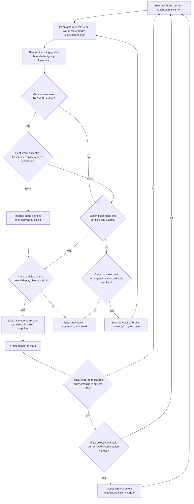
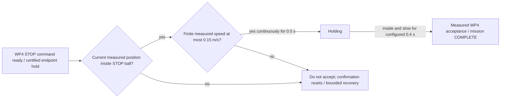

# Certified-iterate checkpoint and terminal STOP: 5 m/s diagnostic matrices

Date: 2026-09-17, Asia/Ho_Chi_Minh.

Latest follow-up: clean commit `4a6369d3` completed all nine normalized-guide
runs and reports. Mission completion is **2/9** (2WP 0/3, 5WP 1/3, 9WP 1/3);
report PASS is **0/9**. The repair does not establish a completion-rate gain
over the separate post-STOP 2/9 round. It does expose MAIN/certificate,
BACKUP known-free and estimator-state continuity as higher-leverage boundaries
than isolated optimizer throughput. The withdrawn early-return round remains
0/9, with its independent raw A/J screen retained separately. No denominator
is pooled, failure discarded or qualification claimed. The product target
remains unmet. Historical rounds below are preserved.

## Original checkpoint-round verdict

All nine requested simulations and their reports completed. Mission completion
was 1/9; report PASS was 0/9 (two FAIL, seven BLOCKED). Recorded collisions,
PX4 failsafes, mapping cloud loss and scenario-writer loss were zero in all
nine runs. None of this constitutes qualification or collision-free stopping
proof. The product target of stable, smooth 5 m/s movement remains unmet.

The checkpoint is reachable through the production MAIN/BACKUP admission
path, but nominal feasibility alone does not solve successor availability.
The matrix also separated a terminal mission-completion defect from planner
failure: 5WP repetition 2 reached the last goal and held it, yet timed out.

## Frozen inputs

- Navigation HEAD: `0cd68221b1de5c82028793d746c57daa037e7ad2`, dirty.
  Complete source fingerprint:
  `384664991067f9ef46106e508b47be27c0203657e964de323f36b3b10216abcc`.
  The dirty source includes the checkpoint, ownership-evidence correction and
  numerical replay diagnostics; results must not be attributed to HEAD alone.
- Authoritative Release manifest SHA-256:
  `dd769e7cd77acd62508086355f7cf9a7e0dbf8e8dac96ebc2bfc2c9936418ab6`.
- PX4 HEAD: `deaff86ee335dd697677bcfc2415a23878e1b895`, dirty;
  source fingerprint
  `25341a3df3acb2e557ef386affdf7a67f070603e924eb8107e8d291d22e2081f`;
  SITL binary SHA-256
  `e440bd77fbacdc422eaafdb168fec01554298d545f11e2b004a640b04e324ff9`.
  Each session separately captures mutable PX4 parameter/dataman inputs.
- Legacy positive profiles, motion preset `nominal`, seed 0, requested cruise
  speed override 5 m/s, V/A/J 5/5/8, visibility 40 m / 4,096 endpoints,
  ROS domain 42 and XRCE port 8892. No fault injection or tuning between runs.
- Tracking gates remain 0/0/0, the existing relaxed diagnostic policy. Its
  suppression of tracking, typed-health response and stopped-hold rejection
  prevents qualification. Lifecycle, reference lineage and acceptance-policy
  completeness also remain blockers, including in the completed mission.
- Simulations ran sequentially without concurrent builds/tests. Nominal
  snapshot capture was OFF. The sequencer was briefly held during postflight
  reporting for an isolated mission reproducer; no simulation was active then.
- The older 2026-09-16 matrix used motion preset `fast`, not `nominal`.
  It is historical context, not a paired performance A/B comparator.

Command template (repeat 1--3 for each profile):

```bash
env -u UAV_NAVIGATION_NOMINAL_SNAPSHOT_DIR \
  -u UAV_NAVIGATION_NOMINAL_SNAPSHOT_INCLUDE_WORLD \
  -u UAV_NAVIGATION_NOMINAL_SNAPSHOT_FAILURE_ONLY \
  python3 tools/runtime/runner.py external-mode-check \
  --map-profile PROFILE --speed-cap-mps 5.0 --map-seed 0 \
  --visibility-max-endpoints 4096 --visibility-range-max-m 40.0 \
  --ros-domain-id 42 --xrce-port 8892 --experiment-id RUN_ID
```

2WP uses `long_three_pillars_speed` (140 m straight terminal goal); 5WP uses
`long_three_pillars` (48 m outbound, orthogonal return to [41,0,3]); 9WP uses
`long_three_pillars_multiwaypoint` (alternating detours to [140,0,3]).

## Denominator-preserving results

All sessions are under `.artifacts/runtime/`. Accepted indices include the
takeoff origin WP0. Planning distributions cover recorded decision samples,
not every timer trigger. Certificate time is the maximum per-record aggregate,
not one validator call. Observed maxima and p99 are not deadline upper bounds.

| Case | Session | Report / outcome | Accepted | Planning p99/max ms (n) | Checkpoint selections / current records | Certificate aggregate max ms |
|---|---|---|---|---|---|---|
| 2WP-1 | `external-mode-check-20260917T011411-29321` | FAIL / COMPLETE | 0,1 | 50.488/50.488 (25) | 3/25 | 0.261 |
| 2WP-2 | `external-mode-check-20260917T011617-33729` | BLOCKED / PAUSED_SAFETY_STOP | 0 | 80.689/80.689 (8) | 0/6 | 15.008 |
| 2WP-3 | `external-mode-check-20260917T011748-37356` | BLOCKED / PAUSED_SAFETY_STOP | 0 | 69.060/69.060 (10) | 1/9 | 10.486 |
| 5WP-1 | `external-mode-check-20260917T011903-40949` | BLOCKED / PAUSED_SAFETY_STOP | 0 | 66.473/66.473 (10) | 0/7 | 4.060 |
| 5WP-2 | `external-mode-check-20260917T012031-44350` | FAIL / WALL_TIMEOUT | 0,1,2,3 | 86.635/86.635 (25) | 7/23 | 13.969 |
| 5WP-3 | `external-mode-check-20260917T013622-52473` | BLOCKED / PAUSED_SAFETY_STOP | 0 | 70.725/70.725 (1) | 0/1 | 10.134 |
| 9WP-1 | `external-mode-check-20260917T013728-56165` | BLOCKED / PAUSED_SAFETY_STOP | 0 | 80.275/80.275 (7) | 3/7 | 19.881 |
| 9WP-2 | `external-mode-check-20260917T013834-59591` | BLOCKED / PAUSED_SAFETY_STOP | 0 | 80.525/80.525 (6) | 2/6 | 17.180 |
| 9WP-3 | `external-mode-check-20260917T013936-62944` | BLOCKED / PAUSED_SAFETY_STOP | 0 | 80.261/80.261 (7) | 4/7 | 15.953 |

Completion by route: 2WP 1/3, 5WP 0/3, 9WP 0/3. Non-completion is retained as
2/3, 3/3 and 3/3 respectively; it is not removed from timing denominators.
The 91 current diagnostic records contain 20 checkpoint selections, 2,009
certificate calls and 274,121 us of certificate work. Sparse records are not a
complete optimizer-call census or a complete latency distribution.

| Metric | Per-run p99 range | Largest observed max |
|---|---|---|
| Mapping callback | 69.183--88.055 ms | 126.142 ms |
| Planning worker | 49.458--82.973 ms | 88.947 ms |
| World snapshot export | 15.577--18.340 ms | 22.027 ms |
| PX4 local-position setpoint source gap | Not reported as p99 | 32 ms; zero stale events |
| Propagated odometry source gap | Not reported as p99 | 28 ms; zero stale events |

Measured speed reached 6.004 m/s, while the largest setpoint speed was
4.967 m/s. These descriptive maxima include the entire captured run, including
braking/hover; tracking remains NOT_EVALUABLE. They are not a qualified
closed-loop envelope or evidence attributing error to LIO or PX4.

## Findings and next minimum changes

1. **CONFIRMED, integrated reachability:** In 2WP-1, checkpoint cycles 1, 73
   and 206 passed BACKUP and reached immediate admission or staging. The
   checkpoint is not an alternate authority path. In 9WP-3, cycle 27 selected
   a checkpoint but was rejected for `backup_dynamics`; cycle 28 subsequently
   staged generation 2, which activated at source 25.552 s. Cycles 25/26 had
   rejected at `no_complete_bundle_at_deadline`. Downstream gates still
   distinguish nominal feasibility from an executable proposal.
2. **CONFIRMED, successor availability remains open:** All three 9WP runs
   stopped before WP1 despite selected nominal checkpoints. Deadline and
   BACKUP failures must be classified separately. Do not enlarge the solver
   budget, weaken jerk limits or replace execution ownership from this result.
3. **CONFIRMED, terminal STOP predicate:** 5WP-2 accepted WP0--WP3, then held
   the final endpoint without COMPLETE. At source 243.968 s, LIO position was
   approximately [41.1963,-0.0178,2.8478] with speed about 0.0076 m/s. A
   deterministic test against the exact Release mission library reproduced
   non-completion at 0.249 m goal error inside its unchanged 0.8 m radius.
   `ExecutingWaypoint` applies `passThroughAcceptance()` to STOP as well as
   PASS_THROUGH; ordered projection selected earlier segment 0 and rejected
   STOP. An isolated one-predicate correction used geometric current-position
   acceptance for STOP, preserved measured-speed/confirmation/hold gates, and
   passed the reproducer plus all 43 existing mission tests. Canonical
   integration and fresh SITL evidence are separate follow-up work.
4. **CONDITIONAL, postflight report scaling:** 5WP-2 report generation consumed
   minutes of CPU after simulation cleanup. Its JSON is 168,320,320 bytes.
   Lifecycle reduction currently scans all authorizations for every publish;
   this is a quadratic candidate for a measured, parity-tested indexing change,
   not proof that it explains all report time. This cost is outside the command
   path. Profiling attachment was unavailable; the live worker was allowed to
   finish rather than restarted.

The opt-in snapshot discriminator
`external-mode-check-20260917T010955-24315` is separate from the nine-run
denominator: PAUSED_SAFETY_STOP, 0 selected checkpoints in 10 current records,
429 certificate calls / 50,760 us. Its preflight LiDAR source gap (10.8 to
11.4 s) does not establish causality for the final handover around 45 s.

After the matrix, canonical `make test` passed all 81 currently selected CTest
entries. The Python check ran 380 tests successfully with one explicit
artifact-dependent skip (379 executed passes), not 380 executed passes.

Architecture remains option A plus bounded ownership completion: retain one
timeline store and the existing execution episode. Fix the mission predicate
at its current External Mode owner and close complete-bundle availability and
evidence lineage with focused tests/replay. A new large coordinator or process
split is not justified by this matrix.

## Post-fix terminal STOP round

All nine fresh simulations **and** reports are terminal. Completion by route
is 2WP 1/3, 5WP 1/3 and 9WP 0/3. Non-completion is 2/3, 2/3 and 3/3,
respectively (66.7%, 66.7%, 100%; three repetitions are a small sample).
Report PASS is 0/9: three FAIL, six BLOCKED. There were two COMPLETE outcomes,
six PAUSED_SAFETY_STOP outcomes and one FAILED_COMPONENT outcome. The latter
is an odometry-lease rejection, not a permission failure. No failed run was
removed or replaced. This is not qualification or proof of stable/smooth
5 m/s operation.

### Frozen follow-up inputs

- Navigation: clean `14e7d367552004ca161420531824b4e6a49f1711`, source
  fingerprint `18e02b423b7ea8728aecd8a36902245201bfe9e1dadd85ef61d9cc3c64b08333`.
- Authoritative full Release manifest SHA-256:
  `74edfb7bcce8c97bcb9f7b4d7a44d975b28e79c97febd03c21efdc631769b7d3`.
  Each report's `provenance.manifest.source` and manifest digest match these
  values. Canonical build passed all 23 packages; mission tests passed 44/44,
  selected CTest entries 81/81, Python 379 executed passes plus one explicit
  artifact-dependent skip, and seven auxiliary tests passed.
- External PX4 remains the separately captured dirty source/binary described
  above: HEAD `deaff86ee335dd697677bcfc2415a23878e1b895`, source fingerprint
  `25341a3df3acb2e557ef386affdf7a67f070603e924eb8107e8d291d22e2081f`, binary
  `e440bd77fbacdc422eaafdb168fec01554298d545f11e2b004a640b04e324ff9`.
  Mutable parameter/dataman snapshots remain session-specific.
- Same profiles, positive case, `nominal` preset, seed 0, requested cruise
  5 m/s, MAIN V/A/J 5/5/8, visibility 40 m / 4,096 endpoints, DDS domain 42,
  XRCE 8892, no injected fault, nominal-problem capture OFF. BACKUP physical
  limits remain separate (12/12/30), not the MAIN control envelope.
- Sequential order: three 5WP, three 2WP, three 9WP. No concurrent build/test
  or behavior/configuration change. Small read-only artifact/source inspections
  occurred; this is not a claim of an otherwise workload-free machine.
- Tracking remains the existing relaxed diagnostic policy, including its
  documented suppressed gates. Every report assessment is NOT_EVALUABLE,
  evidence INCOMPLETE and qualification ineligible, with the same six blocking
  codes listed in the original round. Provenance VALID is not qualification.

The command template above applies with explicit `--test-case positive
--motion-preset nominal` and experiment IDs
`terminal-stop-matrix-{2wp,5wp,9wp}-r{1,2,3}-20260917`.

### Full follow-up denominator

Accepted indices below come from
`scenario.json.waypoint_acceptance_events[].accepted_waypoint_index`.
The event's `waypoint_index` is the **next** index; the ephemeral batch wrapper
used that field in its printed `accepted_waypoints`, so that printed list is
not the acceptance witness. No product recorder/reducer data was changed.

| Case | Session under `.artifacts/runtime/` | Report / outcome | Accepted | Planning p99/max ms (n) | Checkpoint selections / current records | Certificate aggregate max ms |
|---|---|---|---|---|---|---|
| 2WP-1 | `external-mode-check-20260917T015652-94541` | FAIL / FAILED_COMPONENT | 0 | 84.242/84.242 (33) | 5/29 | 18.507 |
| 2WP-2 | `external-mode-check-20260917T015841-98513` | BLOCKED / PAUSED_SAFETY_STOP | 0 | 81.768/81.768 (17) | 1/16 | 23.219 |
| 2WP-3 | `external-mode-check-20260917T020007-102032` | FAIL / COMPLETE | 0,1 | 80.195/80.195 (31) | 2/29 | 13.227 |
| 5WP-1 | `external-mode-check-20260917T015138-83125` | BLOCKED / PAUSED_SAFETY_STOP | 0 | 73.719/73.719 (11) | 0/10 | 2.921 |
| 5WP-2 | `external-mode-check-20260917T015251-86803` | FAIL / COMPLETE | 0,1,2,3,4 | 80.764/80.764 (24) | 2/24 | 16.963 |
| 5WP-3 | `external-mode-check-20260917T015438-90782` | BLOCKED / PAUSED_SAFETY_STOP | 0 | 80.351/80.351 (9) | 0/9 | 21.217 |
| 9WP-1 | `external-mode-check-20260917T020158-105668` | BLOCKED / PAUSED_SAFETY_STOP | 0 | 80.306/80.306 (7) | 3/7 | 23.265 |
| 9WP-2 | `external-mode-check-20260917T020304-108922` | BLOCKED / PAUSED_SAFETY_STOP | 0 | 80.479/80.479 (8) | 2/8 | 22.082 |
| 9WP-3 | `external-mode-check-20260917T020411-112209` | BLOCKED / PAUSED_SAFETY_STOP | 0,1,2 | 80.598/80.598 (22) | 6/22 | 18.907 |

The 162 decision-trace records include 154 current checkpoint-diagnostic
records, 21 checkpoint selections, 3,207 certificate calls and 408,806 us of
summed certificate work. These remain sparse captured records, not a census
of all solver jobs. Max certificate time is a per-record aggregate, not one
call. The nine separate `navigation_mapping.timing_distributions` report:

| Metric | Per-run p99 range | Largest observed max |
|---|---|---|
| Mapping callback | 61.332--108.986 ms | 144.086 ms |
| Planning worker | 37.467--82.683 ms | 87.199 ms |
| World snapshot export | 14.432--20.762 ms | 24.405 ms |

These maxima are not upper bounds. No paired ON/OFF overhead or causal
performance improvement is established by comparing the two rounds.

### Adversarial findings and next direction

1. **CONFIRMED, integrated STOP reachability:** 5WP-2 accepted WP0--WP4.
   Its final measured STOP acceptance was 0.182362 m error and 0.049766 m/s.
   `logs/external_mode.log:159`--`:171` show terminal hold, above-limit speed
   samples and eventual measured acceptance. The deterministic regression
   isolates the predicate change; this one integrated completion does not
   establish 3/3 availability or attribute all round differences to that fix.
2. **CONFIRMED, clearance rejection:** 5WP-3 reports minimum ground-truth
   collision clearance 0.078432 m at `long_three_pillar_03`, below its frozen
   `scenario.minimum_collision_clearance_m=0.1`. Recorded collisions, PX4
   failsafes, scenario-writer drops and mapping cloud drops are zero in all
   nine runs; zero collision does not erase this clearance failure. Root
   cause/which layer violated its assumptions remains INCONCLUSIVE without
   synchronized state/command/truth/world residuals. The relaxed policy's
   known suppression of tracking/health responses is not a qualified envelope.
3. **CONFIRMED, receive-age containment:** 2WP-1
   `logs/external_mode.log:131`--`:132` rejects generation 22 with
   `RECEIVE_STALE`, source age 164 ms and receive age 207.942 ms, then hands
   over to PX4 Hold. The report also records one active propagated-odometry
   source gap of 512 ms and wall-arrival gap of 637.962446 ms around the same
   interval (source 52.116 to 52.628 s; arrival wall
   1789610287480217380 to 1789610288118179826 ns). The external-odometry bridge
   separately records `DT_TOO_LARGE`. This supports a missing-update interval,
   not a proven LIO/DDS/PX4 root cause. PX4 setpoint source-gap max remains
   28 ms for this run, showing why output continuity alone is insufficient.
   External Mode already has a separate state-input thread; adding threads
   without dispatch/lock/resource attribution is not the selected fix.
4. **CONFIRMED, mixed availability failures:** In 9WP-1, accepted nominal
   candidates are followed by BACKUP swept-tube failures and MAIN deadline
   failures. `logs/mapping.log:306` records seed V/A/J approximately
   4.890/9.176/28.771, feasible under BACKUP 12/12/30, followed by
   `last_reject_stage=known_free`, failure 8 (`kCertificateTubeBlocked`), cell
   1 (`kUnknown`), role 1 (`BACKUP`). The coarse outcome `backup_dynamics`
   is not causal proof of a dynamics violation. Likewise optimized MAIN
   certificate stage 4 is `kDynamics`, not continuity/corridor failure merely
   because a finite corridor residual is logged. In 9WP-3, progress reaches
   WP2 before an actual later corner corridor rejection (0.01977 > 0.01),
   then invalid-window revalidation (failure 1, zero samples). The code alone
   does not establish the expiry cause; do not classify every stop as the same
   first-waypoint error.
5. **CONFIRMED, limited legacy freshness metric:**
   `NavigationMode::last_state_age_s_` is reset to -1 and read by periodic
   logging, but has no producer assignment in the current source. It is not
   measured decision-age evidence. The explicit freshness rejection and
   source/arrival witnesses above remain distinct authoritative observations.
   9WP-2 also has raw stream stale-event counts despite small source gaps;
   source-stale counts are zero there. Phase/observer-dispatch attribution is
   required before calling those sensor interruptions or dropping the events.

Architecture remains A plus bounded B. The next experiment must close the
complete MAIN/BACKUP/world readiness contract and measured corner/stop
tracking, alongside a source-to-use discriminator for the odometry interval.
Replay must separate geometric/numerical dynamics, UNKNOWN swept tube,
deadline and invalid-window admission. Preserve the 0.1 m clearance gate, the
5/5/8 MAIN and 12/12/30 BACKUP limits, stop gates and all failed runs. No large
coordinator, process split, budget increase, or additional fallback is
justified by this round. Evidence lineage/eligibility and representative
recorded-data/hardware validation remain open.

The temporary terminal-overlap source copies and binaries were removed after
canonical regression and integrated evidence were available. The committed
regression can reproduce the case; all runtime artifacts are retained. No new
parallel execution path or cleanup of user files was introduced.

## Completion-focused discriminator and architecture choice

The post-STOP denominator remains 2/9 complete, with report PASS 0/9.
Rechecking each terminal chain classifies six of the seven non-completions as
loss of a complete successor before the active execution ends, and one as an
odometry lease rejection. This is a terminal-mechanism census, not proof that
all six share one numerical root cause. The low clearance in 5WP-3 is a
separate safety failure, not the causal reason for its mission stop. The
completed 5WP-2 itself contains eight deadline-failure trace records, so a
single failed solve or sparse failure frequency cannot explain completion.

For 9WP, eleven trace records have an observed hard deadline, ten before
BACKUP begins. Durations below are differences of the same transaction's
steady stage stamps, not the cached `time_consuming_` fields:

| 9WP repetition | MAIN n / median / max ms | A* n / median / max ms | BACKUP n / median / max ms | Deadline records / before BACKUP |
|---|---|---|---|---|
| 1 | 7 / 43.930 / 77.740 | 7 / 2.360 / 12.360 | 4 / 2.340 / 4.270 | 3 / 3 |
| 2 | 8 / 61.870 / 77.840 | 8 / 2.290 / 16.140 | 4 / 3.760 / 7.390 | 4 / 4 |
| 3 | 22 / 36.020 / 76.580 | 22 / 2.670 / 22.760 | 11 / 8.700 / 14.300 | 4 / 3 |

This supports prioritizing complete-bundle readiness and the problem sent to
MAIN. It does not justify an executor/process rewrite, making BACKUP optional,
raising budgets, or treating A* as universally negligible: 2/5WP A* tails reach
about 66 ms. BACKUP also fails strict known-free swept tubes even when its
V/A/J is within its separate physical limits.

### Exact-current 9WP capture

Clean observational commit `ab5b4c58b9a6061a73c802ce84e68cc7bcebcdb3`, Release
manifest `7b950aba1b595f1b064b3f4afb336ba6ee43ad7bbf49bf7fa9ca248545e88514`,
source fingerprint
`dd7a9c37a716dd161510e946db2fa3f2d0a288fd6edcea52f277ba6832259eb6`
ran `completion-readiness-9wp-discriminator-20260917` under the same nominal
5 m/s/seed-0 scenario. World capture was ON, unlike the nine-run baseline;
therefore this is not a matched performance/completion comparison. Session
`external-mode-check-20260917T022857-134431` was BLOCKED /
PAUSED_SAFETY_STOP, accepted only WP0 and stopped near [8.71,1.35,3] before
WP1 [20,5,3]. It does not demonstrate improved progress or completion.

The snapshot directory
`.artifacts/runtime/completion-readiness-9wp-discriminator-20260917`
contains ten written snapshots from eleven submissions, one dropped, zero
pending/write errors. The sidecar's accounting COMPLETE / capture_complete
means accounting was finalized; its writer_capture_complete_at_process_stop
is false. **The capture is not lossless.** Replay findings apply to identified
written problems, not a complete solve census.

The source-to-use observation is integrated: 534/534 PX4-update records are
usable, 427 distinct states, zero missing/invalid records or epoch mismatch.
Observed receiver-mutex wait max is 0.000916 ms and receive-to-snapshot max
25.387104 ms. This rejects a receiver-mutex bottleneck **in this run only**;
it does not explain the older 512 ms odometry interval or prove DDS/producer
latency/PX4 acceptance. Instrumentation overhead has no paired OFF/ON bound.

### Historical proposal: ready-first mandatory feasibility (now withdrawn)

Claim: when no certified seed exists, waiting until the optional-refinement
cutoff before preserving a fully certified accepted iterate can exhaust the
budget needed for BACKUP/world finalization. Strong counterargument: checking
every iterate early can itself consume the deadline. The old frozen 5WP
snapshots 13--15 distinguish these conditions:

| Frozen problem | Old 40/80 result / cert calls / aggregate us | Naive 0/80 result / calls / us | Weight-independent screen, 40/80 result / calls / us |
|---|---|---|---|
| 13, cycle 161 | candidate / 2 / 344 | candidate / 197 / 17322 | candidate / 9 / 984 |
| 14, cycle 162 | candidate / 78 / 6409 | deadline / 241 / 19774 | deadline / 0 / 0 |
| 15, cycle 163 | candidate / 68 / 5674 | deadline / 281 / 21407 | candidate / 1 / 257 |

These are serial individual probes, not statistical timing bounds. Preserve
the unfavorable problem 14: the new screen removes wasted certification but
the first search attempt can still exhaust 80 ms before reaching its retry.

In current 9WP snapshot 1 / cycle 21, the existing 40/80 path fails after
about 1,880 evaluations and 118 certificates (11,175 us aggregate). The new
40/80 path selects attempt 1 / iteration 8 after eleven evaluations, one
certificate (681 us). Snapshot 6 / cycle 27 likewise selects iteration 9
after eleven evaluations and one certificate (754 us). Both pass optimized
nominal corridor/route/V/A/J/flatness and offline world checks, with unchanged
boundaries/limits. Their MAIN durations are about 16.09 and 17.74 s: readiness
does not establish smooth sustained 5 m/s. Recovery snapshot 7 / cycle 83
still exhausts 80 ms, zero certificate calls, no candidate. Every replay has
`complete_executable_bundle=0`; no BACKUP/admission/lease is invented.

The implementation keeps objective cost/gradient/weights unchanged. It
records raw acceleration/jerk maxima from the already computed samples and
uses product limits plus the existing numerical boundary policy to reject
definitely invalid iterates cheaply. Only the independent full nominal
certificate can select a checkpoint; all downstream gates remain mandatory.
The future-cutoff regression fails on old source and passes after this change,
along with mandatory-feasibility, cancellation and expired-hard-deadline cases.
Canonical Release build passed (23 packages); `make test` exited zero with
selected component suites, 386 Python tests (one explicit artifact-dependent
skip) and seven runtime auxiliary tests. Adversarial diff review found no
concrete P1/P2 bypass or checkpoint identity incoherence. An earlier build
compiled all packages but provenance rejected a concurrent report edit; it
was rerun on fixed source. At this stage integrated verification was pending;
the completed matrix below rejects promotion of the early-return proposal.

### Remaining structural work, kept separate

- **CONFIRMED input defects / conditional completion impact:** current capture
  guide lengths reach 25.341 m against a 20 m local-window contract. Some
  guide suffixes fold; some initialized junctions repeat a position with
  nonzero durations. Seed jerk ranges about 7,058--125,434 m/s³. Correct
  ordered guide geometry and coherent point/time allocation before tuning
  solver throughput; do not infer every deadline was caused by the fold.
- **DESIGN_DEBT:** `SimplifySFC` bypasses compaction for the entire chain if any
  route gate exists. Gate-aware compaction must preserve marker order,
  metadata, the incoming boundary-point overlap and representable transitions,
  not merely pairwise overlap. Exploratory regression tests confirmed the
  blanket behavior but were removed when this separate implementation was
  deferred; no new dead tests, coordinator, fallback or command path remains.
- **EVIDENCE_GAP:** complete successor readiness must be evaluated jointly
  with strict known-free BACKUP reachability, active remaining horizon,
  state/truth tracking and clearance. Completion is the primary operational
  denominator; faster MAIN or a diagnostic PASS cannot substitute for it.

The selected behavior change must finish with a clean Release repeated
2/5/9WP matrix, three runs each at 5 m/s, snapshots OFF, unchanged gates and
configuration. Recorded-data/hardware validation and qualification eligibility
remain outstanding; no small successful replay closes the product goal.

## Ready-first integrated matrix: proposal rejected

All nine sequential runs completed on clean
`c3d7c841f598a67411cb090df394cdbfe33e383f`, authoritative Release manifest
`a1d3d25412f9e7e44cc822b344c653898ec5247f118624aadec3c38d1a4cd7cc`,
source fingerprint
`2eb082a5419b1b4d42c6735d18e695ab43a419a0b1d6261dd18c2c4b6fab1968`.
All nine provenance statuses are VALID. PX4 source/dirty checkout and binary
identity are unchanged from the prior round; its binary remains
`e440bd77fbacdc422eaafdb168fec01554298d545f11e2b004a640b04e324ff9`.
Every captured planner config has SHA-256
`6480ff9679e20c3d5f9f5a38efbe7702d9ca98e66c454299019b423d5d298356`.
Positive/nominal profiles, seed 0, requested 5 m/s, 40 m / 4,096 visibility,
DDS 42 / XRCE 8892, MAIN 5/5/8 and BACKUP 12/12/30 are unchanged. Snapshots
were OFF, no concurrent build/test/replay or gate tuning occurred. The order
was 9WP-1 as the integrated discriminator, 2WP-1--3, 5WP-1--3, then 9WP-2--3.

| Case | Session | Report / outcome | Accepted | Planning p99/max ms (n) | Checkpoints / trace records | Certificate calls / total us / max aggregate us |
|---|---|---|---|---|---|---|
| 2WP-1 | `external-mode-check-20260917T024743-158989` | FAIL / FAILED_COMPONENT | 0 | 54.073 (32) | 31/32 | 34 / 7030 / 421 |
| 2WP-2 | `external-mode-check-20260917T024928-163383` | BLOCKED / PAUSED_SAFETY_STOP | 0 | 31.506 (5) | 5/5 | 6 / 1360 / 438 |
| 2WP-3 | `external-mode-check-20260917T025037-167222` | BLOCKED / PAUSED_SAFETY_STOP | 0 | 22.399 (9) | 9/9 | 10 / 2219 / 426 |
| 5WP-1 | `external-mode-check-20260917T025156-170962` | BLOCKED / PAUSED_SAFETY_STOP | 0 | 73.122 (11) | 2/11 | 3 / 694 / 390 |
| 5WP-2 | `external-mode-check-20260917T025336-174950` | BLOCKED / PAUSED_SAFETY_STOP | 0,1,2 | 68.152 (11) | 4/11 | 5 / 1972 / 1073 |
| 5WP-3 | `external-mode-check-20260917T025623-179594` | BLOCKED / PAUSED_SAFETY_STOP | 0,1,2,3 | 102.563 (19) | 11/19 | 17 / 5050 / 836 |
| 9WP-1 | `external-mode-check-20260917T024625-154562` | BLOCKED / PAUSED_SAFETY_STOP | 0 | 80.338 (51) | 9/51 | 12 / 4352 / 1086 |
| 9WP-2 | `external-mode-check-20260917T025849-184062` | BLOCKED / PAUSED_SAFETY_STOP | 0 | 80.197 (17) | 13/17 | 13 / 5207 / 837 |
| 9WP-3 | `external-mode-check-20260917T030006-187886` | BLOCKED / PAUSED_SAFETY_STOP | 0 | 64.171 (9) | 4/9 | 4 / 1419 / 481 |

Completion is 0/3 for each route, 0/9 overall; report PASS 0/9, FAIL 1,
BLOCKED 8. Sparse trace totals are 164 records, 88 checkpoint selections,
104 certificate calls and 29,303 us certificate work. They do not represent
every solve or an all-job timing distribution. Much less certification work
and faster individual planning records did not improve mission completion.
The 102.563 ms observed planning maximum is retained, not hidden by a nominal
80 ms configured solve budget or a p99-only claim.

All nine scenario captures are complete with zero writer drops, mapping cloud
drops, recorded collisions and PX4 failsafes. Observed minimum clearances
range 0.447258--5.307079 m; this is not a stopping/physical safety proof.
The execution-timeline invariant counter is missing in three reports
(9WP-1, 5WP-2, 5WP-3), not zero by inference. All runs are ineligible with the
six existing qualification blockers; some additionally have incomplete
tracking position/velocity sources. Diagnostic tracking 0/0/0 remains active.

### Low-level causes and counterarguments

- **2WP-1:** explicit receiver odometry lease rejection: source age 164 ms,
  receive age 205.229 ms (`external_mode.log:128`). The prior post-STOP 2WP-1
  had the same receiver-side mechanism. Producer/IMU, FAST-LIO, transport and
  callback starvation remain indistinguishable from the captured witnesses;
  do not attribute this to the receiver mutex or LIO algorithm.
- **2WP-2/3 and 9WP-2/3:** complete successor loss includes strict known-free
  BACKUP rejection. In 9WP-3, two explicit batches contain eight and four
  feasible braking seeds within BACKUP 12/12/30, with zero known-free passes
  (`mapping.log:305,324`). Last V/A/J in the four-seed batch is
  4.682/8.526/26.274; its blocked cell is UNKNOWN at (12.3,2.1,2.9), role
  BACKUP, time 0.327808 s. Aggregate visibility reception cannot distinguish
  missing tube observation from discretization/body support/reset effects. The coarse
  `backup_dynamics` reason is not a physical-dynamics diagnosis. Five
  `input/invalid_input` trace records there also require producer-contract
  discrimination; stale cached stage timings are not fresh solve durations.
- **5WP-1:** MAIN dynamics/corridor failures persist before the first outbound
  goal. A shorter solve duration is not proof of feasibility.
- **9WP-1:** 41 final trace records are fresh recovery attempts (stage MAIN
  stamps are present) rejected by final MAIN route-regression certificates,
  approximately 0.9--1.0 m against unchanged 0.5 m tolerance. They are not a
  proven world-identity race: `PLANNER_CANDIDATE_REJECTED` maps generically to
  `world_changed/commit_recertification`. Local nominal seed certificates
  succeed, often by stretching MAIN to about 28 s, but final command route
  authorization fails. There is no route-rejection feedback that repairs the
  next seed; repeatedly returning a nominal-only baseline is not bundle-ready.
- **5WP-2:** stopped recovery plus MAIN route/corridor rejection and world
  occupancy rejection, not a reproduced geometric STOP predicate bug.
- **5WP-3:** terminal capture exists inside the goal radius, followed by
  execution/publish rejection before measured STOP confirmation. An initial
  `TRACKING_EXPERIMENT_BYPASS` reports anchor error 0.815 > 0.750 m, but the
  final publication boundary independently enforces the hard 0.750 m support
  limit. That is a reachable policy/containment distinction, not permission
  to suppress the final check. The exact final state/transition witness is
  still needed before claiming one unique causal latch. PVA stale is the
  receiver containment response, not itself the upstream cause.

The suspected sampler gap after declared end but before bundle lease expiry
is **not confirmed in production**: runtime candidate admission and store
renewal clamp the bundle lease to the declared endpoint. PVA `valid_until`
is a separate egress deadline, not that bundle lease. No sampler behavior
change is justified by that timestamp comparison.

### Decision and next leverage

Withdraw early checkpoint return before the refinement window. Retain the
weight-independent raw A/J necessary screen, with unchanged full certificates
and all hard gates. A single favorable nominal replay is insufficient to
promote early return after 0/9 integrated completion. The prior 2/9 round and
this 0/9 round are not a paired OFF/ON statistical causality proof.

After withdrawal, canonical Release build passed all 23 packages (33.6 s)
and `make test` exited zero: all selected CTest entries passed, 386 Python
tests included one explicit artifact-dependent skip, and seven runtime
auxiliary tests passed. Independent read-only artifact audit matched all nine
rows and denominators. These are component/build results, not a new integrated
completion measurement of the withdrawn source.

Next change should normalize the existing guide boundary rather than add a
coordinator or more conditions: one execution-anchor time origin; ordered
collision-checked geometry without folds or duplicate-position/nonzero-time
junctions; bounded route-window accounting; and seed/readiness semantics that
include the actual route contract needed by the complete MAIN/BACKUP bundle.
Keep the terminal measured-state/hold authority case separately reproduced.
Do not increase solve budget, allow UNKNOWN BACKUP, tune jerk weights, widen
anchor/acceptance tolerances, or treat telemetry/partial progress as success.

## Coherent guide boundary: implementation and component evidence

The existing planner now owns one anchor-relative ordered point/time sequence
and one spatial-window accounting path. The hot guide starts at immutable
anchor elapsed zero; every retained future sample keeps `sample_tt - anchor_tt`,
including its actual first positive delay. The anchor edge is counted before
A* search. Returned routes are clipped by actual polyline length rather than
the straight goal chord. A corner entry is selected on the incoming guide by
arc length, with aligned time interpolation and the old suffix removed; it
cannot be extrapolated behind the penultimate sample. Outgoing geometry is
capped by remaining window while the required envelope remains unchanged and
incomplete when insufficient. No coordinator, extra command path, tuning or
hard-gate relaxation is introduced.

The initial full test rejected two facade route-event fixtures. Their fake
world mapped all grid coordinates to zero and manufactured a 3 m descent/
climb in a horizontal route; actual-length clipping exposed it. Correcting
the declared 0.2 m voxel transforms and relocating the synthetic BACKUP-only
event volume retained the same tight radius, first-entry-after-MAIN and role
assertions. A voxel round-trip regression now protects that fixture contract.

Final Release build passed 23 packages (15.8 s), full `make test` exited zero:
all 83 selected CTest entries passed; 386 Python tests included one explicit
artifact-dependent skip; seven auxiliary tests passed. Planner config passed
75 cases, including five guide-boundary cases; facade passed 17. Independent
diff review found no concrete P1/P2 bypass. These tests do not prove improved
completion or fix strict BACKUP visibility, terminal tracking or odometry loss.
The clean repeated integrated matrix below has its own SHA/manifest and all
nine results. Component correctness is not a completion improvement claim.

## Normalized-guide integrated round: systemic completion review

All nine simulations **and** reports are terminal. Two missions completed:
5WP-2 and 9WP-3. The other seven are six PAUSED_SAFETY_STOP and one
FAILED_COMPONENT. Report verdicts are three FAIL, six BLOCKED, zero PASS.
A report FAIL must not be counted automatically as mission non-completion:
both COMPLETE runs fail the evidence/qualification assessment. Conversely,
partial waypoint progress is not COMPLETE.

### Frozen inputs and denominator

- Navigation: clean `4a6369d338506dd4cb4864b8a9f89dd77530df60`, source
  fingerprint `e091e06a7e5637732e74a6e0cc2a2a1ed9aca0fb10b6831206258fcdcafd3e52`.
- Authoritative 23-package Release manifest SHA-256:
  `2cf81e62ab8d320bd1c7f1b785cdda26c0fba09994142a977a78814fc94652c7`.
  The post-commit clean build completed in 9.92 s. All nine reports record
  this manifest/source and VALID provenance, not qualification.
- All nine captured `planner.yaml` files have SHA-256
  `6480ff9679e20c3d5f9f5a38efbe7702d9ca98e66c454299019b423d5d298356`.
  Positive/nominal, requested 5 m/s, seed 0, MAIN V/A/J 5/5/8, BACKUP
  12/12/30, visibility 40 m/4096, DDS 42/XRCE 8892 are unchanged.
  PX4 has the same separately captured dirty HEAD/source/binary stated
  above; its mutable parameter/dataman snapshots remain per-session inputs.
- Nominal snapshot capture OFF; sequential order 9WP-1, 2WP-1--3,
  5WP-1--3, 9WP-2--3. No concurrent build/test/replay, tracked-source edit,
  injected fault or gate/tuning change during the matrix. Small read-only
  inspections occurred; this is not an otherwise workload-free-machine claim.
- IDs: `normalized-guide-4a6369-5mps-{2wp,5wp,9wp}-r{1,2,3}-20260917`.
  Use the earlier command template with explicit positive/nominal arguments.

Accepted indices below are
`report.json.mission_outcome.acceptance.waypoint_acceptance_indices`, not
published goal indices or the scenario's next-waypoint field. Sessions are
under `.artifacts/runtime/`. Planning samples are captured decision durations,
not all triggers or solver-only durations; p99/max are not deadline bounds.

| Case | Session | Report / outcome | Accepted | Planning p99/max ms (n) | Checkpoints / records | Certificate aggregate max ms |
|---|---|---|---|---|---|---|
| 2WP-1 | `external-mode-check-20260917T032129-223352` | FAIL / FAILED_COMPONENT | 0 | 80.119/80.119 (30) | 3/30 | 0.502 |
| 2WP-2 | `external-mode-check-20260917T032321-227164` | BLOCKED / PAUSED_SAFETY_STOP | 0 | 80.086/80.086 (9) | 0/9 | 0.000 |
| 2WP-3 | `external-mode-check-20260917T032430-231058` | BLOCKED / PAUSED_SAFETY_STOP | 0 | 56.550/56.550 (19) | 3/19 | 0.290 |
| 5WP-1 | `external-mode-check-20260917T032600-235030` | BLOCKED / PAUSED_SAFETY_STOP | 0,1,2 | 80.368/80.368 (24) | 6/24 | 0.539 |
| 5WP-2 | `external-mode-check-20260917T032754-238676` | FAIL / COMPLETE | 0,1,2,3,4 | 82.018/82.018 (26) | 9/26 | 0.424 |
| 5WP-3 | `external-mode-check-20260917T032953-243355` | BLOCKED / PAUSED_SAFETY_STOP | 0 | 55.973/55.973 (10) | 4/10 | 1.181 |
| 9WP-1 | `external-mode-check-20260917T032010-219652` | BLOCKED / PAUSED_SAFETY_STOP | 0 | 66.332/66.332 (8) | 5/8 | 0.485 |
| 9WP-2 | `external-mode-check-20260917T033127-247127` | BLOCKED / PAUSED_SAFETY_STOP | 0,1 | 80.364/80.364 (19) | 6/19 | 0.400 |
| 9WP-3 | `external-mode-check-20260917T033305-250648` | FAIL / COMPLETE | 0,1,2,3,4,5,6,7,8 | 122.899/122.899 (48) | 10/48 | 0.598 |

Sparse totals: 193 decision records, 46 checkpoint selections, 64 certificate
calls and 16,102 us summed checkpoint certificate work. Certificate aggregate
max is per record, not one validator call. All nine capture-complete flags
are true, scenario-writer/cloud drops and recorded collisions are zero, and
PX4 failsafe flags are false. Observed minimum-clearance values range
0.121171--3.868828 m; this is not collision-free stopping proof. Timeline
invariant counts are missing in 2WP-2, 5WP-1, 5WP-2 and 9WP-3; the other
five report zero. Missing values remain missing, never an inferred zero.

All runs remain relaxed diagnostic/ineligible, with NOT_EVALUABLE assessment,
INCOMPLETE evidence and the six core qualification blockers listed above;
2WP-2 and 5WP-1 additionally lack complete tracking-position/velocity sources.
No hardware, recorded-data or C0 acceptance has been established.

### Decisive boundaries, counterarguments and leverage

The seven non-completions have one explicitly matched odometry-lease loss and
six planner/execution-continuity losses. This identifies the failed boundary,
not seven uniquely proved underlying causes. Multiple rejection types can
coexist; later successful commits mean an earlier rejection alone is not a
sufficient causal explanation.

1. **Complete-proposal readiness, not nominal convergence.** 2WP-3 rejects
   an optimized MAIN with V=5.0333/5 and J=9.3710/8
   (`logs/mapping.log:428`), then repeatedly fails to replace generation 11.
   5WP-1 rejects J=9.7146/8 although corridor residual 0.004202 is within
   0.01 (`mapping.log:656,662`); it stops after accepting WP2, not all goals.
   9WP-2 reaches WP1, then repeats MAIN deadline rejection before WP2
   (`mapping.log:502,517,547`). These are distinct dynamics/availability and
   budget boundaries; a coarse failure enum is not a numerical root cause.
   Even COMPLETE 5WP-2 has repeated final MAIN route-regression rejection
   near 1.5667 m against 0.5 m (`mapping.log:598,610,624,636`) after a local
   nominal seed certificate. Therefore final route/BACKUP readiness must
   inform seed construction; merely returning nominal incumbents sooner is
   not an adequate architecture. Next review: continuous ordered
   guide-to-overlap junction selection and coherent per-piece seed timing,
   tested on exact frozen inputs before changing costs, budgets or gates.
2. **Stopping tube and observed-free support must be designed together.**
   2WP-2 has batches of 7/7, 7/7 and 5/5 physically feasible BACKUP seeds
   with SFC hull passes but zero known-free passes (`mapping.log:322,329,342`),
   including UNKNOWN at (22.9,-0.7,3.1). 5WP-3 similarly ends with 6/6
   feasible seeds/hull passes and 0/6 known-free at (23.9,-0.7,2.9), BACKUP
   t=0.317506 s (`mapping.log:357`); it is not solely a MAIN failure.
   9WP-1 has the same boundary and then a retained recovery endpoint outside
   WP1 acceptance. Earlier/later MAIN failures and successful stages remain
   in the traces. The exact origin of those UNKNOWN cells is EVIDENCE_GAP;
   visibility endpoint counts alone do not prove the braking tube was seen.
   Next discriminator must compare the actual swept body/reaction/braking
   tube with observation support, grid semantics and world lineage. Do not
   permit UNKNOWN, inflate map uniformly by guess, or raise BACKUP limits.
3. **Estimator observability and validated prediction continuity.** In
   2WP-1 the direct External Mode input becomes stale
   (`external_mode.log:147`, wall 1789615370.163107692): source age 164 ms,
   receive age 207.044 ms, generation 22. The exact state-use witness reuses
   sequence 2619/source 56.296 s. Diagnostics at source 56.300/56.424 s show
   DEGRADED, `INSUFFICIENT_TRANSLATIONAL_OBSERVABILITY`, navigation/corrected
   validity false and correction rejects 1 then 2; IMU/LiDAR ingress continues,
   queue overflow is zero and replay is false. Tracking recovers at 56.820 s.
   `fast_lio_ros/src/propagated_odometry_worker.cpp:342--367` suppresses
   publication unless the main estimator is TRACKING/navigation-valid and
   no transition/correction/replay is pending. This strongly supports that
   policy mechanism for the direct state gap, not CPU congestion or the
   reason observability was lost. External Mode subscribes directly to
   `/lio/odometry_propagated`; the separate PX4 odometry bridge's
   `DT_TOO_LARGE` appears later and is containment, not its upstream cause.
   Underlying observability loss and per-message skip attribution remain
   INCONCLUSIVE. Next review must distinguish correction rejection from
   demonstrably bounded prediction uncertainty, with recorded-data and
   fault evidence. Do not lower observability thresholds, call unhealthy
   state healthy, extend freshness or assume PX4 GPS is a navigation fallback.

### Whole-system decision

Keep one implementation path and existing owners. The normalized guide is a
necessary input-contract repair, not the completion solution. Compared with
the separate post-STOP 2/9 round, total completion is still 2/9; 9WP now has
one complete run but 2WP has none. Same deterministic scene/seed does not
make these scheduler-dependent runs a paired statistical A/B. Current
9WP-3 completes with planning max 122.899 ms, while 2WP-3 and 5WP-3 fail
with maxima below 57 ms: reducing one timing number cannot by itself secure
completion. Hard deadlines and containment remain mandatory.

Run-wide speed must use `external_mode.speed_metrics`, not the final
`planning.execution.maximum_velocity_mps` snapshot. In COMPLETE 5WP-2,
setpoint maximum/p95 are 4.900114/4.722138 m/s (2679 samples), measured
maximum/p95 5.615598/4.800785 m/s (2844). The final planner diagnostic is
1.600849 m/s and is **not** the whole-run maximum. COMPLETE 9WP-3 has
setpoint maximum/p95 4.950888/4.898737 m/s and measured maximum/p95
5.794046/5.148808 m/s. These include braking/hover and are descriptive,
not a matched tracking proof or stable/smooth 5 m/s qualification.

Priority is joint executable-proposal reliability (ordered seed plus actual
MAIN/BACKUP/route contract), observation-supported stopping continuity, and
estimator-state continuity under a validated uncertainty envelope. Optimize
small hot-path costs or extract a coordinator only after evidence says they
limit these outcomes. No new coordinator, process split, alternate publisher,
fallback or hard-gate relaxation is justified by this round.

## Continuous overlap junction follow-up (nine-run diagnostic closed)

The next bounded repair normalizes geometry/time together at the existing
optimizer setup owner, rather than tuning solver cost or extracting authority.
The current-guide discriminator `external-mode-check-20260917T034028-259405`
is separate from the nine-run matrix: requested 5 m/s, positive/nominal,
`long_three_pillars_speed`, same seed/config/visibility, snapshot/world capture
ON. Navigation clean `08cb9d3fbc9c535f72f36b69c41bc0219355b210`, source
`692472f228aa8fa161e24a9f8fe33e6d041998d6937525b70b74ca4a0895c531`, Release
manifest `0bd58069607e92c75a216ca243e09ed95b65c51fc1d701cea6d8042893d4964e`.
Outcome COMPLETE, accepted [0,1], report FAIL and qualification ineligible.
This refutes universal straight-route infeasibility, not prior failures or
the product target. Capture produced 30/30 submitted snapshots, zero drops,
errors or pending records. The runner finalized COMPLETE accounting after
process stop; writer completion at process stop remained false, so this is
not independently graceful writer closure.

In 26/30 frozen inputs, initialized junctions differ from their discrete
guide references. Cycle 1 has a guide near y=-0.1,z=3, but its overlap
[7.0,7.2] contains no discrete sample: nearest x=5.7 is outside. Setup
therefore uses overlap interior (7.1,-1.5,3.1), while retaining the time at
x=5.7. The same guide **edge** intersects the overlap. An analytic optimizer
regression against pre-optimization state fails before the repair with
1.4 m lateral, 0.1 m vertical and 0.3 s timing error. Solver convergence is
deliberately not the test oracle; this run nevertheless completed, so the
defect alone does not explain every non-completion.

The repair preserves an existing sampled junction already inside its overlap,
with its coherent sample time. If discrete lookup misses that intersection,
it clips ordered guide chords by overlap halfspaces, projects the
interior onto the feasible chord fraction, and interpolates position/time
at that fraction. Continuous guide coordinates retain mission-gate phase
and order. Existing interior fallback remains when no ordered chord
intersects, but an empty/reversed sample interval cannot silently reuse an
old index. Mission boundary override and all independent final certificates
remain. No limits, costs, deadlines, UNKNOWN, freshness, execution or mission
gates are relaxed. Six analytic projection tests and the optimizer
before/after regression pass; the existing sparse-gate timing test also passes.
Independent diff review found no concrete P1/P2 authority/certificate bypass.

Frozen current 2WP snapshots 0/6/17 (cycles 1/106/263) replay serially with
exact config. At 40/80 ms, cycles 1 and 263 return nominal candidates; cycle
106 remains unavailable, without a hard-deadline failure. The cycle-1
isolated baseline used 714 objective evaluations; the repaired replay used
278, with nominal duration 4.250264 s versus 4.119645 s. This is one
discriminator, not a timing distribution or completion improvement. Its
zero-refinement case also increases effort (60 to 201 evaluations), so do
not claim uniform performance gain. Frozen raw construction and independent
numerical checks remain in the replay; some deterministic boundary witnesses
still reject even when the production optimized-candidate certificate passes.
Every replay still reports `complete_executable_bundle=0`, and its world
verdict is non-authoritative (no complete role/BACKUP/admission transaction).

The first full-test attempt rejected unrestricted projection at three
optimizer fixtures and one facade fixture, including high-speed certified
corridor availability. Moving already-valid sampled junctions unnecessarily
changed the optimization basin. The revised source limits continuous lookup
to discrete containment misses and retains valid sampled geometry/time and
the existing sampled outgoing gate split. Existing success/dynamics/corridor
assertions and tolerances are not weakened. The isolated replay numbers above
belong to the unrestricted prototype, not the revised source; they must be
rerun before drawing conclusions about it.

The revised prefer-valid-sample source passes canonical Release build (23
packages) and `make test` (exit 0). Optimizer XML has 24 tests/zero failures,
config XML 81/zero and facade XML 17/zero; the four fixtures rejected by the
prototype now pass unchanged. Python runtime contracts: 386 tests, one
existing artifact-dependent skip, zero failures. A sixth analytic fixture
also confirms arithmetic failure leaves output point/time/coordinate intact,
so a failed projection cannot corrupt the sampled fallback. Read-only
adversarial review rejected its earlier mission-boundary time finding:
geometry and reference are both overridden to the producer-owned guide
boundary before its time is assigned; no concrete P1/P2 bypass remains.

Revised-source exact-config serial replays at 40/80 ms return nominal
candidate/unavailable/candidate for cycles 1/106/263, with objective
evaluations 386/264/823. Cycle 1 duration is 4.123666 s; optimized and
independent deterministic certificates pass. Cycle 263 duration is 4.781459 s
and both certificates pass. At 0/80 ms, cycle 1 uses 31 evaluations and
retains an independent boundary rejection; cycle 263 uses 653 and passes.
Cycle 106 remains unavailable at both budgets without a deadline failure.
No executable bundle or authoritative world/role/BACKUP/admission proof is
created by these replays; no general latency or completion gain is claimed.

A fresh clean capture-OFF nine-run matrix is required before judging
integrated benefit. Observation-supported stopping and estimator-state
continuity remain separate unclosed product requirements. The declared
`aist-mid360-drive` registry/config exists but its prepared local ROS2 bag
does not; recorded-data verification is not silently counted as performed.

### Retained continuous-guide matrix

All nine sequential capture-OFF runs finished on clean navigation
`82ef05ca161a18cf4d0e0dfd40ad257ec6a87509`, requested 5 m/s, positive/nominal,
three-pillar 2/5/9WP, three repetitions per case, seed 0, visibility 4096/40 m,
ROS domain 42/XRCE UDP 8892. No concurrent build/test/replay or source edits.
All nine reports have VALID authoritative Release provenance, manifest
`643bda00d7ae7ca155fb592aee6e27fffbb267ec17dd2c61cabbfd0e4207af88`, source
`b8c4e498ec7151cf1fe366d40f54921c18e692af3c68b1c37154861eee489a92` and
captured planner YAML SHA
`6480ff9679e20c3d5f9f5a38efbe7702d9ca98e66c454299019b423d5d298356`.
External PX4 remains the same project-customized dirty dependency and binary
identity declared in the prior matrix; mutable parameters/dataman are pinned
per artifact, not implicitly equal. The later documentation-ledger migration
began at 04:19:40 UTC, after the final runner exited at 04:19:03 UTC; it is
not part of this frozen source or runtime evidence.

Session suffixes below resolve under `.artifacts/runtime/` as
`external-mode-check-20260917T<suffix>`; experiment IDs are
`continuous-guide-82ef05-5mps-<case>-r<rep>-20260917`.

| Case | Session suffix | Report / outcome | Accepted | Planner p99=max ms (n) | Checkpoint / records | Cert calls / total us |
|---|---|---|---|---|---|---|
| 2WP-1 | 035846-286284 | BLOCKED / PAUSED | [0] | 74.153 (21) | 4/21 | 4/1258 |
| 2WP-2 | 040029-290249 | FAIL / COMPLETE | [0,1] | 66.884 (31) | 4/31 | 4/1115 |
| 2WP-3 | 040227-294163 | BLOCKED / PAUSED | [0] | 65.699 (9) | 0/9 | 0/0 |
| 5WP-1 | 040346-297863 | FAIL / COMPLETE | [0..4] | 80.285 (22) | 7/22 | 7/2170 |
| 5WP-2 | 040606-302065 | FAIL / WALL_TIMEOUT | [0] | 80.393 (17) | 2/17 | 2/721 |
| 5WP-3 | 041318-308455 | BLOCKED / PAUSED | [0,1] | 85.390 (22) | 2/22 | 2/686 |
| 9WP-1 | 041530-313123 | BLOCKED / PAUSED | [0] | 65.207 (7) | 5/7 | 5/2005 |
| 9WP-2 | 041649-316844 | BLOCKED / PAUSED | [0] | 78.891 (10) | 5/10 | 5/1797 |
| 9WP-3 | 041758-320471 | BLOCKED / PAUSED | [0] | 80.143 (4) | 1/4 | 1/408 |

PAUSED is `PAUSED_SAFETY_STOP`, not mission acceptance. Completion is
**2/9**: 2WP 1/3, 5WP 1/3, 9WP 0/3; report verdicts are 3 FAIL/6 BLOCKED,
zero PASS. Total 143 trace records, 30 selected checkpoints, 30 certificates,
10,160 us; largest observed certificate cost 0.539 ms. These are small
diagnostic populations, not deadline upper bounds. Total completion is no
better than the separate prior 2/9 matrix; no statistical or integrated
performance improvement is established. Contract repair is not the completion
solution, and the new failure below precludes a safety-improvement claim.

All nine capture/writer counters are complete with zero writer/cloud drops
and no observed PX4 failsafe. Qualification is false in every report;
tracking/health-response suppressions remain the unchanged diagnostic baseline.
Eight assessments are NOT_EVALUABLE/INCOMPLETE; 5WP-2 is FAIL/INCOMPLETE with
an additional `safety.collision source incomplete` blocker. The six common
blockers remain experimental tracking, lifecycle attribution, missing motion
acceptance/coverage policies, reference lineage and required dimension not
passing. Timeline invariant counter is missing in 2WP-2/5WP-1, not zero;
the other seven have observed zero. Neither counter completeness nor zero
observed collisions proves continuous stopping safety.

### Failure discrimination and next whole-system priorities

- **2WP-1:** active generation 18 fails new-world revalidation, failure 8,
  BACKUP role, 112 samples (`mapping.log` near the final active invalidation).
  Store authority is removed and External Mode requests native Hold. Validator
  begins at current authorization time, so the inspected source does not
  support a "rechecks already-flown prefix" explanation. Actual unsafe voxel,
  deviation bound and world/sensing lineage remain to be distinguished.
- **2WP-3:** repeated corridor CIRI INIT_ERROR has nonfinite ellipsoid radius,
  then no successor and lease expiry; observed planner maximum is 65.699 ms.
  **5WP-3** instead has MAIN MINCO hard-deadline rejection near 80 ms and a
  retained endpoint 2.867 m outside WP2, followed by expiry/hold. Those are
  different availability failures, not all solver latency.
- **All three 9WP:** MAIN accepted/certified iterates are present, but final
  BACKUP KNOWN_FREE tube checks reject (failure 8/cell UNKNOWN). Physical
  minimum-snap seed and aligned-SFC hull pass in the final examples. The
  generation remains untouched; the retained suffix then expires outside
  the next waypoint. Cell/failure enums alone do not prove UNKNOWN's origin.
- **5WP-2 containment:** report observes 67 collision-envelope samples and
  7 rising-edge events, minimum clearance -0.14797 m at
  `long_three_pillar_03`. This is the Gazebo-ground-truth geometry observer
  minus the configured vehicle envelope, not physics-contact evidence.
  Collision-source coverage is incomplete and exact first-contact ordering
  is not available in the JSON counters; physical contact is NOT_EVALUABLE.
  No LAND was requested. Safety stop is at 37.204 s, native Hold is observed,
  first applicable Hold request at 37.352 s, and localization watchdog first
  divergence at 39.480 s (position 0.412561 m, velocity 2.437277 m/s).
  The second Hold-request event at 39.980 s has a different trigger
  (localization divergence), not a provenance conflict with the first-request
  summary. Ground truth is ENU/FLU with absolute sim time and 20 ms matching;
  final LIO status LOST is not proof of its state at initial command loss.
  The runner reaches 360 s wall timeout. Do not claim Hold implies a safe
  stop, blame the seed repair, or assign LIO-to-PX4 causality from final status.

The broad source review found a concrete production-reachable CIRI contract
defect, not just a timing hypothesis. `Ellipsoid::pointsInside` preserves
**input** point IDs while packing filtered output; `CIRI::findEllipsoid`
indexes that packed output with an input ID. With outside points preceding
the nearest inside point, the ID can exceed output columns: undefined behavior.
The existing boundary test intentionally expects the original source ID,
so changing the API to packed IDs would break its contract. Two CIRI calls
also alias input/output while the utility clears output before reading input,
silently ending obstacle-filter iterations. Read-only independent review
confirmed both call paths. This is CONFIRMED source/API behavior with
production reachability; attribution of a particular captured NaN or collision
to it is CONDITIONAL without that exact CIRI obstacle input/reproducer.

Highest-leverage next implementation is correct source-domain obstacle
selection and non-destructive filtering with analytic/permutation regressions,
not a coordinator or relaxed corridor gate. Keep the independent source-ID
contract and all clearance/certificate limits. The natural later planner seam
is complete-proposal construction: current MAIN precedes BACKUP, and a failed
BACKUP only tries switch/duration variants or rejects the completed MAIN; no
same-request geometry/speed feedback exists. That is DESIGN_DEBT/opportunity,
not proof that adding a retry will solve these failures. Any linked retry must
remain inside the existing deadline/world identity and final atomic validation.
Separately close observation-supported stopping and synchronized estimator/
PX4 containment before a stable/smooth product claim. No threshold tuning,
unsafe fallback, secondary publisher or qualification closure is justified.

All nine outcomes, denominators, provenance and aggregate counters were
independently audited without discrepancy.

### CIRI source-domain correction: component evidence, not completion evidence

The next bounded correctness change preserves the utility's original-input
ID contract. Initial CIRI selection reads `pc`, second-phase selection reads
`obs`, and each iterative selection reads its current input before swapping
in a separately filtered output. The utility itself postpones output mutation
until all input reads finish, so aliased calls no longer erase their input.
Invalid/nonfinite geometry still returns failure with an empty output and
ID -1. No radius, obstacle-inside predicate, clearance tolerance, loop cap,
deadline, UNKNOWN policy, certificate, command authority or tracking gate is
changed; there is no added fallback or test-specific production path.

Two regressions were first run on the pre-fix production implementation and
both failed: aliased filtering unexpectedly returned false, and permuting the
same obstacle cloud produced an empty CIRI ellipsoid when the unique inside
obstacle had source ID 2 but the packed output had one column. After correction,
all eight selected `CiriGeometry.*` / `PlannerTrajectory.Ellipsoid*` tests pass,
including the unchanged fail-closed boundary fixtures. Independent read-only
review found no concrete remaining P1/P2 in this change. Restoring actual
obstacle-filter iterations can increase CIRI work; unchanged iteration caps
do not imply unchanged latency, and a new integrated nine-run matrix is still
required before any completion/performance claim.

The first full Release attempt compiled all 23 packages but **failed build
provenance** because unrelated safety-document migration changed the workspace
while it ran. That attempt is not an authoritative runtime build. Its compiled
components pass full `make test` (exit 0; runtime Python 386 tests with one
existing missing-artifact skip); rebuild a stable committed snapshot before
SITL. The migration is not part of this feature: its documents and validator
are neither overwritten nor staged here. The current working contract was
read from `docs/safety/runtime_safety_current.md`; ordinary source correctness
repair adds no temporary bypass requiring a new bypass decision.

### CIRI corrected baseline: all nine integrated outcomes

Feature commit `478855eeb3370e592216f9f54f02f3b3314f6d18` was pushed before
these runs. Full `make test` passed all 81 selected CTest entries, including
137 trajectory, 24 optimizer-seed and 17 facade tests, plus the runtime Python
suite noted above. The stable rebuild completed 23 Release packages in
10.5 s with a valid authoritative manifest. Its source snapshot deliberately
includes unrelated safety-document migration WIP; it is **not a clean-HEAD
build**. That WIP was preserved, not committed as this feature.

Shared manifest SHA256:
`21b67946289e4d81e26609d2b7925eda565274885b086f45c848ea87d323aa5d`;
source fingerprint:
`540376d84008446531d15c5b98e20db32e106247997f3197de66b5fe92cd1f08`;
tracked WIP diff SHA256:
`2f9a593e5d93cf737c50eb9df0aa67bb57bb8fb70356e4d4262787166f627e6b`.
The untracked inputs were separately hashed: archived ledger
`8842b9f986b057fb2443b2e6874a82fdce2d6cb23ed8139f850a0d0d6f903290`,
current contract
`93408125d602346aa2113d501de8f369508b9a26991f02a96a2408ea0cb04a21`,
decision index
`c740cf62500365ed2b5ece86a9ce47999e51391e8ea6db3e111be7357783848e`,
and safety-ledger validator
`6d5b84ab07db77e0f652ae84fe9432e9272d1cdd0548a9421b5bbaf8c62d5828`.
Runtime provenance binds the full tracked/untracked
source fingerprint rather than silently attributing that WIP to the commit.
All nine captured planner YAMLs have unchanged SHA256
`6480ff9679e20c3d5f9f5a38efbe7702d9ca98e66c454299019b423d5d298356`.
PX4 HEAD/source/runtime binary identities are unchanged from the preceding
continuous-guide matrix; mutable PX4 rootfs inputs remain separate captures.

Runs were sequential, with no concurrent build, test, replay or source edits,
from 04:29:20 to 04:44:44 UTC on 2026-09-17. Labels are
`ciri-source-domain-478855-5mps-{2|5|9}wp-r{1|2|3}-20260917`;
profile, seed, speed cap, visibility, domain and XRCE settings match the
preceding matrix. Nominal/world snapshot capture is OFF. Session suffixes
below identify `.artifacts/runtime/external-mode-check-20260917T...`.
Accepted indices are zero-based `accepted_waypoint_index`, not the next active
one-based `waypoint_index`. PAUSED means `PAUSED_SAFETY_STOP`.

| Route/run | Session suffix | Mission / report | Accepted indices | Planner p99=max ms (n) | Checkpoints used / trace records | Cert calls / total us / max us |
|---|---|---|---|---|---|---|
| 2WP-1 | 042921-337624 | COMPLETE / FAIL | 0,1 | 80.186 (34) | 4/34 | 4/1273/342 |
| 2WP-2 | 043118-342222 | PAUSED / BLOCKED | 0 | 83.041 (9) | 2/9 | 2/652/334 |
| 2WP-3 | 043237-345845 | COMPLETE / FAIL | 0,1 | 69.180 (32) | 6/32 | 6/2091/468 |
| 5WP-1 | 043439-349790 | PAUSED / BLOCKED | 0 | 139.511 (17) | 0/17 | 0/0/0 |
| 5WP-2 | 043622-353500 | PAUSED / BLOCKED | 0,1,2 | 80.478 (23) | 6/23 | 6/2075/467 |
| 5WP-3 | 043835-357420 | PAUSED / BLOCKED | 0 | 82.942 (16) | 1/16 | 1/234/234 |
| 9WP-1 | 044005-361036 | PAUSED / BLOCKED | 0 | 80.509 (5) | 1/5 | 2/809/501 |
| 9WP-2 | 044117-364596 | PAUSED / BLOCKED | 0,1 | 80.900 (24) | 3/24 | 3/1152/413 |
| 9WP-3 | 044244-368261 | PAUSED / BLOCKED | 0,1,2,3 | 86.325 (31) | 6/31 | 7/2699/453 |

**Completion remains 2/9**: 2WP 2/3, 5WP 0/3, 9WP 0/3. The preceding
continuous-guide matrix was also 2/9 (1/3, 1/3, 0/3); route-level changes are
descriptive, not causal/statistical gains. Current verdicts are two FAIL and
seven BLOCKED, zero PASS. Independent review checked all nine exact reports
and accepted-index lists. A mistaken intermediate census of 3/9 mixed in a
prior 5WP COMPLETE; it was rejected against these artifacts and withdrawn.
Do not reuse it. Totals are 191 trace records, 29 selected checkpoints,
31 certificate calls and 10,985 us; largest per-record certificate-work total
is 0.501 ms, not a per-call upper bound. Certificate calls and selected
checkpoints need not be equal.

All nine provenance statuses are VALID; capture/writer completion is true,
writer/cloud drops and processing exceptions are observed zero, and no PX4
failsafe or collision-envelope event is recorded. Those observations do not
prove continuous physical safety. All assessments remain
NOT_EVALUABLE/INCOMPLETE and qualification is false. In addition to the six
common baseline blockers, 2WP-1 has CAPTURE_NOT_FINALIZED and PX4 trace
sequence/prefix gaps despite the final writer-complete flag; 5WP-2 has
incomplete position/velocity tracking sources. Those are evidence-contract
failures, not rescued by final counter completeness. Timeline invariant
counters must be read from `navigation_mapping`: missing in 2WP-1/5WP-2,
observed zero in the other seven, not inferred from unrelated
`planning.execution` fields or missing values.

Run-wide speed retains hover/braking. In the two COMPLETE 2WP runs, setpoint
max/p95/count is 4.900185/4.900006/2564 and 4.901507/4.900011/2596 m/s;
measured max/p95/count is 5.894468/5.165514/2726 and
5.698435/5.349545/2766 m/s. These show motion near the requested cap, not
qualified smooth sustained 5 m/s tracking.

### Whole-system reassessment: CIRI repair is not the completion solution

The inspected failed runs no longer show the pre-fix CIRI INIT_ERROR witness,
but this small population cannot close all numerical robustness questions.
The remaining terminal chains are materially different:

- **2WP-2:** late cycles 54/55/56 exceed the 80 ms budget, cycle 57 rejects
  BACKUP known-free (code 8/cell UNKNOWN), then two A*/nominal-seed failures
  leave generation 3 ending at x=24.68 before WP x=140. Lease/hold failure
  follows. Revalidation code 1 with zero samples is invalid time window,
  downstream, not a second world-tube finding. Startup epoch reset and the
  initial terminal-endpoint warning are not the late cause.
- **5WP-1:** active generation 3 fails new-world BACKUP revalidation, code 8,
  73 samples. This is a real certificate/authority loss; the exact tube
  witness, numerical deviation and sensor/free-space lineage remain open.
- **5WP-2:** generation 15 activates at 62.272 s. The subsequent hot-replan
  finalization cannot retain a safe suffix: elapsed 0.036 s, raw/projected
  anchor error 0.864/0.877 m against tracking budget 0.250 m, state age
  0.016 s, sweep clear. Commit decision 6 is finalization failure, not proof
  of a world-update race; the generic `world_changed` trace label is too
  coarse. Emergency `initial_point_blocked` appears after cancellation.
  Endpoint error 5.361 m alone does not explain the authority loss.
- **5WP-3 and 9WP-1/3:** prolonged MAIN deadline failures leave the retained
  certified command stopped outside the next waypoint; anchor/lease expiry
  follows. Valid earlier BACKUP commits refute a blanket "BACKUP always
  unavailable" claim. 9WP-3 reaches four accepted waypoints but never finishes.
- **9WP-2:** after valid earlier commits, late BACKUP known-free rejects
  dominate, then retained anchor/lease fails. Code 8/cell UNKNOWN alone still
  cannot distinguish a real blocked inflated voxel from curve-bound/fallback
  diagnostic classification. No direct state-freshness rejection is established.

A second **CONFIRMED** source/runtime lever is budget propagation in complete
proposal construction. The backward BACKUP switch search has no outer
cancellation/deadline check: passing a deadline only to its corridor subcall
does not stop repeated seed/hull enumeration. 5WP-1 records 803 feasible seed
attempts, zero aligned-SFC/known-free checks, and startup BACKUP overruns of
126.126/139.511 ms. Failure-path frontend timing remains zero because it is
assigned only after successful selection. This is not the terminal cause of
that run, but demonstrates wasted worker work and a timing-evidence gap.

The next bounded cycle should stop enumeration once its existing deadline or
cancellation expires (FAILED, never a MAIN-only NO_NEED), account for every
failure-path duration, and preserve current committed authority. Beyond that,
choose progress from **complete MAIN+BACKUP proposals**, not from nominal-only
feasible iterates: world-supported braking and measured-state handoff must
participate before optional refinement consumes the budget. First capture
the exact production tube/witness and tracking/handoff state to distinguish
false rejection from a genuinely unsafe/untrackable proposal. No relaxed
UNKNOWN/tracking/corridor gate, large coordinator, unbounded linked retry or
new parallel command path is justified by this matrix. Correctness is repaired
locally; product completion and stable/smooth 5 m/s flight remain unclosed.

### BACKUP failure timing closure — observability only

The production-facade regression now interrupts the first BACKUP corridor
world query, either by advancing the injected source clock or by cancelling
the solve. MAIN completes before the interruption; there is no sleep or
absolute latency assertion. With no preceding successful BACKUP to leave a
stale timing value, both cases fail on the old source because
`module_time_us[2] == 0`. A scope timer now closes BACKUP frontend accounting
on every return, and closes it explicitly before optional optimization so
optimizer work is not double-counted. The regression passes after this change.

This patch does **not** stop enumeration or increase completion: the old
74-candidate/71-world-query behavior remains visible after the interruption.
The existing timeout/cancellation classifications and absence of an admitted
candidate remain unchanged. A separate behavior patch will test stopping
that wasted work while preserving the previously committed trajectory.

Verification: `make build` finishes 23 Release packages (11.9 s);
`make test` exits zero, with 18 facade cases passing and the runtime Python
suite passing 386 cases with one existing unavailable-GUI-artifact skip.
`colcon test-result --test-result-base test-results` reports 83 test entries,
zero errors/failures; `git diff --check` passes. Independent read-only review
found no concrete gate, authority, phase-accounting or fixture defect. The
unrelated safety-document migration remains dirty and is excluded from this
commit. The last complete SITL baseline remains 2/9, not a new measurement.

### BACKUP budget propagation — separate behavior correction

On the timing-corrected `dc01ef2a` baseline, both production-facade tests
`BackupSourceExpiryStopsEnumerationAndPreservesActive` and
`BackupCancellationStopsEnumerationAndPreservesActive` fail: 74 switch
candidates and 71 BACKUP world queries are performed despite the first query
expiring/cancelling the request. The prior active bundle survives, but this
work cannot create an admissible successor and delays the worker's next job.

BACKUP now uses the outer transaction's existing `classifySolveFailure()`
policy at phase/loop boundaries and after world/certification calls. Each
abort returns `FAILED`, never `NO_NEED`/MAIN-only permission. No deadline,
dynamic limit, UNKNOWN, tracking, clearance, admission or recovery policy
changes. Both before-failing tests pass after the correction, with at most
one candidate and exactly the first interrupting world query. They also
verify unchanged active generation, duration and sampled P/V/A/J at origin,
midpoint and end; no replacement candidate is admitted.

Verification: three focused BACKUP cases pass; `make build` finishes 23
Release packages (12.3 s); `make test` exits zero, with all 20 facade cases
and the 386-case runtime Python suite passing (one existing GUI-artifact
skip). The test-result summary reports 83 entries, zero errors/failures.
Independent review found no concrete authority/gate regression. Individual
world/CIRI/seed calls remain non-preemptible: these checks stop subsequent
work but do **not** establish a hard WCET or deadline upper bound.

This is a request-budget correctness fix, not yet a demonstrated completion
lever. The next nine-run matrix must retain all failed runs, compare complete
MAIN+BACKUP readiness and terminal cause, and preserve the existing 2/9
baseline. No new bypass or qualification claim is introduced.

### Request-budget matrix closure and completion-first reassessment

The sequential `backup-budget-06e59cd0-5mps-{2,5,9}wp-r{1,2,3}-20260917`
matrix ran to all nine terminal reports, 06:22:42--06:36:19 UTC. Snapshots were
OFF; no concurrent build, replay, tests or source edits occurred. Parameters
remain nominal/positive, requested 5 m/s, seed 0, visibility 40 m/4096,
DDS 42/XRCE 8892. The 2WP/5WP/9WP profiles are respectively
`long_three_pillars_speed`, `long_three_pillars`, and
`long_three_pillars_multiwaypoint`; the last profile resolves its declared
`long_three_pillars_speed` world alias. Do not pool these scene identities.

All runs bind navigation HEAD `06e59cd0678538cbae16dabf52bc4a5a55dc303b`,
source fingerprint `e12d7b390200f157157592117a259dccc07be218b3264ecc969dcd088bb02df4`,
Release manifest `b3721585fcc3ebb862634506ea76308fcba29a0a21ba669fa0e6df427e275b30`,
and planner YAML `6480ff9679e20c3d5f9f5a38efbe7702d9ca98e66c454299019b423d5d298356`.
The unrelated safety-document migration is dirty and included in the source
fingerprint, not silently claimed to be clean-commit evidence. PX4 binds
`deaff86ee335dd697677bcfc2415a23878e1b895`, customized dirty source fingerprint
`25341a3df3acb2e557ef386affdf7a67f070603e924eb8107e8d291d22e2081f`.
Per-run scenario/configuration, mission and map hashes remain in each
`metadata.json`; run-specific configuration hashes are not interchangeable.

Artifact paths below share `.artifacts/runtime/external-mode-check-20260917T`.
Accepted waypoint indices are zero-based, not the next active waypoint.

| Case | Artifact suffix | Mission outcome | Report | Accepted | Planning p99/max ms (n) | Timeline invariant count |
|---|---|---|---|---|---|---|
| 2WP-1 | 062242-9956 | FAILED_COMPONENT | FAIL | 0 | 80.292 / 80.292 (24) | 0 |
| 2WP-2 | 062435-14033 | PAUSED_SAFETY_STOP | BLOCKED | 0 | 80.366 / 80.366 (9) | 0 |
| 2WP-3 | 062551-17619 | COMPLETE | FAIL | 0,1 | 71.303 / 71.303 (32) | MISSING |
| 5WP-1 | 062754-21339 | PAUSED_SAFETY_STOP | BLOCKED | 0 | 66.928 / 66.928 (7) | 0 |
| 5WP-2 | 062905-24766 | PAUSED_SAFETY_STOP | BLOCKED | 0 | 80.241 / 80.241 (10) | 0 |
| 5WP-3 | 063036-28118 | PAUSED_SAFETY_STOP | BLOCKED | 0,1,2 | 80.301 / 80.301 (31) | MISSING |
| 9WP-1 | 063254-31658 | PAUSED_SAFETY_STOP | BLOCKED | 0 | 80.350 / 80.350 (11) | 0 |
| 9WP-2 | 063358-34886 | PAUSED_SAFETY_STOP | BLOCKED | 0 | 80.497 / 80.497 (13) | 0 |
| 9WP-3 | 063506-39302 | PAUSED_SAFETY_STOP | BLOCKED | 0 | 80.286 / 80.286 (8) | 0 |

Completion is **1/9**: 2WP 1/3, 5WP 0/3, 9WP 0/3. Report PASS is 0/9
(FAIL 2, BLOCKED 7). All provenance checks are VALID, final evidence writers
are closed with zero drops/serialization/write errors, and observed mapping
cloud drops/exceptions and PX4 failsafe/collision event counters are zero.
These counters do not prove physical safety or complete lifecycle coverage.
Every versioned assessment remains NOT_EVALUABLE with qualification false;
the existing relaxed tracking configuration is unchanged. The COMPLETE run's
FAIL verdict is specifically versioned assessment/eligibility, not failure
to complete its mission. Its missing invariant counter is not treated as zero.

The previous corrected CIRI matrix is separately 2/9. Neither this small,
unpaired distribution nor the lower observed maximum establishes causal
completion regression/improvement or a hard deadline upper bound. The budget
fix is justified by the controlled cancellation/expiry tests, not by this
matrix's mission outcome. More microsecond optimization alone is not a
supported completion strategy.

Root-owned causal checks distinguish the following chains:

- 2WP-1 loses odometry receive freshness (206.537 ms at the rejection versus
  164 ms source age), after a valid admitted generation 20 successor. LiDAR,
  registered, propagated and external odometry streams share a roughly
  0.5 s source gap while IMU/clock advance. The coarse bridge accounting is
  loss-free; it cannot identify the upstream producer/transport/executor
  stall. Attribution to FAST-LIO or PX4 remains INCONCLUSIVE.
- 2WP-2 has MAIN and BACKUP deadline failures followed by MAIN dynamics
  failures before its finite bundle ends far short of the remote waypoint.
  Measured-stop recovery does not observe the required <=0.15 m/s in time.
  Same-source-time, same-child `base_link` speed norms at 36.12--36.30 s
  agree with independent simulation ground truth (0.3503/0.3544 down to
  0.2501/0.2555 m/s). This supports real residual motion, not an estimator-only
  speed error; it is not a full vector/frame or braking qualification proof.
- 5WP-1/2 lose complete successor readiness at production BACKUP known-free
  checks despite nominal-feasible MAIN. 5WP-1's maximum is only 66.928 ms.
  Terminal hold anchor/lease loss and zero-sample invalid-time-window
  recertification follow; they are not evidence of initial new-world tube
  failure. 5WP-3 demonstrates a successful measured-stop restart and progress
  through index 2, then a later handoff/tracking containment rejection.
- 9WP-1/2 lack a usable successor before BACKUP ends, eventually observe a
  measured stop, attempt ordinary REST planning, and meet MAIN deadlines
  before External Mode's recovery handover. Recovery is not simply absent.
  9WP-3 has repeated current BACKUP known-free failures (cycles 28/29/31)
  interleaved with MAIN deadlines, followed by terminal anchor/lease loss.

The 145 recorded transactions contain 137 observed MAIN entries: 131 seed
diagnostics fail at dynamics, five use a certified seed, and one fails at
boundary. There are 29 MAIN deadline outcomes and 20 current-stage BACKUP
known-free failures. These are sparse transaction counts, not mission-level
failure rates. Forty-four records carry BACKUP-attempted fields without a
current observed BACKUP entry: phase diagnostics persist when MAIN skips
BACKUP. Do not attribute those sticky fields to the current request. Likewise
failure 8 plus UNKNOWN does not distinguish a real tube cell from the
curve-bound/subdivision fallback's classified endpoint.

The separate world-enabled 9WP discriminator `064057-44569`, label
`complete-bundle-discriminator-06e59cd0-9wp-20260917`, also pauses before WP1.
Its directory `.artifacts/diagnostics/complete-bundle-06e59cd0-9wp-20260917`
has 10 written of 11 submitted snapshots, one accounted drop, zero pending/
write errors. Runner-finalized accounting is complete, **not lossless capture**.
It is excluded from the snapshot-OFF matrix and its performance denominator.
Eight of its ten frozen initializations have a zero-displacement terminal
piece despite nonzero terminal velocity. Source inspection identifies the
all-or-nothing `SimplifySFC()` route-gate bailout as retaining redundant
terminal cells; timestamp-only spreading cannot repair that geometry.

Next priority is geometry/time normalization that preserves the hard mission
gate and its neighboring cells, then selecting from world-supported complete
MAIN+BACKUP proposals before optional objective shaping. Measured-state
handoff and actual braking/settling are the next coupled layer; state-ingress
freshness is an independent containment lever. No UNKNOWN, tracking, mission,
recovery timeout or deadline relaxation, MAIN-only early return, unbounded
retry, large coordinator or parallel command authority is justified.

### WP3-to-terminal workflow audit: measured progress versus planned progress

The completion-first review was redirected to the reported 5WP west-turn
stall before implementing the proposed corridor-tail compaction. This audit
reads current source at `0c6ede18` and exact retained artifacts; production
behavior, thresholds and configuration are unchanged. Waypoint indices below
are zero-based. The route is `(0,0,3) -> (48,0,3) -> (48,5,3) -> (41,5,3)
-> (41,0,3)`, with WP0--WP3 PASS_THROUGH and WP4 STOP.

The actual integrated ownership is mission progress in External Mode,
immutable execution authority in the timeline, proposal construction in the
planning worker/backend, and direct P/V/A/yaw setpoints at the PX4 adapter.
The workflow below describes existing source, not a proposed coordinator or
an active OMMPC/controller path.



This MAIN progression branch has explicit initial/coincident/completed-suffix
exceptions, not a generic planner-success exception. The terminal branch is:



Key source cuts, separating logic from runtime evidence:

| Boundary | Existing condition and ownership |
| --- | --- |
| PASS position | `navigation_mission/src/route_progress.cpp:430-489`: current in-ball position or recent forward measured segment intersecting the ball, with projection onto an incoming/outgoing arc of the current waypoint. Spatial proximity on a later self-crossing branch is insufficient. |
| PASS velocity | `mission_controller.cpp:488-495`: measured velocity must exist and be finite. Ordinary PASS does **not** require speed <=0.15 m/s or outgoing-heading alignment. |
| PASS progression | `mission_controller.cpp:569-579`: current mission/WP/request continuation witness, or the explicit certified suffix-stop/coincident/initial exception, AND measured crossing AND finite velocity. Generic `trajectory_ready_` alone is insufficient. |
| Continuation production | `navigation_runtime_node.cpp:7904-7916` and `certified_continuation.hpp:60-101`: sampled unfinished MAIN, current boundary event/constraint and identity, plus remaining MAIN reserve. Current product reserve is `0.08 + 0.40 + 0.10 + 0.02 = 0.60 s`; this is not a waypoint acceptance radius. |
| Continuation consumption | `navigation_mode_node.cpp:1367-1399`: accepted command lease, source/receive freshness, health/epoch and exact current mission/WP/request precede the per-update witness. A retained predecessor cannot advance the successor WP. |
| Next goal | `mission_controller.cpp:587-613` and `navigation_mode_node.cpp:1468-1500`: only measured acceptance advances WP/request; preserve eligible predecessor under its old identity while the successor activates. |
| Future anchor | `navigation_runtime_node.cpp:2083-2146` and `planner.cpp:3264-3275`: desired goal and executing predecessor remain distinct; new PVAJ comes from immutable execution anchor, not private trajectory history. |
| Safety continuity | `navigation_runtime_node.cpp:5474-5500`: having `backup_available=1` does not establish that the physical state can still enter that suffix; strict current-anchor/tracking and world checks remain necessary. |
| Terminal STOP | `mission_controller.cpp:505-545,615-669`: current measured in-ball position, measured speed, continuous confirmation and hold. The earlier overlapping-route STOP false rejection is already corrected in current source. |

#### Discriminating the reported WP3 stall

Four retained exact-5WP runs have WP0--WP2 accepted but terminate with WP3
still active. The search inspected 89 retained September-15/17 runtime
manifests; these are diagnostic examples, **not one matched rate denominator**.
Each minimum uses finite source-stamped `lio_odom` propagated positions only
after its own WP2 acceptance event and no later than its safety-stop event.

| Artifact suffix (20260917T) | Build navigation SHA | Measured interval (s) | Samples | Minimum WP3 error (m) | Samples inside 0.8 m |
| --- | --- | --- | --- | --- | --- |
| `025336-174950` | `c3d7c841` | 81.216--84.320 | 155 | 1.218105 | 0 |
| `032600-235030` | `4a6369d3` | 54.636--56.896 | 113 | 1.540812 | 0 |
| `043622-353500` | `478855ee` | 59.416--62.316 | 145 | 3.795044 | 0 |
| `063036-28118` | `06e59cd0` | 71.908--74.088 | 110 | 1.210296 | 0 |

All four use the `long_three_pillars` 5WP route, not the distinct
`long_three_pillars_multiwaypoint` 9WP mission. The first two manifests are
clean; the later two include the separately identified documentation-migration
dirty fingerprint. Their separate full SHA, manifest hash and config snapshots
remain in each `runtime.json`/`metadata.json`; they are not pooled as an A/B.

**CONFIRMED:** the four examples do not show a vehicle entering WP3's ball and
then being refused by acceptance. They lose executable continuity before
measured entry. All four report an existing BACKUP and clear sampled command
path but current/projected anchor beyond its 0.25 m tracking certificate:
raw errors 0.520/0.906/0.864/0.714 m respectively. This is a different invariant
from the receiver's independent 0.75 m outer command-anchor cap. A clear
sampled path does not prove closed-loop trackability or reachability from the
diverged measured state.

The latest run closes the causal chain particularly clearly:

1. WP2 acceptance at source 71.908 s publishes WP3/request4. WP4/request5 is
   never published. An outgoing path towards `(41,0,3)` is WP3's lookahead,
   not proof that mission authority has advanced to WP4.
2. Generation11 activates at 72.444 s and is authorized/sampled as MAIN
   WP3/request4. PX4 input traces still attribute its PVA update at 74.072 s.
   Thus this path was not merely waiting behind an admission/queue blocker.
3. Cycle620's replacement fails at 35.244 ms, before its 80 ms deadline.
   `mapping.log:734` shows seed stage3 with a per-component continuity failure;
   the coarse failure taxonomy says `nominal_dynamics`. Do not interpret the
   sticky earlier BACKUP selection fields as a new successful BACKUP solve.
4. The retained current/source-aligned/projected errors are
   0.714447/0.706650/0.901935 m, above 0.25 m; relative velocity error is
   1.952851 m/s. A one-shot measured emergency is authorized (reason1), but
   commit result2 records failure. `mapping.log:745-746` resolves the reason:
   `initial_point_blocked`, inflated cell3 (`kOccupied`) at
   `(42.043676,5.649716,3.039761)`. The first two examples have the same
   explicit reason at their mapping lines451/668. Do not infer the remaining
   `043622-353500` example's emergency rejection reason without its exact witness.
5. A REJECTED command appears at 74.076 s; External Mode enters safety Hold at
   74.088 s. The planned WP3 boundary timestamp is 74.073629581 s, while
   measured entry has not occurred. Planned event time is not measured arrival.

**CONDITIONAL architecture seam:** planned/future progress can outrun measured
mission progress. In cycle620 the new guide starts near
`(41.047565,4.315124,2.994670)`, while the measured state remains north/east of
WP3. Source `planner.cpp:3632-3642,3992-4030` reconstructs the current mission
boundary gate when extending that guide to the outgoing leg; it does not
explicitly consume a predecessor-prefix boundary obligation in the immutable
request. `PlanningHistory` currently carries generation/velocity and
`ExecutionAnchor` carries PVAJ/role/end/world/lineage, not the predecessor route
event. This may force a future-anchor solve to revisit an unacknowledged gate,
but the observed reinserted gate and solver failure do **not** by themselves
prove that removing it would be correct or restore availability.

The next controlled reproducer must put the planned boundary before successor
activation while measured acceptance is still pending, with both an in-tube
case and a diverged/occupied case. Compare the obligation covered by the
retained prefix, the new suffix, certificate/identity lifetimes, and exact
measured progression. Preserve the hard waypoint obligation; do not waive it
because an anchor or solver path is already on the outgoing leg.

The second high-leverage discriminator is synchronized closed-loop corner
trackability and braking clearance: command PVA versus source-matched measured
P/V, independent aligned ground truth, and actual inflated-world classification.
An optimizer certificate does not establish that the vehicle remains inside
its reserved tracking tube. The new census does not isolate LIO, PX4, frame
anchoring, sensing/inflation, or controller dynamics as the root cause.

#### Verification and implementation boundary

Added `FiveWaypointWestTurnUsesMeasuredCrossingAndCurrentWitness` in the
existing mission test file. It keeps the exact 5WP geometry and existing
0.8 m/0.15 m/s/0.5 s/0.4 s semantics. It rejects the latest outside-ball
measured position, generic readiness and predecessor witness, then accepts
in-ball WP3 at 2.9 m/s with the exact current witness and publishes WP4/request5.
It also preserves STOP speed, confirmation and hold before COMPLETE.

The rebuilt mission target passes 45/45 cases; runtime planner-FSM 69/69 and
continuation/completion 11/11 pass. Tests require the ordinary Jazzy/install
environment; an initial unsourced CTest invocation failed in the Python test
runner (`ament_cmake_test` unavailable), then passed after sourcing the existing
environment. `git diff --check` passes. This is workflow/contract evidence,
**not** a full fresh Release build, new SITL matrix or qualification.

The corridor-tail proposal and its two previously added RED test files remain
uncommitted and paused. No new bypass, threshold/config change, runtime
implementation path, or larger coordinator is introduced by this audit.
Priority now is the explicit boundary-obligation/future-anchor reproducer and
closed-loop clearance/trackability, followed by the smallest justified change
and a fresh sequential 2/5/9WP three-repetition matrix. The broader complete-
MAIN+BACKUP readiness failures remain independent completion blockers.
